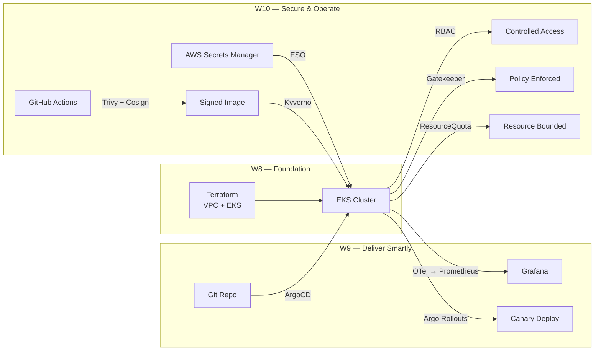

# Hướng Dẫn Tự Học & Ôn Tập Tuần 10: Secure & Operate

Tuần này tập trung vào triết lý **"Hệ thống tự từ chối vi phạm — không dựa vào lời hứa của developer"**. Sau W8 (build platform) và W9 (deliver smartly), W10 là lớp bảo vệ cuối: **ai được làm gì** (RBAC), **hệ thống tự block vi phạm** (Admission Policy), **secret xoay tự động** (ESO), **image có chữ ký** (Cosign), và **vận hành có quy trình** (Runbook / IR Playbook).

---

## 🗓️ Cách Học Tuần Này

| Ngày | Việc cần làm | Mục tiêu |
|---|---|---|
| **T2 (đã qua)** | Đọc Day A → tạo RBAC → test `kubectl auth can-i` → deploy Gatekeeper → audit mode trước, deny sau | Hiểu tại sao ClusterAdmin cho developer là thảm họa |
| **T3 (đã qua)** | Setup ESO → verify rotation 60s → thêm Trivy vào CI → cosign sign locally → apply Kyverno → test reject | Thấy secret tự cập nhật mà pod không restart |
| **T4 (hôm nay)** | Sáng: đọc Day C → tích hợp toàn stack. **Tối nay: Test 1** scope D1+D2+live | Ôn RBAC + Gatekeeper + ESO + Trivy + Cosign |
| **T5 (ngày mai)** | Onsite: 6-risk cleanup → từng risk một → verify sau mỗi fix | Cluster sạch, 3 roles + 4 constraints + ESO + Kyverno |
| **T6** | Hoàn thiện lab → show-and-tell → **Test 2** scope D3+Lab | Giải thích được toàn bộ platform trước pod |

### Ôn thi nhanh trước Test 1 (tối nay):
> Nắm chắc 5 câu hỏi dạng: "Gatekeeper ConstraintTemplate vs Constraint khác gì?", "Tại sao volume mount không restart pod khi secret thay đổi?", "Keyless OIDC signing hoạt động thế nào?", "audit vs enforce mode?", "RBAC Role vs ClusterRole?"

---

## 🗺️ Bản Đồ Kiến Thức Tổng Quan

```mermaid
graph TD
    subgraph "Day A — Who Can Do What"
        Dev[Developer] -->|kubectl apply| Admission[API Server Admission]
        Admission -->|Check 1| RBAC[RBAC\nRole / ClusterRole]
        Admission -->|Check 2| Gatekeeper[OPA Gatekeeper\nConstraint Deny]
        Admission -->|Check 3| VAP[ValidatingAdmissionPolicy\nCEL Native]
        RBAC -->|Authorized?| Cluster[K8s Cluster]
        Gatekeeper -->|Compliant?| Cluster
        VAP -->|Valid?| Cluster
    end

    subgraph "Day B — What Goes In"
        CI[GitHub Actions CI] -->|Trivy Scan| Scan{HIGH/CRITICAL?}
        Scan -->|Yes → FAIL| Block[Block Merge]
        Scan -->|No → PASS| Build[Build & Push Image]
        Build -->|Cosign Sign| Registry[Container Registry\nghcr.io]
        Registry -->|Kyverno verifyImages| Admission2[Admission]
        Admission2 -->|Unsigned? DENY| Block2[Pod Rejected]
        Admission2 -->|Signed? ALLOW| Pod[Pod Running]
        SM[AWS Secrets Manager] -->|ESO refreshInterval: 60s| K8sSecret[K8s Secret]
        K8sSecret -->|Volume Mount| Pod
    end

    subgraph "Day C — How to Operate"
        Bootstrap[bootstrap.sh] -->|Apply all| Platform[Hardened Platform]
        Platform -->|ResourceQuota| Quota[Namespace Bounded]
        Platform -->|Cost Anomaly| Alert[SNS Alert]
        Platform -->|Chaos Test| Verify[Self-Heal Verified]
        Runbook[Runbook / IR Playbook] -->|Guide on-call| Incident[Incident Resolved]
    end
```



---

## 1. Day A: RBAC + Admission Policy

### 🛠️ Tech Stack
- **Identity control:** Kubernetes RBAC (Role, ClusterRole, ServiceAccount)
- **Policy engine:** OPA Gatekeeper (Rego language)
- **Native admission:** ValidatingAdmissionPolicy (CEL, K8s 1.30+)
- **Verification:** `kubectl auth can-i --as`

### ❌ Vấn Đề Thực Tế

Trong cluster không có RBAC đúng cách:

1. **Developer vô tình (hoặc cố ý) xóa production deployment:** `kubectl delete deployment backend -n app` — không ai chặn được.
2. **Pod chạy root, mount hostPath, dùng `privileged: true`:** Một container bị exploit → attacker thoát ra ngoài node → chiếm toàn cluster.
3. **CI pipeline dùng tài khoản cá nhân có ClusterAdmin:** Token bị leak → attacker có toàn quyền cluster.
4. **Không có admission policy:** Developer push manifest thiếu `securityContext`, không có label — cluster chấp nhận hết, violation chỉ phát hiện lúc audit sau sự cố.

### ✅ Giải Pháp: Defense in Depth tại Admission

Mọi request tới API Server đều qua 3 lớp kiểm tra theo thứ tự:

```
kubectl apply → API Server → [1] Authentication → [2] RBAC → [3] Admission Webhooks → etcd
                                                          ↓                    ↓
                                                    "Bạn có quyền       "Config này có
                                                     làm việc này?"      hợp lệ không?"
```

#### A. RBAC — Phân Quyền Tối Thiểu (Least Privilege)

**Hierarchy quan trọng cần thuộc:**

| Object | Scope | Dùng khi |
|---|---|---|
| `Role` | Namespace | Developer chỉ làm việc trong namespace `app` |
| `RoleBinding` | Namespace | Gắn Role vào User/Group/SA trong namespace |
| `ClusterRole` | Cluster-wide | SRE cần xem log tất cả namespace; viewer read-only toàn cluster |
| `ClusterRoleBinding` | Cluster-wide | Gắn ClusterRole vào subject toàn cluster |

**3 role của W10 — học thuộc:**

```
developer (Role, namespace-scoped):
  ✅ get/list/watch pods, deployments
  ✅ create/update/patch deployments
  ❌ delete pods/deployments
  ❌ get secrets
  ❌ tạo/sửa RBAC

sre (ClusterRole, cluster-wide):
  ✅ get/list/watch * (tất cả resource, tất cả namespace)
  ✅ update/patch deployments, rollouts (để restart khi incident)
  ✅ pods/exec (debug trực tiếp vào pod)
  ✅ delete pods (force restart)
  ❌ delete deployments/namespaces
  ❌ sửa RBAC

viewer (ClusterRole, cluster-wide):
  ✅ get/list/watch (pods, deployments, services, events...)
  ❌ mọi thứ write
  ❌ exec vào pod
  ❌ xem secrets
```

**ServiceAccount — identity cho workload:**

```yaml
# ĐÚNG: CI dùng ServiceAccount riêng, quyền tối thiểu, bind IRSA
serviceAccountName: ci-deployer
annotations:
  eks.amazonaws.com/role-arn: arn:aws:iam::ACCOUNT_ID:role/ci-role

# SAI: CI dùng user cá nhân có ClusterAdmin → token leak = catastrophe
```

**Test nhanh xem role có đúng không:**
```bash
# developer có thể get pods?
kubectl auth can-i get pods --as=alice -n app     # → yes ✅

# developer có thể delete pods?
kubectl auth can-i delete pods --as=alice -n app  # → no ✅

# developer có thể get secrets?
kubectl auth can-i get secrets --as=alice -n app  # → no ✅
```

#### B. OPA Gatekeeper — Policy as Code

**Khái niệm then chốt:**

```
ConstraintTemplate  =  "Khuôn mẫu" — định nghĩa schema + Rego logic
                        (tạo ra một CRD mới trong cluster)

Constraint          =  "Instance" của khuôn mẫu — apply vào namespace/resource cụ thể
                        (là resource thuộc CRD mới đó)
```

**Ví dụ luồng hoạt động:**
```
1. Apply ct-no-root.yaml    → tạo CRD "K8sNoRootContainer"
2. Apply c-no-root.yaml     → tạo một K8sNoRootContainer resource
                              scope: namespace=app, enforcementAction: deny
3. Developer: kubectl apply pod-root.yaml
4. Gatekeeper webhook intercept → chạy Rego → violation!
5. API Server trả về: "admission webhook denied: Container 'main' must set runAsNonRoot: true"
```

**audit vs deny — khi nào dùng cái nào:**

| Mode | Hành vi | Khi nào dùng |
|---|---|---|
| `audit` | Cho qua, ghi violation vào `.status` | Lần đầu deploy policy — đếm vi phạm hiện tại mà không phá hệ thống |
| `deny` | Block tại admission, trả về lỗi | Sau khi đã fix hết violation trong audit mode |
| `warn` | Cho qua nhưng hiển thị cảnh báo | Transition period |

**Luồng deploy Gatekeeper đúng cách:**
```bash
# Bước 1: apply ConstraintTemplate
kubectl apply -f ct-no-root.yaml
# Bước 2: ĐỢI CRD đăng ký (quan trọng! không wait là lỗi)
sleep 10
# Bước 3: apply Constraint ở audit mode trước
kubectl apply -f c-no-root.yaml   # enforcementAction: audit
# Bước 4: check violations
kubectl get k8snorootcontainer no-root-container-app -o yaml | grep -A20 violations
# Bước 5: fix tất cả violations
# Bước 6: switch sang deny
kubectl patch k8snorootcontainer no-root-container-app -p '{"spec":{"enforcementAction":"deny"}}'
```

#### C. ValidatingAdmissionPolicy (K8s 1.30+) — Không cần Webhook

**Khác gì Gatekeeper?**

| | Gatekeeper (OPA) | ValidatingAdmissionPolicy |
|---|---|---|
| Language | Rego (Datalog-based) | CEL (Common Expression Language) |
| Deployment | Webhook pod trong cluster | Built-in API Server |
| Overhead | Network hop + pod latency | Zero (in-process) |
| Phù hợp | Policy phức tạp, nhiều conditions | Policy đơn giản, nhanh |

```yaml
# CEL expression ví dụ — không privileged:
expression: >
  object.spec.containers.all(c,
    !has(c.securityContext) ||
    !has(c.securityContext.privileged) ||
    c.securityContext.privileged == false
  )
```

---

## 2. Day B: Secrets Rotation + Supply Chain Security

### 🛠️ Tech Stack
- **Secret management:** AWS Secrets Manager + External Secrets Operator (ESO)
- **Image scanning:** Trivy (Aqua Security)
- **Image signing:** Cosign / Sigstore (keyless OIDC)
- **Admission enforcement:** Kyverno `verifyImages`
- **Supply chain framework:** SLSA levels

### ❌ Vấn Đề Thực Tế

1. **Secret hardcode trong Git:** `password: "mypassword123"` trong manifest → Git history → bị tìm thấy mãi mãi dù đã xóa file.
2. **Secret không rotate:** Credential bị leak 6 tháng trước nhưng vẫn còn dùng → attacker có quyền truy cập 6 tháng không ai hay.
3. **Image có CVE nghiêm trọng:** Base image `ubuntu:20.04` từ 2 năm trước có 200+ CVEs, deploy lên production mỗi ngày.
4. **Image bị tamper sau khi build:** Ai đó push image lên registry với tag giống nhau nhưng nội dung khác (supply chain attack).

### ✅ Giải Pháp: Từ Secret Tĩnh → Rotation Tự Động + Image Integrity

#### A. External Secrets Operator (ESO) — Secret Tự Cập Nhật

**Kiến trúc 3 tầng:**
```
AWS Secrets Manager ──────────────────────────────────────────
  /w10/db/credentials = {"username":"dbadmin","password":"p@ss"}
         ↑ poll mỗi refreshInterval (60s)
ESO Controller (chạy trong cluster)
  SecretStore  → "Kết nối tới AWS Secrets Manager region ap-southeast-1 qua IRSA"
  ExternalSecret → "Lấy /w10/db/credentials, tạo K8s Secret tên db-credentials"
         ↓ create/update
K8s Secret (db-credentials)
         ↓ volumeMount
Pod (đọc /mnt/secrets/password từ file)
```

**Điểm then chốt: Volume Mount vs Env Var**

```
Env Var (BAD for rotation):
  Pod start → env var đọc secret 1 lần → secret xoay → env var VẪN CŨ
  → Phải restart pod để lấy giá trị mới

Volume Mount (GOOD for rotation):
  Pod start → mount secret như file → ESO cập nhật K8s Secret
  → kubelet tự cập nhật file trong container (< 60s)
  → App đọc file → thấy password mới → KHÔNG cần restart
```

**Auth IRSA — không có static credential:**
```yaml
# ESO dùng IRSA thay vì ACCESS_KEY + SECRET_KEY
# ServiceAccount được annotate với IAM Role ARN
# EKS OIDC provider xác nhận identity → IAM cấp token tạm thời
annotations:
  eks.amazonaws.com/role-arn: arn:aws:iam::ACCOUNT_ID:role/eso-role
```

**Rotation flow end-to-end (test = eso-verify.sh):**
```
[T+0s]   aws secretsmanager put-secret-value (new password)
[T+0s]   AWS tạo version mới: AWSPENDING → AWSCURRENT (old → AWSPREVIOUS)
[T+60s]  ESO poll → thấy version mới → update K8s Secret
[T+62s]  kubelet detect Secret changed → update file trong container
[T+62s]  App đọc file mới → có password mới
[T+62s]  Pod vẫn Running, restartCount không tăng ✅
```

#### B. Trivy — Scan Trước Khi Vào Production

**Severity levels:**

| Level | Ví dụ | Hành động |
|---|---|---|
| CRITICAL | Remote code execution không auth | Block CI ngay |
| HIGH | Privilege escalation | Block CI (default policy) |
| MEDIUM | DoS, info disclosure | Cảnh báo, tạo ticket |
| LOW | Hardening suggestion | Advisory |
| UNKNOWN | CVE mới, chưa phân loại | Review thủ công |

**Trivy trong CI — 2 loại scan:**
```yaml
# 1. Image scan — scan container image
uses: aquasecurity/trivy-action@master
with:
  image-ref: my-image:sha
  severity: HIGH,CRITICAL
  exit-code: 1        # CI fail nếu tìm thấy

# 2. Config scan — scan K8s YAML / Terraform cho misconfig
scan-type: config
exit-code: 0          # Advisory ban đầu, không block
```

**CVE Exception ADR — không exception vô thời hạn:**
```yaml
# Mỗi exception phải có:
cve_id: CVE-2024-XXXXX
expiry_date: "2026-09-30"  # Hết hạn → CI fail lại → buộc phải review
owner: thihtktk@gmail.com
reason: "Vulnerable code path not reachable — input only from internal gRPC"
```

#### C. Cosign Keyless OIDC — Chữ Ký Không Cần Lưu Private Key

**Tại sao keyless tốt hơn key-based?**

```
Key-based:
  Tạo keypair → lưu private key vào GitHub Secret → ký image
  Vấn đề: key bị leak? key hết hạn? key rotate thế nào?

Keyless OIDC:
  GitHub Actions có OIDC identity → Fulcio (CA) cấp certificate 10 phút
  → Cosign ký bằng ephemeral key từ certificate đó
  → Rekor ghi vào transparency log (public, immutable)
  Không có private key nào cần lưu trữ lâu dài ✅
```

**Luồng signing:**
```
GitHub Actions job chạy
    ↓ (id-token: write permission)
GitHub OIDC Provider cấp JWT
    ↓
Fulcio (CA của Sigstore) verify JWT → cấp X.509 certificate (hết hạn 10 phút)
    ↓
Cosign ký image digest bằng ephemeral key từ certificate
    ↓
Rekor ghi log entry (immutable, timestamped)
    ↓
Image registry nhận signature
```

**Verify signature — 2 field quan trọng:**
```bash
cosign verify \
  --certificate-oidc-issuer "https://token.actions.githubusercontent.com" \
  --certificate-identity-regexp "https://github.com/ORG/REPO/.github/workflows/.*" \
  IMAGE@DIGEST
# Ý nghĩa: "Image này được ký bởi GitHub Actions workflow của ORG/REPO"
```

**Kyverno verifyImages — block admission:**
```
Pod create request
    ↓
Kyverno webhook intercept
    ↓
verifyImages: check signature trong Rekor
    ↓
Không có signature / signature sai → DENY (validationFailureAction: Enforce)
Có signature hợp lệ → ALLOW + mutateDigest (thay tag bằng digest)
```

**Tại sao `mutateDigest: true`?**
```
Tag có thể bị overwrite: my-image:v1.0 hôm nay ≠ my-image:v1.0 ngày mai
Digest là hash nội dung: my-image@sha256:abc123 KHÔNG BAO GIỜ thay đổi
→ mutateDigest đảm bảo pod chạy đúng image đã được ký, không bị tamper sau đó
```

#### D. SLSA — Supply Chain Levels (biết để nói chuyện)

```
SLSA Level 0: Không có provenance
SLSA Level 1: Build script tạo provenance (ghi lại "build từ source nào")
SLSA Level 2: Hosted build service (GitHub Actions, không build local)
SLSA Level 3: Hardened build (hermetic, không network access lúc build)
```

W10 đang ở SLSA L2: build qua GitHub Actions + có Cosign attestation.

---

## 3. Day C: Platform Integration + Runbook + Cost Guard

### 🛠️ Tech Stack
- **Resource control:** K8s ResourceQuota + LimitRange
- **Cost monitoring:** AWS Cost Anomaly Detection
- **Chaos testing:** Chaos Mesh
- **Operations:** Runbook template + IR Playbook 6-step

### ❌ Vấn Đề Thực Tế

1. **Một pod OOM kill cả cluster:** Không có ResourceQuota → một developer deploy job dùng 100GB RAM → node die → tất cả pod trên node đó mất.
2. **AWS bill tăng đột ngột:** Ai đó vô tình tạo NAT Gateway ở tất cả AZ, không ai biết cho đến khi bill cuối tháng về.
3. **Khi incident xảy ra, team không biết làm gì:** Mỗi người làm một kiểu → mâu thuẫn → mất thêm thời gian → MTTR cao.
4. **Chaos không được test:** Cluster chưa bao giờ được test fail pod → ngày production thật sự fail không ai biết system có tự recover không.

### ✅ Giải Pháp: Bounded Resources + Cost Alert + Runbook

#### A. ResourceQuota vs LimitRange — Hay Nhầm Lẫn

```
ResourceQuota:  Giới hạn TỔNG namespace
  "Namespace app không được dùng quá 4 CPU + 8Gi RAM + 20 pods"
  → Bảo vệ cluster khỏi một namespace chiếm hết tài nguyên

LimitRange:     Default cho từng CONTAINER
  "Container nào không khai báo limits → tự động set 200m CPU / 256Mi RAM"
  → Bảo vệ node khỏi container không giới hạn (unbounded)
```

**Phải dùng cả hai cùng nhau:**
```yaml
# Không có LimitRange: container không khai báo limits
# → K8s không biết đặt container vào QoS class nào
# → ResourceQuota không áp dụng được (yêu cầu request/limit phải có)

# Không có ResourceQuota: LimitRange chỉ giới hạn từng container
# → 100 containers × 200m = 20 CPU tổng, không ai chặn
```

**QoS Classes — biết để hiểu scheduling:**
```
Guaranteed:  requests == limits → ưu tiên cao nhất, không bị evict
Burstable:   requests < limits → có thể dùng thêm khi node rảnh
BestEffort:  không có requests/limits → bị evict đầu tiên khi node pressure
```

#### B. AWS Cost Anomaly Detection — ML Baseline

**Khác với threshold alert thông thường:**
```
Threshold alert: "Alert nếu EC2 cost > $100/ngày"
  Vấn đề: growth bình thường cũng trigger → alert fatigue

Anomaly Detection: "Alert nếu EC2 cost cao hơn BÌNH THƯỜNG của mày"
  ML học baseline 10–14 ngày → "Tuesday thường $50, hôm nay $200 → anomaly"
  → Ít false positive hơn nhiều
```

**Setup cần nhớ:**
- Monitor type: `DIMENSIONAL` với `SERVICE` → track từng service AWS riêng
- Subscription: Daily alert ($20 impact) + Immediate alert ($50 impact)
- Cần 14 ngày để ML có đủ data → đừng expect ngay ngày đầu

#### C. Chaos Engineering — Fail Intentionally

**Mục tiêu:** Xây dựng confidence rằng system tự recover — không phải tìm lỗi.

```bash
# Chaos Mesh: kill 1 backend pod mỗi 5 phút
# Expect: ArgoCD tự heal trong < 3 phút, Prometheus không fire SLO breach

# Nếu fail → tìm ra được điểm yếu trước khi production fail thật
```

**Quan sát sau chaos:**
```bash
kubectl argo rollouts get rollout backend -n app --watch
kubectl get pods -n app -w
# ArgoCD self-heal: pod mới lên trong < 3 phút
# SLO: availability không drop dưới 99% (downtime < 30s trong 30 ngày)
```

#### D. IR Playbook 6-step — Muscle Memory

**Tại sao cần playbook:**
- Khi incident xảy ra, người bị stress làm sai → playbook là checklist cognitive load thấp
- Blameless post-mortem: tìm lỗi hệ thống, không tìm người có lỗi → team dám báo lỗi sớm hơn

**6 bước — học thuộc thứ tự:**
```
1. DETECT    → GuardDuty / CloudWatch / Prometheus fire
2. TRIAGE    → P1/P2/P3? Đang exfil? Blast radius?
3. CONTAIN   → Cordon node, delete pod, NetworkPolicy deny-all, disable IAM key
4. ERADICATE → Tìm root cause, remove malicious artifact, rotate secrets
5. RECOVER   → Redeploy từ Git, verify health, monitor 2h
6. POST-MORTEM → Blameless, timeline, action items với owner + due date
```

**"Pod compromised — làm gì trong 5 phút đầu" (hay bị hỏi thi):**
```bash
# 1. Preserve logs
kubectl logs $POD -n app > /tmp/ir-evidence.log
# 2. Cordon node
kubectl cordon $NODE
# 3. Delete pod (reschedule lên node sạch)
kubectl delete pod $POD -n app
# 4. Rotate secrets
kubectl annotate externalsecret db-credentials -n app force-sync=$(date +%s)
```

---

## 4. Kết Nối Toàn Stack W8→W10



**Mini platform end-to-end — deploy từ repo lên fresh cluster trong < 2h:**
```bash
# Step 1: Terraform (W8) — 20 phút
cd w8/terraform && terraform apply

# Step 2: ArgoCD (W9) — 5 phút
kubectl apply -f w9/lab-final/argocd/root.yaml

# Step 3: Security hardening (W10) — 5 phút
cd w10/day-c/platform-bootstrap && ./bootstrap.sh
```

---

## 💡 Bài Học & Thực Hành Tốt Nhất

1. **Admission control > runtime detection:** Block tại admission (Gatekeeper) rẻ hơn detect lúc runtime (GuardDuty). Sửa lúc build rẻ hơn sửa lúc deploy. Sửa lúc design rẻ hơn sửa lúc code. Shift left.

2. **Secret không bao giờ được nằm trong Git:** Dù là private repo. Dù đã xóa. Git history còn mãi. Dùng ESO + AWS Secrets Manager — đây là standard, không phải optional.

3. **Audit mode trước, enforce sau:** Deploy Gatekeeper policy lên production bằng `audit` mode trước → fix hết violations → mới `deny`. Enforce ngay trên cluster đang chạy = break production.

4. **Exception phải có expiry:** CVE exception không có ngày hết hạn = nợ kỹ thuật vô hạn. Set `expiry_date` → CI tự fail lại sau ngày đó → buộc team review.

5. **Runbook là code:** Runbook không cập nhật = runbook vô dụng khi cần. Treat runbook như code — review, version, test định kỳ.

6. **MTTR quan trọng hơn MTBF:** Không thể ngăn 100% incident. Quan trọng là khi incident xảy ra, recover nhanh thế nào. IR Playbook + runbook tốt = MTTR thấp.
