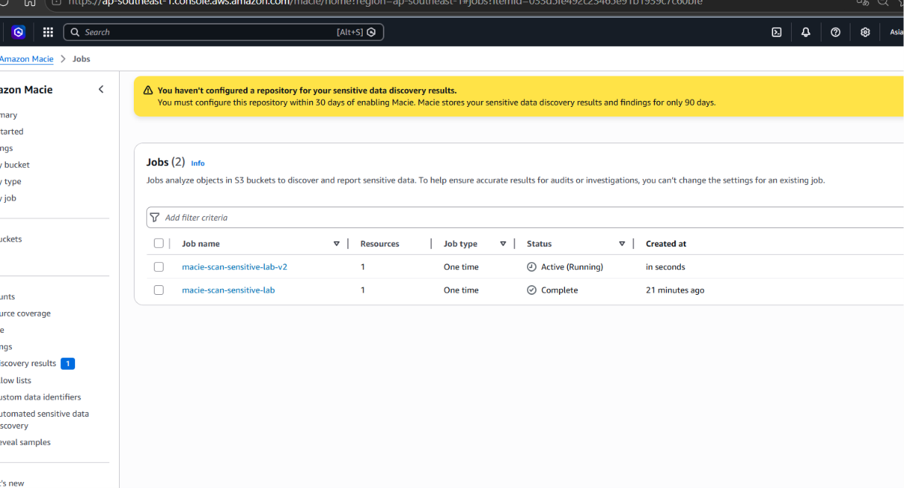
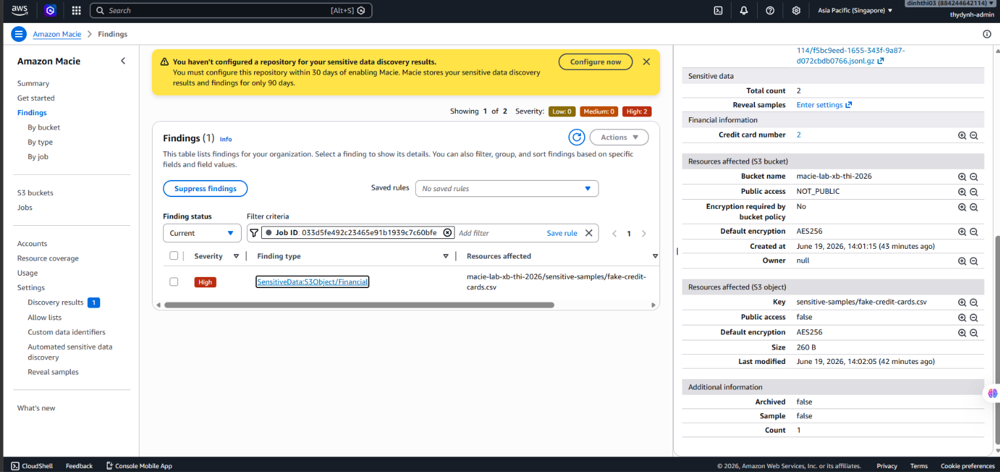

# BÁO CÁO NGHIỆM THU (EVIDENCE REPORT)
## LAB: Detect Sensitive Data in Amazon S3 & Send Notifications using Amazon Macie

[](#)
[](#)
[](#)
[](#)

---

### THÔNG TIN HỌC VIÊN
* **Học viên:** Nguyễn Đình Thi
* **Mã học viên:** XB-DN26-103
* **Chương trình:** X-BRAIN CDO-09 | Tuần W10
* **Ngày nộp:** ___/06/2026

---

## I. BẢNG ĐỐI CHIẾU TIÊU CHÍ ĐẠT

| STT | Yêu cầu | Trạng thái | Ghi chú |
| :--- | :--- | :---: | :--- |
| 1 | Tạo S3 bucket và upload sample data | ⬜ ĐẠT | |
| 2 | Bật Amazon Macie và tạo Classification Job | ⬜ ĐẠT | |
| 3 | Xem Macie Findings phát hiện dữ liệu nhạy cảm | ⬜ ĐẠT | |
| 4 | Tạo EventBridge Rule từ Macie Findings | ⬜ ĐẠT | |
| 5 | Tạo SNS Topic + Email Subscription | ⬜ ĐẠT | |
| 6 | Nhận email cảnh báo thực tế | ⬜ ĐẠT | |

---

## II. CÁC BƯỚC THỰC HIỆN (TERMINAL OUTPUTS)

### Bước 1: Tạo S3 Bucket và Upload Sample Data
```bash
# TODO: Thêm output terminal sau khi thực hiện
```

### Bước 2: Bật Amazon Macie
```bash
# TODO: Thêm output terminal sau khi thực hiện
```

### Bước 3: Tạo Macie Classification Job
```bash
# TODO: Thêm output terminal sau khi thực hiện
```

### Bước 4: Xem Macie Findings
```bash
# TODO: Thêm output terminal sau khi thực hiện
```

### Bước 5: Tạo EventBridge Rule
```bash
# TODO: Thêm output terminal sau khi thực hiện
```

### Bước 6: Tạo SNS Topic + Subscription
```bash
# TODO: Thêm output terminal sau khi thực hiện
```

---

## III. BẰNG CHỨNG THỰC THI (SCREENSHOTS)

### Screenshot 1 — Macie Classification Job


### Screenshot 2 — Macie Findings (Phát hiện dữ liệu nhạy cảm)


### Screenshot 3 — Email Alert nhận được

