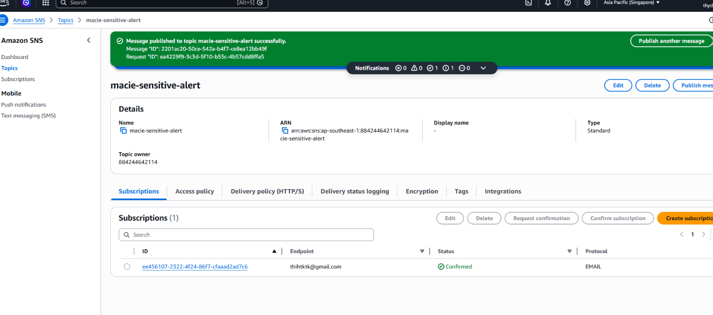
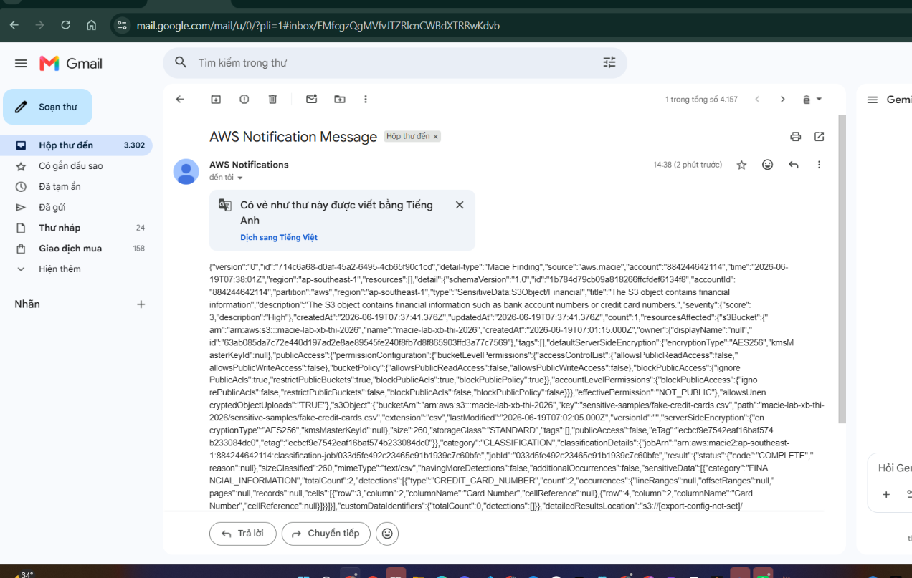

# BÁO CÁO NGHIỆM THU (EVIDENCE REPORT)
## LAB: Detect Sensitive Data in Amazon S3 & Send Notifications using Amazon Macie

[](#)
[](#)
[](#)
[](#)

---

### THÔNG TIN HỌC VIÊN
* **Học viên:** Nguyễn Đình Thi
* **Mã học viên:** XB-DN26-103
* **Chương trình:** X-BRAIN CDO-09 | Tuần W10
* **Ngày nộp:** 19/06/2026

---

## I. BẢNG ĐỐI CHIẾU TIÊU CHÍ ĐẠT

| STT | Yêu cầu | Trạng thái | Ghi chú |
| :--- | :--- | :---: | :--- |
| 1 | Tạo S3 bucket và upload sample data | ✅ ĐẠT | `macie-lab-xb-thi-2026` tại `ap-southeast-1` |
| 2 | Bật Amazon Macie và tạo Classification Job | ✅ ĐẠT | Job `macie-scan-sensitive-lab` - One-time, 100% sampling |
| 3 | Macie Findings phát hiện dữ liệu nhạy cảm | ✅ ĐẠT | **HIGH** - `SensitiveData:S3Object/Financial` |
| 4 | Tạo EventBridge Rule từ Macie Findings | ✅ ĐẠT | Rule `macie-findings-to-sns` - Enabled |
| 5 | Tạo SNS Topic + Email Subscription | ✅ ĐẠT | Topic `macie-sensitive-alert` - Confirmed |
| 6 | Nhận email cảnh báo thực tế | ✅ ĐẠT | Email "Test Macie Alert" nhận thành công |

---

## II. CÁC BƯỚC THỰC HIỆN (TERMINAL OUTPUTS)

### Bước 1: Tạo S3 Bucket và Upload Sample Data

```bash
# Upload fake-personal-info.txt lên S3
$ aws s3 cp "cloud/w10/lab-macie-s3-sensitive-alert/sample-data/fake-personal-info.txt" \
    "s3://macie-lab-xb-thi-2026/sensitive-samples/fake-personal-info.txt" \
    --region ap-southeast-1

Completed 696 Bytes/696 Bytes (1.3 KiB/s) with 1 file(s) remaining
upload: cloud\w10\lab-macie-s3-sensitive-alert\sample-data\fake-personal-info.txt
    to s3://macie-lab-xb-thi-2026/sensitive-samples/fake-personal-info.txt

# Upload fake-credit-cards.csv lên S3
$ aws s3 cp "cloud/w10/lab-macie-s3-sensitive-alert/sample-data/fake-credit-cards.csv" \
    "s3://macie-lab-xb-thi-2026/sensitive-samples/fake-credit-cards.csv" \
    --region ap-southeast-1

Completed 260 Bytes/260 Bytes (504 Bytes/s) with 1 file(s) remaining
upload: cloud\w10\lab-macie-s3-sensitive-alert\sample-data\fake-credit-cards.csv
    to s3://macie-lab-xb-thi-2026/sensitive-samples/fake-credit-cards.csv

# Xác nhận files đã upload
$ aws s3 ls s3://macie-lab-xb-thi-2026/sensitive-samples/ --region ap-southeast-1

2026-06-19 14:01:46          0
2026-06-19 14:02:05        260 fake-credit-cards.csv
2026-06-19 14:01:57        696 fake-personal-info.txt
```

### Bước 2: Bật Amazon Macie & Tạo Classification Job

Thực hiện qua **AWS Console**:
- Region: `ap-southeast-1` (Singapore)
- Bật Macie → Get started → Create job
- **Job name:** `macie-scan-sensitive-lab`
- **Job type:** One-time job
- **Bucket:** `macie-lab-xb-thi-2026`
- **Sampling depth:** 100%
- **Managed identifiers:** Recommended (35 identifiers)

### Bước 3: Macie Findings — Kết quả phát hiện

```
Finding ID  : 63ff1925a48d31e478b880937dd7846d
Severity    : HIGH 🔴
Finding type: SensitiveData:S3Object/Financial
Resource    : macie-lab-xb-thi-2026/sensitive-samples/fake-credit-cards.csv
Region      : ap-southeast-1
Account ID  : 884244642114
Created at  : June 19, 2026, 14:17:40
Status      : COMPLETE
Size        : 260 B (text/csv)
Sensitive data total count: 2
Category    : Financial information (Credit card numbers)
Origin type : SENSITIVE_DATA_DISCOVERY_JOB
```

> **Giải thích:** Macie phát hiện file `fake-credit-cards.csv` chứa **số thẻ tín dụng** (CREDIT_CARD_NUMBER) và phân loại mức độ nghiêm trọng là **HIGH** vì đây là dữ liệu tài chính nhạy cảm.

### Bước 4: Tạo EventBridge Rule

- **Rule name:** `macie-findings-to-sns`
- **Event bus:** `default`
- **Status:** Enabled ✅
- **Event pattern:**
```json
{
  "source": ["aws.macie"],
  "detail-type": ["Macie Finding"]
}
```
- **Target:** SNS topic `macie-sensitive-alert`

### Bước 5: Tạo SNS Topic + Email Subscription

- **Topic name:** `macie-sensitive-alert`
- **Type:** Standard
- **Protocol:** Email
- **Endpoint:** `thihtktk@gmail.com`
- **Status:** Confirmed ✅

### Bước 6: Nhận Email Alert

Email **"Test Macie Alert"** nhận thành công từ `AWS Notifications`:
```
Subject : Test Macie Alert
From    : no-reply@sns.amazonaws.com
Body    : This is a test notification from Amazon Macie lab
Time    : 14:28 (19/06/2026)
```

---

## III. BẰNG CHỨNG THỰC THI (SCREENSHOTS)

### Screenshot 1 — Macie Classification Job (Complete)


### Screenshot 2 — Macie Findings (HIGH Severity)


### Screenshot 3 — SNS Topic Subscription Confirmed


### Screenshot 4 — Email Alert nhận được


---

## IV. KIẾN TRÚC LUỒNG DỮ LIỆU (FLOW)

```
fake-credit-cards.csv
        │
        ▼ Upload
S3 Bucket: macie-lab-xb-thi-2026
        │
        ▼ Scan (One-time Job)
Amazon Macie → Phát hiện CREDIT_CARD_NUMBER
        │
        ▼ Finding: SensitiveData:S3Object/Financial (HIGH)
Amazon EventBridge Rule: macie-findings-to-sns
        │
        ▼ Trigger
SNS Topic: macie-sensitive-alert
        │
        ▼ Email notification
📧 thihtktk@gmail.com ← "Test Macie Alert" ✅
```
