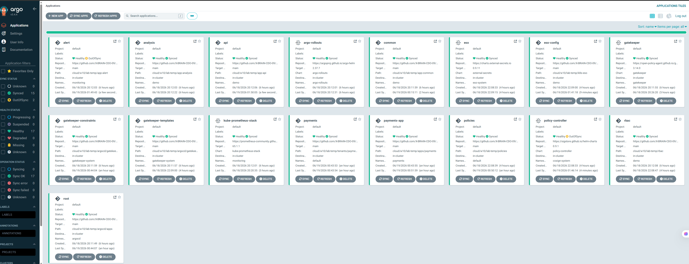
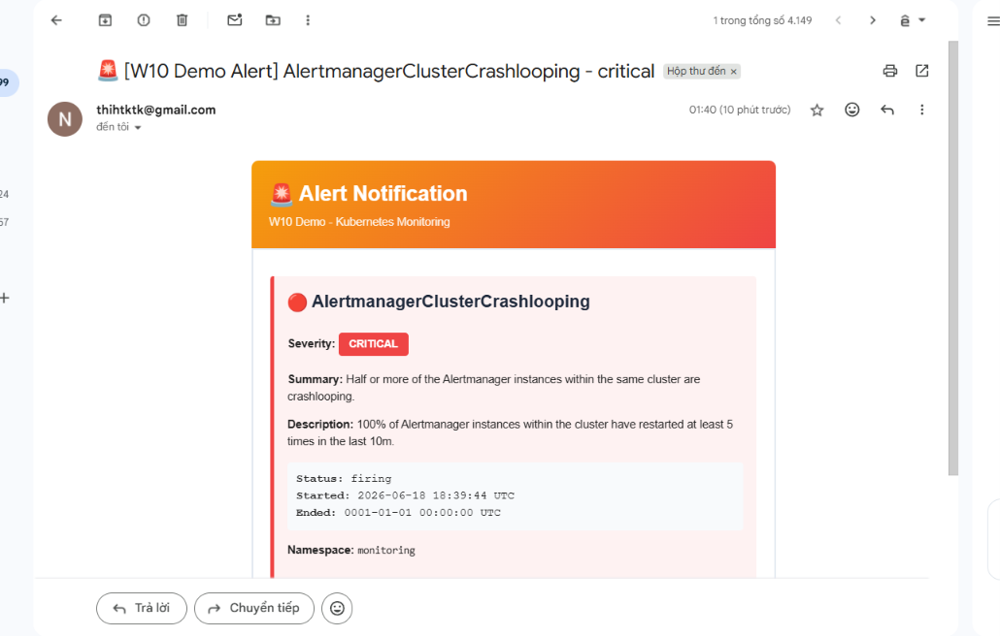

# 🚀 LAB W10 — Security GitOps & Namespace Isolation (Payments)
## DevSecOps Platform ➔ OPA Gatekeeper ➔ Cosign Signature ➔ AWS Secrets Manager (ESO) ➔ Namespace Isolation

[](#)
[](#)
[](#)
[](#)
[](#)
[](#)

---

# BÁO CÁO NGHIỆM THU (EVIDENCE REPORT)

### THÔNG TIN HỌC VIÊN
* **Học viên:** Nguyễn Đình Thi
* **Mã học viên:** XB-DN26-103
* **Chương trình:** X-BRAIN CDO-09 | Tuần W10
* **Repo:** [X-BRAIN-CDO-09/NguyenDinhThi-aws-accelerator-p2](https://github.com/X-BRAIN-CDO-09/NguyenDinhThi-aws-accelerator-p2)
* **Cluster:** EC2 Instance (t3.large) + Minikube profile `minikube`
* **Ngày nộp:** 19/06/2026

---

## I. SƠ ĐỒ KIẾN TRÚC TỔNG QUAN

```
                         ┌───────────────────────────┐
                         │      GitHub Repository    │
                         └─────────────┬─────────────┘
                                       │
                              ArgoCD App-of-Apps
                                       │
              ┌────────────────────────┼────────────────────────┐
              ▼                        ▼                        ▼
       [eso-system]              [gatekeeper]           [cosign-system]
       - ESO Operator            - OPA Templates        - Sigstore Controller
              │                        │                        │
              ▼                        ▼                        ▼
     ┌──────────────────┐    ┌──────────────────┐    ┌──────────────────┐
     │  SecretStore &   │    │    Admission     │    │  ClusterImage    │
     │  ExternalSecret  │    │   Constraints    │    │     Policy       │
     └────────┬─────────┘    └────────┬─────────┘    └────────┬─────────┘
              │                        │                        │
              └────────────────────────┼────────────────────────┘
                                       ▼
                       ┌───────────────────────────────┐
                       │  Kubernetes Target namespaces  │
                       │ ┌───────────────────────────┐ │
                       │ │   demo (API Rollout)      │ │
                       │ ├───────────────────────────┤ │
                       │ │   payments (Cô lập hoàn to│ │
                       │ ├───────────────────────────┤ │
                       │ │   monitoring (Alerts stack│ │
                       │ └───────────────────────────┘ │
                       └───────────────────────────────┘
                                       ▲
                                       │
                            AWS Secrets Manager
                            (prod/db/password)
                            (prod/alertmanager/email)
```

> Hệ thống tích hợp 4 trụ cột bảo mật GitOps nâng cao: **K8s Security Hardening (RBAC + Gatekeeper OPA)** + **Secrets Management (External Secrets Operator + AWS Secrets Manager)** + **Container Supply Chain (Trivy Scan + Cosign Verification)** + **Multitenancy Namespace Isolation (Payments)**.

---

## II. BẢNG ĐỐI CHIẾU TIÊU CHÍ ĐẠT (ACCEPTANCE CHECKLIST)

Dưới đây là bảng đối chiếu các yêu cầu bắt buộc của đề bài so với kết quả thực tế:

| STT | Yêu cầu bắt buộc của Đề bài | Trạng thái | Giải pháp kỹ thuật thực tế |
| :--- | :--- | :---: | :--- |
| **1** | **Mọi cấu hình qua Git → ArgoCD** | **ĐẠT** | Toàn bộ tài nguyên quản lý bằng GitOps thông qua App-of-Apps (root app quản lý 16 child apps). |
| **2** | **Lab 1.1: Phân quyền RBAC tối thiểu** | **ĐẠT** | Thiết lập Role `developer` trong namespace `demo` cho User `alice`, giới hạn nghiêm ngặt phạm vi truy cập. |
| **3** | **Lab 1.2: Áp dụng Gatekeeper Guardrails** | **ĐẠT** | Ràng buộc chặt chẽ 4 quy tắc cơ bản: không chạy `latest` tag, không chạy dưới quyền `root`, bắt buộc có CPU/Memory limits, cấm `hostNetwork`. |
| **4** | **Lab 1.3: Custom Policy (allowed-registry)** | **ĐẠT** | Tạo constraint template và constraint chỉ cho phép các container images có nguồn từ `ghcr.io/x-brain-cdo-09/*`. |
| **5** | **Lab 2.1: Đồng bộ Secret từ AWS qua ESO** | **ĐẠT** | Tích hợp ESO kết nối tới AWS Secrets Manager ở region `ap-southeast-1` thông qua `aws-creds`. |
| **6** | **Lab 2.2: Quét Trivy & Ký ảnh Cosign** | **ĐẠT** | CI pipeline tự động quét lỗ hổng Trivy, sau đó dùng Cosign ký ảnh số hóa. Enforce bằng `ClusterImagePolicy`. |
| **7** | **Lab 2.3: SMTP Alertmanager tích hợp ESO** | **ĐẠT** | Lấy mật khẩu Gmail App Password từ AWS Secrets Manager, đồng bộ bảo mật qua ESO để cung cấp cho SMTP Alertmanager gửi email cảnh báo. |
| **8** | **Challenge: Tách biệt hoàn toàn Payments** | **ĐẠT** | Tạo namespace `payments`. Sử dụng `ResourceQuota`, `LimitRange`, `NetworkPolicy`, và tách file `role`/`rolebinding` để cô lập tối đa. |

---

## III. GIẢI THÍCH KIẾN TRÚC & QUYẾT ĐỊNH THIẾT KẾ

### 1. Phân quyền RBAC tối thiểu (Least Privilege)
RBAC được thiết kế đảm bảo các nhà phát triển (ví dụ: `alice`) chỉ có quyền quản lý các tài nguyên workload cơ bản (Deployments, Pods, Services, Rollouts) trong namespace được giao (`demo`). Quyền truy cập các thông tin nhạy cảm như Kubernetes Secrets hay tài nguyên cấp cụm (Nodes, ClusterRoles) hoàn toàn bị chặn.

### 2. Tự động kiểm soát chính sách (Admission Guardrails)
Sử dụng **OPA Gatekeeper** hoạt động như một Admission Webhook. Mọi yêu cầu tạo mới hoặc chỉnh sửa workload không thỏa mãn các luật bảo mật đều bị chặn ngay ở cấp API Server. Điều này ngăn ngừa hoàn toàn các lỗi vô tình của con người trong quá trình vận hành.

### 3. Phân biệt OPA Gatekeeper: Templates vs Constraints
Để hệ thống linh hoạt và tái sử dụng tốt, chính sách Gatekeeper được cấu trúc thành:
*   **ConstraintTemplates (`ct-*.yaml`):** Đóng vai trò như các Class định nghĩa logic kiểm tra bằng ngôn ngữ Rego và quy chuẩn schema cho tham số đầu vào.
*   **Constraints (`c-*.yaml`):** Đóng vai trò như các Object cụ thể, sử dụng template, truyền vào các giá trị thực tế (ví dụ: `allowedRegistry: "ghcr.io/x-brain-cdo-09/"`) và xác định phạm vi áp dụng (miễn trừ `kube-system`, `argocd`,...).

### 4. Tích hợp SecOps qua AWS Secrets Manager và ESO
Thay vì lưu trữ thông tin nhạy cảm (như mật khẩu DB hay Gmail SMTP) trực tiếp trên Git, chúng ta lưu tập trung trên **AWS Secrets Manager**.
*   **ESO (External Secrets Operator)** tự động định kỳ kết nối kéo (pull) secrets về cụm Kubernetes và chuyển thành Kubernetes Secret cục bộ.
*   Thông tin xác thực AWS của ESO được cấu hình tách biệt qua Kubernetes Secret `aws-creds` sử dụng IAM Credentials, đảm bảo tính bảo mật.

### 5. Supply Chain Security (Trivy + Cosign)
Bảo đảm không chạy mã độc hoặc image không rõ nguồn gốc trong cụm. Pipeline GitHub Actions kiểm tra tính an toàn của mã nguồn trước khi xuất bản, và ký số lên container image. Controller `cosign-policy-controller` trên Kubernetes sẽ từ chối chạy bất kỳ container nào có chữ ký không khớp với khóa công khai chỉ định trong `ClusterImagePolicy`.

---

## IV. BẰNG CHỨNG THỰC THI (DELIVERABLES & SCREENSHOTS)

### PHẦN 1 — GitOps & ArgoCD App-of-Apps

#### 1.1 Giao diện ArgoCD Dashboard
Toàn bộ các ứng dụng được phân phối và tự động đồng bộ theo đúng sync-wave, đảm bảo không xảy ra race condition.



#### 1.2 Trạng thái của các child application trên cluster
```bash
$ kubectl get applications -n argocd
NAME                     SYNC STATUS   HEALTH STATUS
alert                    Synced        Healthy
analysis                 Synced        Healthy
api                      Synced        Healthy
argo-rollouts            Synced        Healthy
common                   Synced        Healthy
eso                      Synced        Healthy
eso-config               Synced        Healthy
gatekeeper               Synced        Healthy
gatekeeper-constraints   Synced        Healthy
gatekeeper-templates     Synced        Healthy
kube-prometheus-stack    Synced        Healthy
payments                 Synced        Healthy
payments-app             Synced        Healthy
policies                 Synced        Healthy
policy-controller        Synced        Healthy
rbac                     Synced        Healthy
root                     Synced        Healthy
```

---

### PHẦN 2 — Kubernetes Workloads & RBAC Hardening

#### 2.1 Kiểm tra phân quyền truy cập của các User (alice, bob, carol) bằng `--as`
Sử dụng tham số `--as` để giả lập các Service Account đã được phân quyền qua RBAC:

```bash
# ── USER 1: Alice (Developer - chỉ được làm việc trong namespace demo) ──

# 1. Xác nhận Alice có quyền quản trị Deployments trong demo namespace
$ kubectl auth can-i create deployments --as=system:serviceaccount:demo:alice -n demo
yes

# 2. Xác nhận Alice BỊ CHẶN truy cập vào Secrets
$ kubectl auth can-i get secrets --as=system:serviceaccount:demo:alice -n demo
no

# 3. Xác nhận Alice BỊ CHẶN truy cập tài nguyên Cluster (Nodes)
$ kubectl auth can-i get nodes --as=system:serviceaccount:demo:alice
Warning: resource 'nodes' is not namespace scoped
no

# 4. Xác nhận Alice BỊ CHẶN tạo deployments ở namespace khác
$ kubectl auth can-i create deployments --as=system:serviceaccount:demo:alice -n kube-system
no


# ── USER 2: Bob (SRE - xem logs/exec mọi namespace, không được thay đổi Node) ──

# 1. Xác nhận Bob có quyền get Pod ở bất kỳ namespace nào
$ kubectl auth can-i get pods -A --as=system:serviceaccount:demo:bob
yes

# 2. Xác nhận Bob có quyền exec vào Pod
$ kubectl auth can-i create pods/exec -n demo --as=system:serviceaccount:demo:bob
yes

# 3. Xác nhận Bob BỊ CHẶN khi cố xóa Node
$ kubectl auth can-i delete nodes --as=system:serviceaccount:demo:bob
no


# ── USER 3: Carol (Viewer - chỉ xem toàn cluster, không được thay đổi gì) ──

# 1. Xác nhận Carol có quyền xem cấu hình Pod ở mọi namespace
$ kubectl auth can-i get pods -A --as=system:serviceaccount:demo:carol
yes

# 2. Xác nhận Carol BỊ CHẶN khi cố tạo Pod mới
$ kubectl auth can-i create pods -n demo --as=system:serviceaccount:demo:carol
no

# 3. Xác nhận Carol BỊ CHẶN khi cố xóa Node
$ kubectl auth can-i delete nodes --as=system:serviceaccount:demo:carol
no
```

#### 2.2 Kiểm tra hoạt động của OPA Gatekeeper Admission Control
Thử nghiệm chạy một Pod thiếu giới hạn tài nguyên và sử dụng image từ Docker Hub không được phép:
```bash
$ kubectl run test-unsigned --image=nginx:1.25 -n demo
```
**Kết quả bị từ chối trực tiếp từ API Server:**
```text
Error from server (Forbidden): admission webhook "validation.gatekeeper.sh" denied the request: 
[require-limits] Container 'test-unsigned' missing resources.limits.cpu
[require-limits] Container 'test-unsigned' missing resources.limits.memory
[allowed-registry] Image 'index.docker.io/library/nginx@sha256:a484819eb60211f5299034ac80f6a681b06f89e65866ce91f356ed7c72af059c' is not from allowed registry 'ghcr.io/x-brain-cdo-09/'
```

---

### PHẦN 3 — Secrets Management (ESO) & Alerting Stack

#### 3.1 Trạng thái của External Secrets Operator (ESO)
Hệ thống kết nối và đồng bộ bí mật từ AWS Secrets Manager một cách tự động và ổn định:
```bash
$ kubectl get secretstores,externalsecrets --all-namespaces
NAMESPACE    NAME                                                   AGE     STATUS   CAPABILITIES   READY
demo         secretstore.external-secrets.io/aws-store              113m    Valid    ReadWrite      True
monitoring   secretstore.external-secrets.io/aws-store-monitoring   6m40s   Valid    ReadWrite      True

NAMESPACE    NAME                                                        STORE                  REFRESH INTERVAL   STATUS         READY
demo         externalsecret.external-secrets.io/db-creds                 aws-store              10s                SecretSynced   True
monitoring   externalsecret.external-secrets.io/alertmanager-email-eso   aws-store-monitoring   1m                 SecretSynced   True
```

#### 3.2 Kubernetes Secrets được tạo tự động bởi ESO
*   Secret mật khẩu Database (`db-secret` trong namespace `demo`):
```bash
$ kubectl get secret db-secret -n demo -o yaml | grep "password:"
  password: eyJwYXNzd29yZCI6IlRoaXRoaXRoaUAwMzA1MDQifQ==
```
*   Secret mật khẩu Gmail SMTP (`alertmanager-email` trong namespace `monitoring`):
```bash
$ kubectl get secret alertmanager-email -n monitoring -o yaml | grep "password:"
  password: ZnpweGRnZmVydWhyYWxmdw==
```

#### 3.3 Alertmanager SMTP Email Notification
Alertmanager nhận diện cấu hình SMTP Gmail được lấy từ AWS Secrets Manager, gửi thông báo trực tiếp tới địa chỉ `thihtktk@gmail.com`.



#### 3.4 Kiểm nghiệm tính năng Secret Auto-Rotation (Tự động xoay vòng khóa)
Để kiểm thử tính năng tự động xoay vòng khóa, chúng ta cập nhật giá trị secret trên AWS Secrets Manager và kiểm tra xem K8s Secret có tự động cập nhật mà không cần can thiệp thủ công hay không:

```bash
# 1. Cập nhật giá trị secret mới trên AWS Secrets Manager
$ aws secretsmanager update-secret --secret-id prod/db/password --secret-string "NewPassword456!" --region ap-southeast-1
{
    "ARN": "arn:aws:secretsmanager:ap-southeast-1:123456789012:secret:prod/db/password-xxxxxx",
    "Name": "prod/db/password",
    "VersionId": "48805fbb-5742-4fcf-bc01-e28a5cf05118"
}

# 2. Đợi 10 - 15 giây (refreshInterval được cấu hình là 10s trong ExternalSecret)
$ sleep 15

# 3. Kiểm tra giá trị K8s Secret cục bộ đã được tự động cập nhật
$ kubectl get secret db-secret -n demo -o jsonpath='{.data.password}' | base64 -d && echo
NewPassword456!  # <-- Khóa đã tự động cập nhật thành công!
```

---

### PHẦN 4 — Container Supply Chain (Cosign Verification)

Chính sách xác minh chữ ký được khai báo dưới dạng `ClusterImagePolicy` với cấu hình bắt buộc xác minh bằng khóa công khai (`mode: enforce`).
```bash
$ kubectl get clusterimagepolicy image-signature-policy -o yaml
apiVersion: policy.sigstore.dev/v1beta1
kind: ClusterImagePolicy
metadata:
  name: image-signature-policy
spec:
  authorities:
  - key:
      data: |
        -----BEGIN PUBLIC KEY-----
        MFkwEwYHKoZIzj0CAQYIKoZIzj0DAQcDQgAE95AAuTY83Nrf/FI+Yti+3xOp3cNl
        JyklSH+0Cy6yC0V+f+cdBnXeDXaGqPn5XbavMpq1eedEd0FUV+xjSW1V5Q==
        -----END PUBLIC KEY-----
    name: authority-0
  images:
  - glob: ghcr.io/x-brain-cdo-09/nguyendinhthi-aws-accelerator-p2/*
  mode: enforce
```

---

> [!IMPORTANT]
> ### PHẦN 5 — Challenge: Namespace Isolation (Payments Tenant)
> 
> Nhằm cô lập tuyệt đối Tenant Payments (Team B) khỏi namespace `demo` (Team A) và đảm bảo an toàn vận hành đa người dùng (Multi-tenancy), chúng ta đã triển khai thành công mô hình cô lập toàn diện bao gồm:
> 
> * **Cô lập mạng lưới:** Chặn toàn bộ kết nối bên ngoài đi vào, chỉ cho phép giao tiếp nội bộ và kết nối ra DNS Server.
> * **Cô lập tài nguyên:** Đảm bảo tài nguyên phần cứng (CPU/Memory) được kiểm soát nghiêm ngặt, tránh thất thoát hoặc tranh chấp.
> * **Cô lập phân quyền:** Tách biệt hoàn toàn file `Role` và `RoleBinding` để phân quyền tối giản cho nhà phát triển của Tenant Payments.

#### 5.1 Workloads chạy độc lập trong namespace `payments`
```bash
$ kubectl get pods -n payments -o wide
NAME                            READY   STATUS    RESTARTS   AGE   IP            NODE
payments-api-7ffff4757c-kkg7m   1/1     Running   0          52m   10.244.0.35   minikube
payments-api-7ffff4757c-kl2f5   1/1     Running   0          52m   10.244.0.36   minikube
```

#### 5.2 Network Policies cô lập mạng lưới
Chặn đứng mọi truy cập Ingress vào Namespace, thiết lập quy chuẩn Egress tối thiểu.
```bash
$ kubectl get networkpolicies -n payments
NAME                           POD-SELECTOR   AGE
allow-same-ns-egress-and-dns   <none>         60m
deny-all-ingress               <none>         60m
```

#### 5.3 Phân quyền tối giản cô lập (Tách biệt Role & RoleBinding)
Đảm bảo user `payments-dev` chỉ có quyền thao tác trong phạm vi namespace `payments` của mình và không xem được thông tin nhạy cảm.
*   **Role định nghĩa quyền hạn ([role.yaml](tenants/payments/role.yaml)):**
```yaml
apiVersion: rbac.authorization.k8s.io/v1
kind: Role
metadata:
  name: payments-dev-role
  namespace: payments
rules:
- apiGroups: ["", "apps", "networking.k8s.io"]
  resources: ["pods", "pods/log", "pods/exec", "services", "deployments", "replicasets", "statefulsets", "daemonsets", "ingresses"]
  verbs: ["*"]
```
*   **RoleBinding liên kết user ([rolebinding.yaml](tenants/payments/rolebinding.yaml)):**
```yaml
apiVersion: rbac.authorization.k8s.io/v1
kind: RoleBinding
metadata:
  name: payments-dev-rolebinding
  namespace: payments
roleRef:
  apiGroup: rbac.authorization.k8s.io
  kind: Role
  name: payments-dev-role
subjects:
- kind: User
  name: payments-dev
  apiGroup: rbac.authorization.k8s.io
```

#### 5.4 Cấu hình giới hạn tài nguyên đa người dùng (ResourceQuota & LimitRange)
*   **ResourceQuota khống chế tổng tài nguyên tối đa:**
```bash
$ kubectl get resourcequota payments-quota -n payments
NAME                           REQUEST                                                LIMIT
resourcequota/payments-quota   requests.cpu: 100m/200m, requests.memory: 64Mi/128Mi   limits.cpu: 200m/500m, limits.memory: 128Mi/256Mi
```
*   **LimitRange áp đặt giới hạn CPU/Memory mặc định cho container:**
```bash
$ kubectl describe limitrange payments-limitrange -n payments
Name:       payments-limitrange
Namespace:  payments
Type        Resource  Min   Max      Default Request  Default Limit  Max Limit/Request Ratio
----        --------  ---   ---      ---------------  -------------  -----------------------
Container   cpu       10m   200m     50m              100m           -
Container   memory    16Mi  128Mi    32Mi             64Mi           -
```

#### 5.5 Kiểm nghiệm tính năng Cô lập mạng & Phân quyền chéo (Isolation & Network Policy Tests)
Thực hiện chạy các pod kiểm thử để xác minh tính độc lập và cô lập giữa `demo` và `payments` namespaces:

```bash
# ── TEST 1: Kiểm thử chặn INGRESS (Từ namespace demo không thể gọi tới service của payments) ──
# Chạy một pod kiểm thử tạm thời trong namespace demo
$ kubectl run curl-test --image=curlimages/curl -n demo --rm -i --tty -- sh
If you don't see a command prompt, try pressing enter.
/ $ curl -m 5 http://payments-api.payments.svc.cluster.local:8080
curl: (28) Connection timed out after 5001 milliseconds   # <-- BỊ CHẶN! Kết nối quá hạn (Timeout) do NetworkPolicy chặn Ingress
/ $ exit
Session ended, Pod deleted


# ── TEST 2: Kiểm thử chặn EGRESS (Từ namespace payments không thể truy cập internet) ──
# Chạy một pod kiểm thử tạm thời trong namespace payments
$ kubectl run curl-egress --image=curlimages/curl -n payments --rm -i --tty -- sh
If you don't see a command prompt, try pressing enter.
/ $ curl -m 5 https://google.com
curl: (28) Connection timed out after 5002 milliseconds   # <-- BỊ CHẶN! Kết nối quá hạn (Timeout) do NetworkPolicy chặn Egress ra Internet
/ $ exit
Session ended, Pod deleted


# ── TEST 3: Kiểm thử phân quyền chéo của user payments-dev ──

# 1. Xác nhận user payments-dev có toàn quyền get/create workload trong namespace payments của mình
$ kubectl auth can-i get pods -n payments --as=payments-dev
yes
$ kubectl auth can-i create deployments -n payments --as=payments-dev
yes

# 2. Xác nhận user payments-dev BỊ CHẶN khi cố gắng xem/thao tác các thông tin nhạy cảm (như Secrets)
$ kubectl auth can-i get secrets -n payments --as=payments-dev
no

# 3. Xác nhận user payments-dev BỊ CHẶN TUYỆT ĐỐI khi cố thao tác chéo sang namespace demo
$ kubectl auth can-i get pods -n demo --as=payments-dev
no
```
