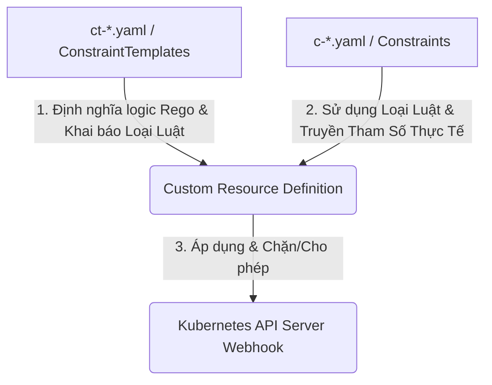

# 🚀 LAB W10 — Security GitOps & Namespace Isolation (Payments)
## DevSecOps Platform ➔ OPA Gatekeeper ➔ Cosign Signature ➔ AWS Secrets Manager (ESO) ➔ Namespace Isolation

---

Tài liệu này giải thích thiết kế cô lập an toàn cho **Tenant `payments`** (Team B) khi đưa vào hệ thống platform.

## 1. Giải thích thiết kế bảo mật & cô lập

### Câu hỏi 1: Vì sao các chính sách bảo mật (guardrails) cũ tự động áp dụng cho Team B mà không cần viết luật mới?
* **Cơ chế hoạt động:** Các chính sách bảo mật của **Gatekeeper (Constraints)** và **Sigstore (ClusterImagePolicy)** được định nghĩa ở cấp độ **Cluster-wide** (quy mô toàn cụm).
* **Áp dụng tự động:** 
  * Các Constraint của Gatekeeper (như cấm chạy root, cấm tag latest, yêu cầu resource limits) được cấu hình áp dụng cho mọi namespace ngoại trừ một số namespace hệ thống được loại trừ cụ thể (như `kube-system`, `argocd`).
  * Sigstore `ClusterImagePolicy` quét tất cả các Pod dựa trên namespace được đánh nhãn `policy.sigstore.dev/include: "true"`.
  * Do đó, khi tạo mới namespace `payments` và triển khai ứng dụng của Team B, các luật này sẽ **tự động chặn và kiểm tra** mà không cần lập trình hay viết thêm bất kỳ luật bảo mật nào mới.

### Câu hỏi 2: Role/RoleBinding khác biệt thế nào so với ClusterRoleBinding để giữ tính cô lập?
* **Role & RoleBinding (Namespace-scoped):**
  * Quyền hạn được giới hạn nghiêm ngặt bên trong **duy nhất một Namespace** (ở đây là namespace `payments`).
  * Tài khoản `payments-dev` được liên kết với `payments-dev-role` thông qua `RoleBinding` tại namespace `payments`. Điều này đảm bảo họ có toàn quyền quản lý ứng dụng của mình nhưng **hoàn toàn không thể** xem, sửa hoặc xóa bất kỳ tài nguyên nào ở namespace khác (như `demo` hay `kube-system`).
* **ClusterRoleBinding (Cluster-scoped):**
  * Liên kết quyền hạn trên **toàn bộ Cluster** (tất cả namespaces).
  * Nếu sử dụng `ClusterRoleBinding` cho `payments-dev`, họ sẽ có quyền hạn xuyên suốt mọi namespace, phá vỡ nguyên lý cô lập đa người dùng (Multi-tenancy) và vi phạm nguyên tắc đặc quyền tối thiểu (Least Privilege).

---

## 2. Phân biệt OPA Gatekeeper: Templates vs Constraints

Trong hệ thống OPA Gatekeeper được triển khai tại dự án, cấu hình được tách bạch rõ ràng giữa **Khuôn mẫu chính sách (Templates)** và **Thực thi chính sách (Constraints)**:

* **ConstraintTemplates (`ct-*.yaml` - Khuôn mẫu):**
  * Định nghĩa **logic kiểm tra chính sách** sử dụng ngôn ngữ lập trình chính sách **Rego**.
  * Khai báo cấu trúc dữ liệu đầu vào (schema parameters) mà luật này yêu cầu.
  * Chưa trực tiếp chặn bất kỳ tài nguyên nào mà chỉ tạo ra một Loại Luật mới trong cụm (ví dụ: `K8sDenyLatestTag`).
* **Constraints (`c-*.yaml` - Thực thi):**
  * Sử dụng Loại Luật được tạo ra từ Template.
  * Truyền vào **tham số thực tế** để kiểm tra (ví dụ: `allowedRegistry: "ghcr.io/x-brain-cdo-09/"`).
  * Xác định **phạm vi áp dụng** (Namespace nào chịu ảnh hưởng, Namespace nào được miễn trừ).

---

> [!IMPORTANT]
> ## 3. CHALLENGE: CÔ LẬP HOÀN TOÀN TENANT PAYMENTS
> 
> Để tích hợp Team Payments (Team B) vào dùng chung Cluster mà không làm ảnh hưởng đến tài nguyên và bảo mật của toàn bộ hệ thống, chúng ta áp dụng mô hình **Namespace Isolation** nghiêm ngặt qua 4 lớp phòng thủ:
> 
> 1. **Cô lập Mạng lưới (Network Isolation):**
>    * Sử dụng [netpol.yaml](tenants/payments/netpol.yaml) với quy tắc `deny-all-ingress` chặn đứng toàn bộ traffic kết nối từ bên ngoài namespace đi vào namespace `payments`.
>    * Chỉ cho phép traffic nội bộ cùng namespace và gửi truy vấn ra DNS của Kubernetes.
> 2. **Cô lập Quyền hạn (Access Control Isolation):**
>    * Thay vì dùng gộp, chúng ta tách riêng thành [role.yaml](tenants/payments/role.yaml) và [rolebinding.yaml](tenants/payments/rolebinding.yaml).
>    * Giới hạn quyền hạn tối thiểu (least privilege) cho user `payments-dev`, chặn tuyệt đối quyền xem Secrets, RoleBindings hoặc tác động sang các namespace khác.
> 3. **Tránh hao hụt tài nguyên (Resource Contention Isolation):**
>    * Cấu hình [quota.yaml](tenants/payments/quota.yaml) thiết lập ResourceQuota khống chế tổng tài nguyên tối đa mà Namespace này được phép sử dụng (CPU/Memory Request & Limit), bảo vệ Cluster khỏi tình trạng bị chiếm quyền ưu tiên tài nguyên (Noisy Neighbor).
> 4. **Chuẩn hóa Container Resource Limits (Defaults Isolation):**
>    * Sử dụng [limitrange.yaml](tenants/payments/limitrange.yaml) thiết lập LimitRange để tự động gán tài nguyên CPU/Memory mặc định cho các Pod của nhà phát triển nếu họ quên khai báo trong cấu hình triển khai.

---

## 4. Các thành phần đã triển khai (GitOps)

Toàn bộ hạ tầng và ứng dụng của team `payments` được quản lý qua GitOps:
* **Hạ tầng (`tenants/payments/`):**
  * [ns.yaml](tenants/payments/ns.yaml): Tạo namespace `payments` có đánh nhãn quét chữ ký số.
  * [role.yaml](tenants/payments/role.yaml): Định nghĩa quyền hạn chế cho `payments-dev`.
  * [rolebinding.yaml](tenants/payments/rolebinding.yaml): Gán quyền cho user `payments-dev`.
  * [quota.yaml](tenants/payments/quota.yaml): Giới hạn tài nguyên tối đa (CPU/Memory) của namespace `payments`.
  * [limitrange.yaml](tenants/payments/limitrange.yaml): Thiết lập cấu hình CPU/Memory mặc định cho các Pod.
  * [netpol.yaml](tenants/payments/netpol.yaml): Cấu hình NetworkPolicy cách ly mạng.
* **Ứng dụng (`apps/payments/`):**
  * [app.yaml](apps/payments/app.yaml): Deploy ứng dụng `payments-api` sử dụng Docker image đã được ký số hợp lệ.
* **ArgoCD Apps (`argocd/apps/`):**
  * [payments.yaml](../../argocd/apps/payments.yaml): Ứng dụng ArgoCD quản lý hạ tầng tenant.
  * [payments-app.yaml](../../argocd/apps/payments-app.yaml): Ứng dụng ArgoCD quản lý deploy workload.
