# BÁO CÁO NGHIỆM THU (EVIDENCE REPORT)
## ĐỀ BÀI: Final Project — Deploy a Web App on AWS

* **Học viên:** Nguyễn Đình Thi  
* **Dự án:** LAB CD9 — 1-Click Automation Platform  
* **Nguồn Repo:** [X-BRAIN-CDO-09/NguyenDinhThi-aws-accelerator-p2](https://github.com/X-BRAIN-CDO-09/NguyenDinhThi-aws-accelerator-p2.git)  

---

## I. BẢNG ĐỐI CHIẾU TIÊU CHÍ ĐẠT (ACCEPTANCE CHECKLIST)

| STT | Yêu cầu Final Project | Trạng thái | Giải pháp kỹ thuật thực tế |
| :--- | :--- | :---: | :--- |
| **1** | Tạo **VPC** module với Public & Private Subnets | **ĐẠT** | Custom VPC `10.0.0.0/16`, 2 Public Subnets (`10.0.1.0/24`, `10.0.2.0/24`), 2 Private Subnets (`10.0.3.0/24`, `10.0.4.0/24`), IGW, NAT Gateway, Route Tables. |
| **2** | Deploy **EC2** instance trong Public Subnet (web server) | **ĐẠT** | EC2 Ubuntu 22.04 (`t3.medium`) trong Public Subnet A, chạy Kind K8s Cluster + Nginx app. |
| **3** | Deploy **RDS MySQL** trong Private Subnet | **ĐẠT** | RDS MySQL 8.0 (`db.t3.micro`) trong Private Subnet, DB Subnet Group span 2 AZ, password tự sinh bằng `random_password`. |
| **4** | Tạo **S3 Bucket** cho Static Assets | **ĐẠT** | S3 Bucket với Server-Side Encryption (AES256), Versioning, Public Access Block. |
| **5** | Cấu hình **Security Groups** chỉ cho phép traffic cần thiết | **ĐẠT** | 3 SG: ALB (80 from Internet), EC2 (30080 from ALB SG, 22 from MyIP), RDS (3306 from EC2 SG only). |
| **6** | State lưu trên **S3 Backend** với **DynamoDB Locking** | **ĐẠT** | S3 Bucket (`lab-cd9-terraform-state-*`) + DynamoDB Table (`lab-cd9-terraform-lock`) tạo tự động. |
| **7** | **Một lệnh** dựng tất cả (1-click) | **ĐẠT** | `terraform apply -auto-approve` tạo toàn bộ hạ tầng + ứng dụng. |
| **8** | Dùng **≥2 Provider** (wire provider) | **ĐẠT** | 5 providers: `aws`, `tls`, `local`, `kubernetes`, `random`. |

---

## II. GIẢI THÍCH KIẾN TRÚC & QUYẾT ĐỊNH THIẾT KẾ

### Sơ đồ Kiến trúc Hệ thống
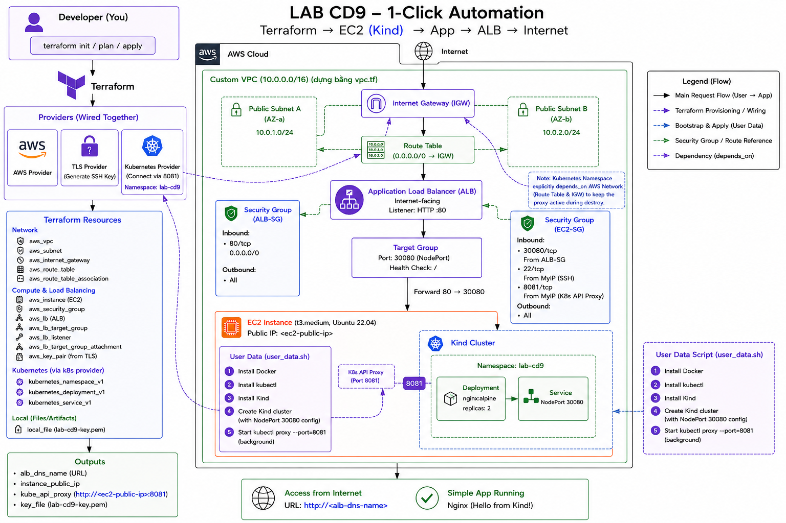

### 1. Cơ chế "Wire" các Provider
* **TLS ➔ AWS**: `tls_private_key` sinh SSH Key → truyền public key sang `aws_key_pair`.
* **AWS ➔ Kubernetes**: Kubernetes Provider dùng IP động từ EC2 (`http://${aws_instance.public_ip}:8081`).
* **Random ➔ AWS**: `random_password` sinh mật khẩu an toàn → truyền vào `aws_db_instance.password`.

### 2. Thiết kế mạng VPC
* **Public Subnets** (2 AZ): Chứa EC2 web server và ALB. Có Internet Gateway để truy cập trực tiếp từ Internet.
* **Private Subnets** (2 AZ): Chứa RDS MySQL. Có NAT Gateway để RDS có thể tải updates nhưng không bị expose ra Internet.
* **Security Groups**: Tuân thủ nguyên tắc Least Privilege — RDS chỉ nhận kết nối từ EC2 SG qua port 3306.

### 3. Giải quyết bài toán Bootstrapping
* `null_resource.wait_for_minikube` dùng `remote-exec` SSH vào EC2 chạy `cloud-init status --wait` để đảm bảo Kind Cluster sẵn sàng trước khi Kubernetes Provider kết nối.

---

## III. BẰNG CHỨNG THỰC THI (SCREENSHOTS)

### 1. Khởi tạo Dự án (`terraform init`)
Tải thành công 6 providers: `aws`, `tls`, `local`, `kubernetes`, `null`, `random`.

📸 **Chụp**: Terminal hiển thị kết quả `terraform init` thành công.

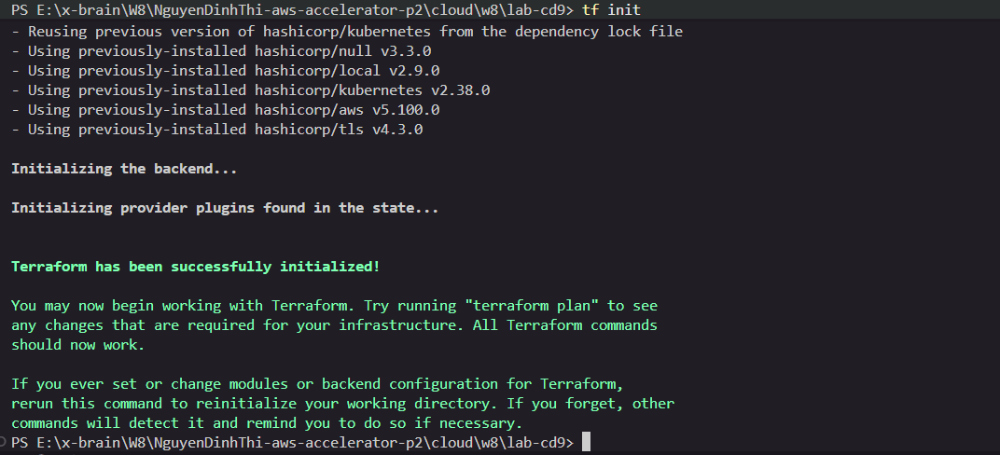

---

### 2. Xem Kế hoạch (`terraform plan`)
Terraform xây dựng đồ thị phụ thuộc và báo cáo số lượng tài nguyên cần tạo.

📸 **Chụp**: Terminal hiển thị kết quả `terraform plan` với tổng số resources.

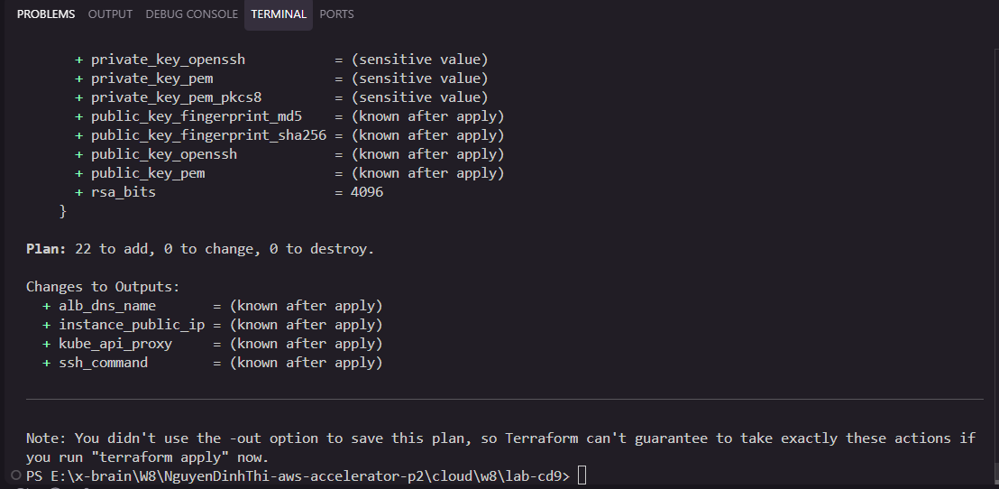

---

### 3. Triển khai 1-Click (`terraform apply`)
Toàn bộ hạ tầng + ứng dụng được tạo tự động bằng 1 lệnh duy nhất.

📸 **Chụp**: Terminal hiển thị `Apply complete!` và danh sách Outputs (alb_dns, rds_endpoint, s3_bucket...).

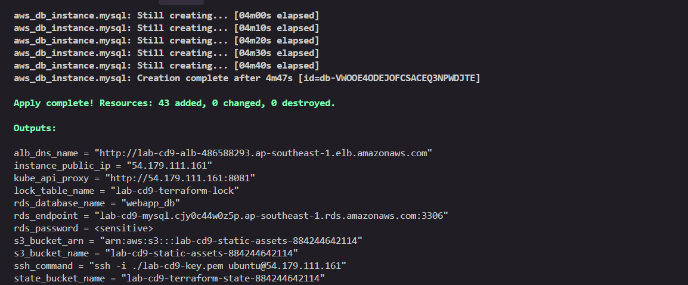

---

### 4. VPC & Subnets trên AWS Console
Xác minh Custom VPC với đầy đủ 4 Subnets (2 Public + 2 Private).

📸 **Chụp**: AWS Console → VPC → Subnets, thấy 4 subnets: `public-subnet-a`, `public-subnet-b`, `private-subnet-a`, `private-subnet-b`.

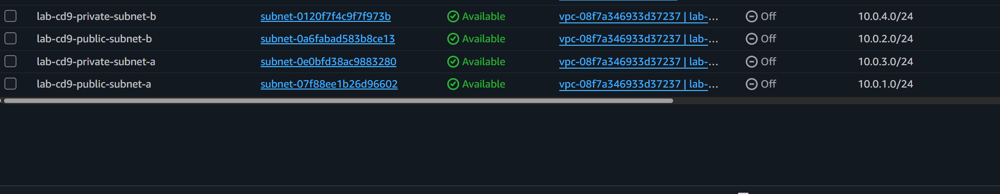

---

### 5. EC2 Instance trạng thái Running
Máy chủ EC2 trong Public Subnet A đang chạy.

📸 **Chụp**: AWS Console → EC2 → Instances, thấy instance `lab-cd9-minikube` ở trạng thái **Running**.

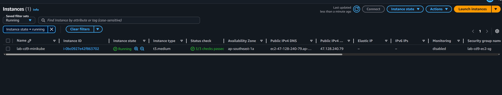

---

### 6. RDS MySQL trong Private Subnet
RDS MySQL đã triển khai thành công trong Private Subnet, không có Public Access.

📸 **Chụp**: AWS Console → RDS → Databases, thấy `lab-cd9-mysql` ở trạng thái **Available**, Publicly Accessible = **No**.

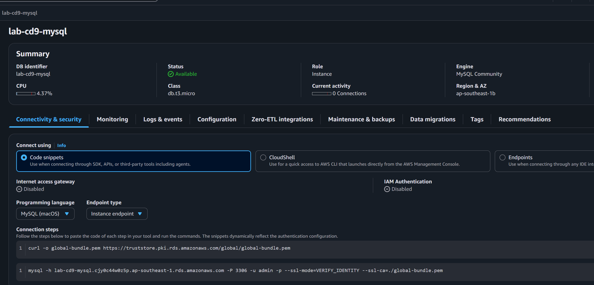

---

### 7. S3 Bucket cho Static Assets
S3 Bucket đã tạo với Encryption và Versioning bật sẵn.

📸 **Chụp**: AWS Console → S3 → Buckets, thấy bucket `lab-cd9-static-assets-*` với Versioning **Enabled**.

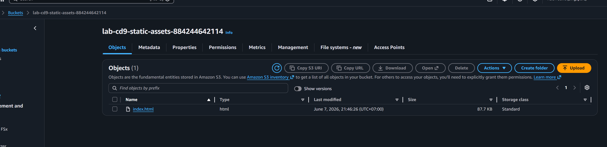

---

### 8. S3 State Bucket + DynamoDB Lock Table
Hạ tầng State Backend đã tạo sẵn để lưu trữ Terraform State.

📸 **Chụp 2 ảnh**:
- AWS Console → S3, thấy bucket `lab-cd9-terraform-state-*`.
- AWS Console → DynamoDB → Tables, thấy table `lab-cd9-terraform-lock`.

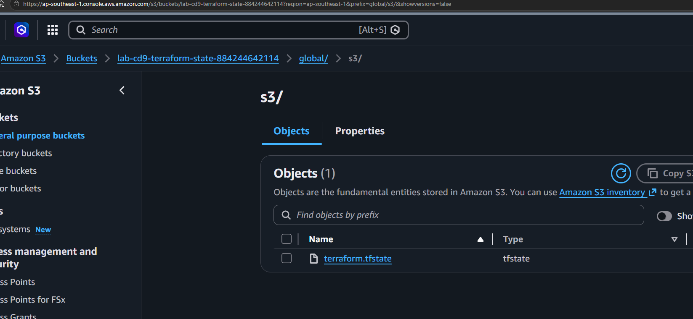

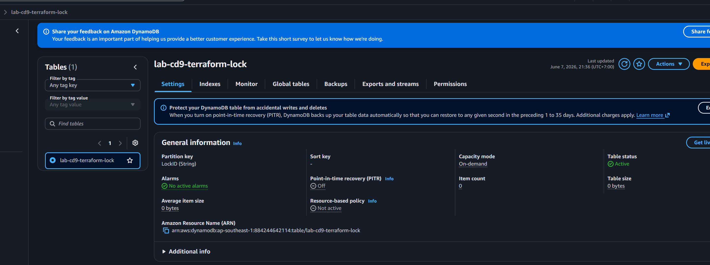

---

### 9. Security Groups — Chỉ cho phép traffic cần thiết
3 Security Groups được cấu hình theo nguyên tắc Least Privilege.

📸 **Chụp**: AWS Console → EC2 → Security Groups, thấy 3 SG: `lab-cd9-alb-sg`, `lab-cd9-ec2-sg`, `lab-cd9-rds-sg` với Inbound Rules tương ứng.

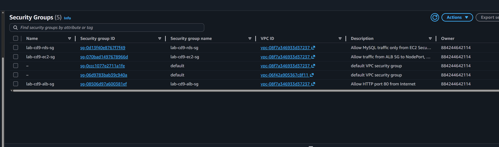

---

### 10. Application Load Balancer trạng thái Active
ALB đang hoạt động và forward traffic vào EC2.

📸 **Chụp**: AWS Console → EC2 → Load Balancers, thấy `lab-cd9-alb` ở trạng thái **Active**.


---

### 11. Ứng dụng chạy trong K8s (không cài thẳng EC2)
SSH vào EC2 kiểm tra Pods và Services trong namespace `lab-cd9`.

📸 **Chụp**: Terminal SSH, chạy `kubectl get pods -n lab-cd9` và `kubectl get svc -n lab-cd9` thấy Pods **Running** và Service **NodePort 30080**.

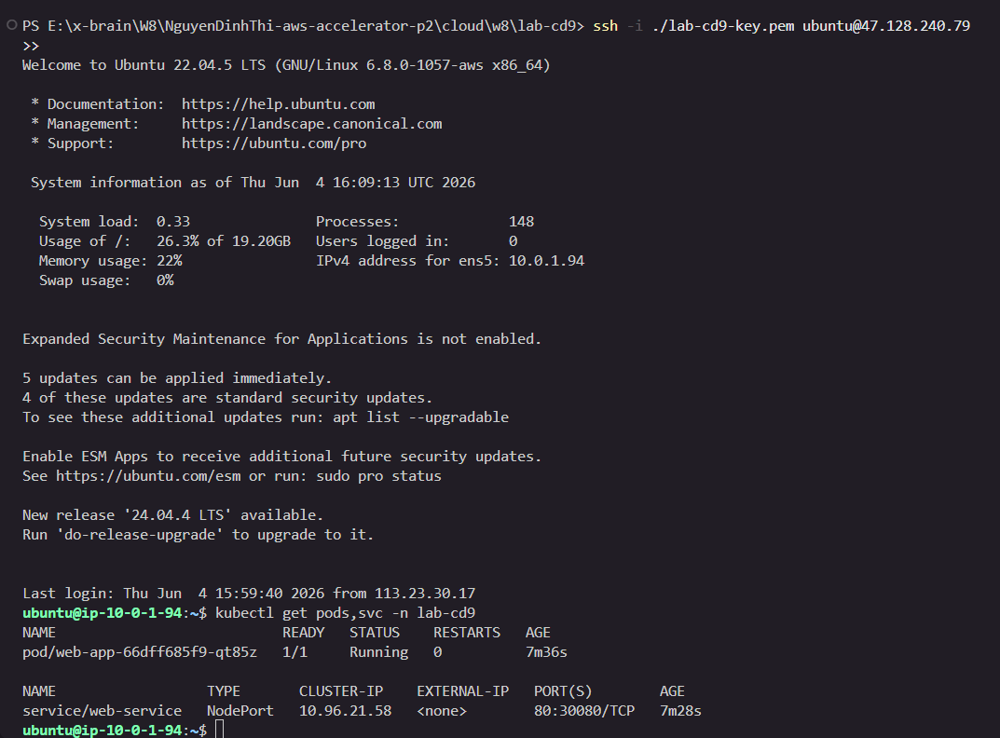

---

### 12. Kết nối RDS từ EC2 thành công
SSH vào EC2 và kết nối thành công vào RDS MySQL để chứng minh EC2 → RDS hoạt động qua Private Subnet.

📸 **Chụp**: Terminal SSH, chạy lệnh:
```bash
mysql -h <rds_endpoint> -u admin -p
# Hoặc nếu chưa cài mysql client:
sudo apt-get install -y mysql-client
mysql -h lab-cd9-mysql.xxx.ap-southeast-1.rds.amazonaws.com -u admin -p
```
Thấy kết nối thành công vào MySQL prompt `mysql>`.

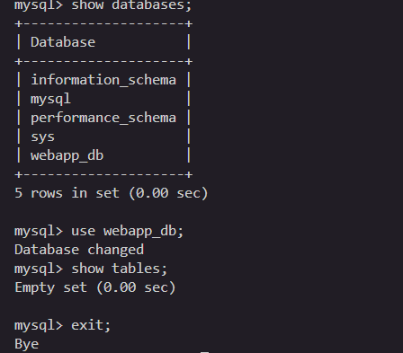

---

### 13. Truy cập ứng dụng qua ALB trên Trình duyệt
Mở URL từ output `alb_dns_name` trên trình duyệt.

📸 **Chụp**: Trình duyệt mở URL `http://lab-cd9-alb-*.elb.amazonaws.com` hiển thị trang web thành công.

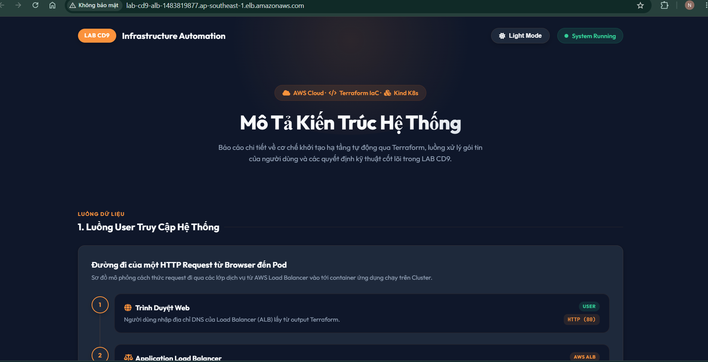

---

### 14. HPA Auto-Scaling (Bonus)
Horizontal Pod Autoscaler tự động co giãn Pod theo CPU.

📸 **Chụp**: Terminal SSH, chạy `kubectl get hpa -n lab-cd9` thấy metrics CPU và số replicas thay đổi.


---

### 15. Dọn dẹp tài nguyên (`terraform destroy`)
Hủy bỏ toàn bộ hạ tầng tránh tốn phí.

📸 **Chụp**: Terminal hiển thị `Destroy complete! Resources: X destroyed.`


