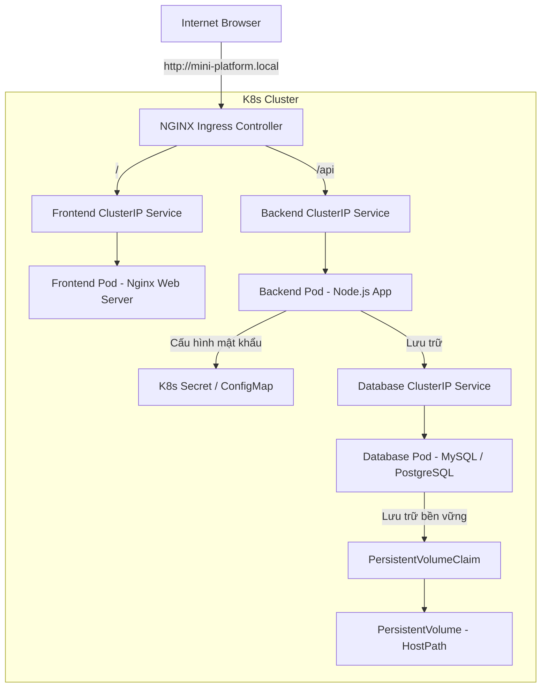

# 🚀 Lab: Mini K8s Platform Trên Minikube - W8 Foundation (Lab)

Tài liệu này hướng dẫn chi tiết cách xây dựng và triển khai một **Nền tảng K8s thu nhỏ (Mini 3-Tier Platform)** hoàn chỉnh trên **Minikube** cục bộ. Đây là bài Lab trọng tâm của đợt Onsite Đà Nẵng giúp bạn làm chủ các cấu hình liên kết phức tạp trong thực tế.

---

## 🏗️ 1. Kiến Trúc Hệ Thống (3-Tier Microservices)

Hệ thống được thiết kế theo mô hình chuẩn bảo mật 3 lớp (3-tier) bao gồm:



---

## 🔒 2. Chính Sách Bảo Mật Mạng (Network Security Policies)

Để bảo vệ hạ tầng tối đa, chúng ta áp dụng mô hình **Zero Trust** thông qua NetworkPolicy:
1.  **Lớp Frontend (Web Server):** Cho phép nhận traffic từ internet (thông qua Ingress Controller) gửi vào cổng HTTP (80).
2.  **Lớp Backend (API App):** **CHỈ** nhận traffic từ lớp Frontend gửi vào. Chặn toàn bộ traffic trực tiếp từ internet hoặc các Pod không phận sự.
3.  **Lớp Database:** **CHỈ** nhận traffic truy vấn dữ liệu từ lớp Backend. Chặn hoàn toàn traffic từ lớp Frontend hoặc bên ngoài.

---

## 💻 3. Các File Manifest Đã Được Thiết Lập Sẵn

Tại thư mục [cloud/w8/lab/](file:///e:/x-brain/W8/NguyenDinhThi-aws-accelerator-p2/cloud/w8/lab), tôi đã tạo sẵn bộ code hoàn chỉnh bao gồm:

*   [db-tier.yaml](file:///e:/x-brain/W8/NguyenDinhThi-aws-accelerator-p2/cloud/w8/lab/db-tier.yaml): Cấu hình Storage (PV & PVC), Database Deployment (Postgres), Service và Secret đi kèm.
*   [backend-tier.yaml](file:///e:/x-brain/W8/NguyenDinhThi-aws-accelerator-p2/cloud/w8/lab/backend-tier.yaml): Cấu hình Deployment lớp xử lý API, nạp credentials từ Secret để kết nối DB, cấu hình Liveness/Readiness probes.
*   [frontend-tier.yaml](file:///e:/x-brain/W8/NguyenDinhThi-aws-accelerator-p2/cloud/w8/lab/frontend-tier.yaml): Cấu hình Web Frontend và Service.
*   [ingress-routing.yaml](file:///e:/x-brain/W8/NguyenDinhThi-aws-accelerator-p2/cloud/w8/lab/ingress-routing.yaml): Ingress định tuyến API (`/api`) về Backend và static site (`/`) về Frontend.
*   [network-policies.yaml](file:///e:/x-brain/W8/NguyenDinhThi-aws-accelerator-p2/cloud/w8/lab/network-policies.yaml): Rào chắn an ninh mạng cô lập 3 lớp.

---

## 🚀 4. Các Bước Chạy & Nghiệm Thu Lab

### Bước 1: Khởi động Minikube với Calico CNI & Ingress
```bash
# Khởi động với CNI Calico để thực thi NetworkPolicy
minikube start --cni=calico

# Kích hoạt Ingress Addon
minikube addons enable ingress
```

### Bước 2: Deploy Lớp Dữ Liệu (Database Tier)
```bash
cd cloud/w8/lab/

# Tạo Storage và DB
kubectl apply -f db-tier.yaml

# Kiểm tra xem Postgres đã chạy thành công chưa
kubectl get pods -l tier=database -w
```

### Bước 3: Deploy Lớp Xử Lý (Backend Tier)
```bash
# Deploy Backend App
kubectl apply -f backend-tier.yaml

# Kiểm tra log xem Backend đã kết nối đến DB thành công chưa
kubectl logs -l tier=backend
```

### Bước 4: Deploy Lớp Giao Diện (Frontend Tier)
```bash
# Deploy Frontend
kubectl apply -f frontend-tier.yaml
```

### Bước 5: Cấu hình Định Tuyến Ngoài (Ingress)
```bash
# Triển khai Ingress
kubectl apply -f ingress-routing.yaml

# Lấy địa chỉ IP của Minikube Cluster
minikube ip
```

Thêm cấu hình trỏ Host trong file `C:\Windows\System32\drivers\etc\hosts`:
```text
<MINIKUBE_IP> mini-platform.local
```

Mở trình duyệt truy cập:
*   Trang chủ: `http://mini-platform.local`
*   API Test: `http://mini-platform.local/api/health`

### Bước 6: Áp dụng Tường Lửa (Network Policy)
```bash
# Deploy rào chắn bảo mật mạng
kubectl apply -f network-policies.yaml
```

*Nghiệm thu: Thử mở một Pod tạm chạy shell để ping trực tiếp tới database. Bạn sẽ thấy kết quả bị chặn đứng hoàn toàn, trong khi backend vẫn kết nối và truy vấn DB bình thường!*
