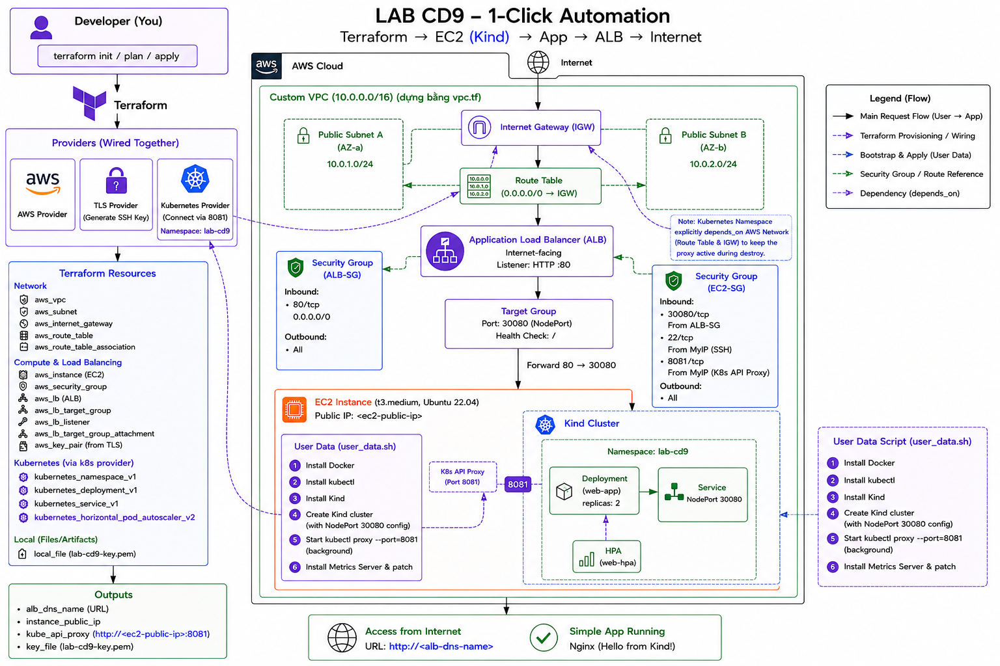
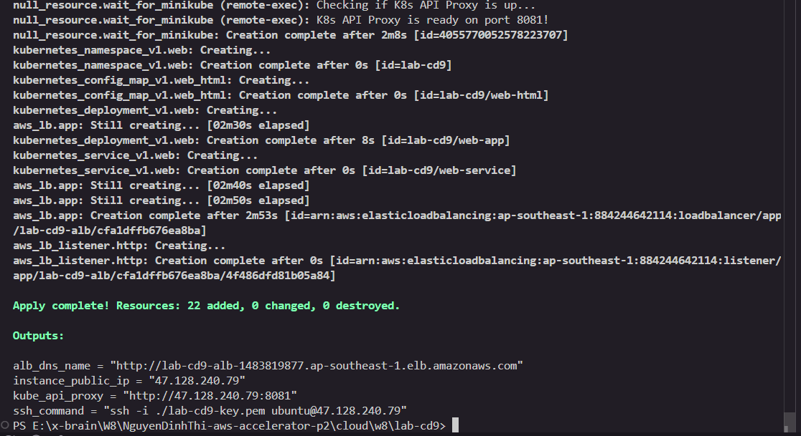
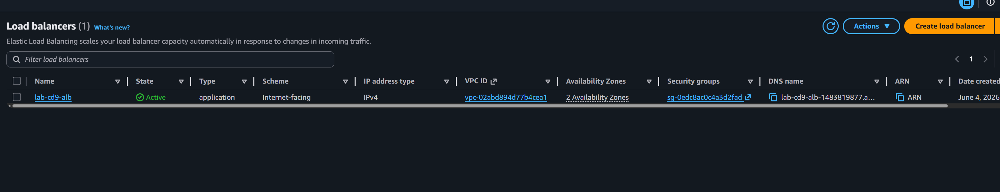
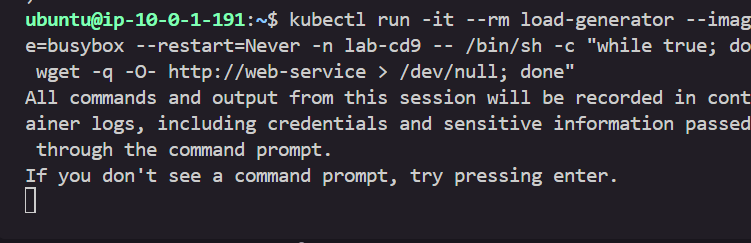
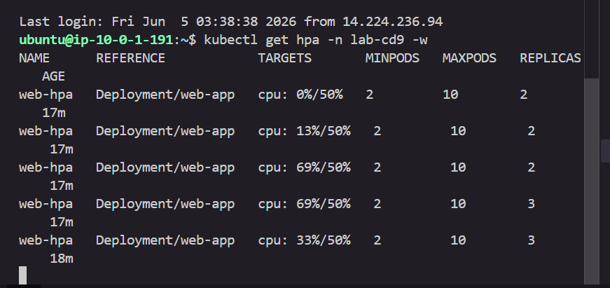
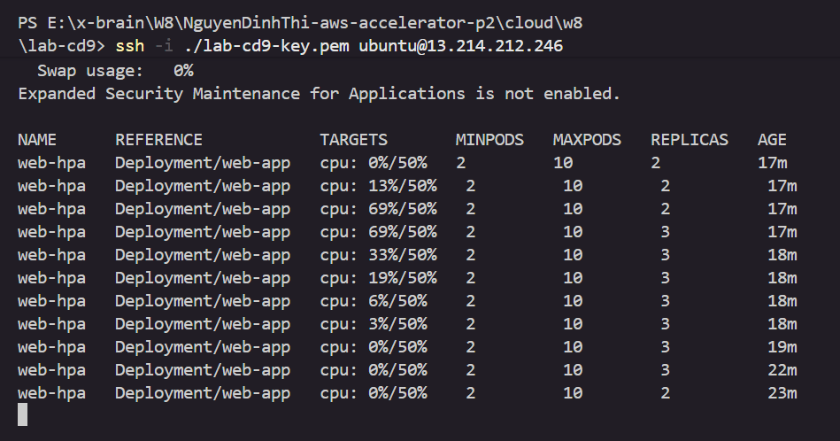
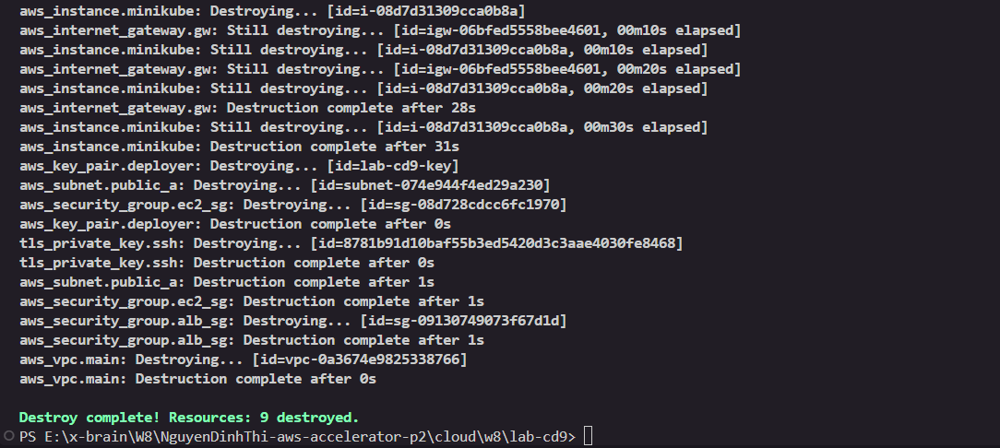

# BÁO CÁO NGHIỆM THU (EVIDENCE REPORT)
## ĐỀ BÀI: K8s on AWS — Terraform 1-Click

* **Học viĂªn:** Nguyá»…n Đình Thi  
* **Dá»± Ă¡n:** LAB CD9 — 1-Click Automation  
* **Nguồn Repo:** [X-BRAIN-CDO-09/NguyenDinhThi-aws-accelerator-p2](https://github.com/X-BRAIN-CDO-09/NguyenDinhThi-aws-accelerator-p2.git)  

---

## I. BẢNG ĐỐI CHIẾU TIÊU CHÍ ĐẠT (ACCEPTANCE CHECKLIST)

DÆ°á»›i Ä‘Ă¢y lĂ  bảng đối chiếu cĂ¡c yĂªu cầu bắt buá»™c của đề bĂ i so vá»›i kết quả thá»±c tế của giải phĂ¡p:

| STT | YĂªu cầu bắt buá»™c của Đề bĂ i | Trạng thĂ¡i | Giải phĂ¡p kỹ thuật thá»±c tế trong Dá»± Ă¡n |
| :--- | :--- | :---: | :--- |
| **1** | Hạ tầng (EC2 + mạng) dá»±ng bằng **Terraform** | **ĐẠT** | Tá»± Ä‘á»™ng tạo Custom VPC, 2 Subnets, Internet Gateway, Route Tables, Security Groups, EC2 vĂ  ALB. |
| **2** | Cụm K8s chạy bằng **minikube hoặc kind** trĂªn EC2 | **ĐẠT** | Sá»­ dụng **Kind** chạy trĂªn Docker Engine của EC2. |
| **3** | App chạy **trong K8s** (khĂ´ng cĂ i thẳng lĂªn EC2) | **ĐẠT** | Ứng dụng chạy dÆ°á»›i dạng Pod trong Namespace `lab-cd9` của cụm Kind K8s. |
| **4** | App truy cập được từ **Internet qua ALB** | **ĐẠT** | ALB lắng nghe cổng 80 cĂ´ng cá»™ng vĂ  forward traffic vĂ o cổng NodePort `30080` của EC2 được Ă¡nh xạ từ Pod. |
| **5** | **Má»™t lệnh** để dá»±ng tất cả (1-click) | **ĐẠT** | Chỉ chạy duy nhất lệnh `terraform apply -auto-approve` để khởi tạo tá»± Ä‘á»™ng toĂ n bá»™ từ đầu đến cuối. |
| **6** | CĂ³ dĂ¹ng **$\ge 2$ provider** (wire provider khĂ¡c) | **ĐẠT** | Sá»­ dụng **4 providers**: `aws`, `tls` (sinh SSH Key), `local` (ghi file `.pem`), vĂ  `kubernetes` (triển khai app). |
| **7** | Dọn được sạch (**destroy**) sau khi xong | **ĐẠT** | Chạy lệnh `terraform destroy -auto-approve` để xĂ³a sạch toĂ n bá»™ 22 tĂ i nguyĂªn trĂ¡nh tốn phĂ­. |

---

## II. GIẢI THÍCH KIẾN TRÚC & QUYẾT ĐỊNH THIẾT KẾ (TRAINER ORAL PREPARATION)

### SÆ¡ đồ Kiến trĂºc Hệ thống (Architecture Diagram)


### 1. CÆ¡ chế "Wire" cĂ¡c Provider trong dá»± Ă¡n
Dá»± Ă¡n thá»±c hiện liĂªn kết (wire) chặt chẽ giữa cĂ¡c Provider Ä‘á»™c lập:
* **TLS Provider ➔ AWS Provider**: TĂ i nguyĂªn `tls_private_key.ssh` sinh khĂ³a Public Key trá»±c tiếp trong bá»™ nhá»› RAM, sau Ä‘Ă³ truyền kết quả sang lĂ m tham số đầu vĂ o cho `aws_key_pair.deployer` để nạp lĂªn AWS. KhĂ³a Private Key được `local_file` ghi xuống ổ cứng dạng `.pem` để Dev sá»­ dụng kết nối SSH.
* **AWS Provider ➔ Kubernetes Provider**: 
  - Khối `provider "kubernetes"` sá»­ dụng địa chỉ Host cấu hình Ä‘á»™ng: `http://${aws_instance.minikube.public_ip}:8081`.
  - IP của EC2 được sinh ra bởi AWS Provider sẽ tá»± Ä‘á»™ng được truyền vĂ o lĂ m tham số đầu cuối cho Kubernetes Provider kết nối.

### 2. CĂ¡ch kết nối Kubernetes vá»›i ALB (Expose Network ra Host)
* **ThĂ¡ch thức**: Cluster chạy bằng Kind nằm trong mạng cĂ´ lập của Docker. ALB ngoĂ i Internet khĂ´ng thể trỏ trá»±c tiếp vĂ o IP ná»™i bá»™ của Container Pod.
* **Giải phĂ¡p**: 
  1. Trong `user_data.sh`, cụm Kind được khởi tạo vá»›i cấu hình `extraPortMappings` Ă¡nh xạ cổng NodePort `30080` của container control-plane ra cổng `30080` của mĂ¡y chủ EC2.
  2. Bảng mục tiĂªu của Load Balancer (`aws_lb_target_group`) được cấu hình trỏ vĂ o cổng `30080` của mĂ¡y chủ EC2.
  3. Khi User truy cập ALB (Port 80) ➔ ALB chuyển tiếp tá»›i EC2 (Port 30080) ➔ Host EC2 định tuyến tiếp vĂ o Service NodePort (Port 30080) ➔ Đi tá»›i Pod ứng dụng (Port 80).

### 3. Giải quyết bĂ i toĂ¡n phụ thuá»™c thời gian (Dependency & Bootstrapping)
* Nếu gọi Kubernetes Provider ngay từ đầu, Terraform sẽ bĂ¡o lá»—i do cụm K8s chÆ°a tồn tại trĂªn mĂ¡y ảo EC2.
* **Giải phĂ¡p**: Sá»­ dụng tĂ i nguyĂªn đồng bá»™ trung gian `null_resource.wait_for_minikube`. TĂ i nguyĂªn nĂ y bắt buá»™c phải đợi EC2 khởi tạo xong (`depends_on = [aws_instance.minikube]`), sau Ä‘Ă³ thá»±c hiện SSH vĂ o chạy lệnh `sudo cloud-init status --wait` để chờ script `user_data.sh` cĂ i đặt K8s hoĂ n tất.
* CĂ¡c tĂ i nguyĂªn Kubernetes trong file `kubernetes.tf` đều khai bĂ¡o `depends_on = [null_resource.wait_for_minikube]` để đảm bảo chĂºng chỉ chạy sau khi cụm K8s Ä‘Ă£ sẵn sĂ ng tiếp nhận kết nối.

---

## III. BẰNG CHỨNG THỰC THI (DELIVERABLES & SCREENSHOTS)

### 1. Khởi tạo Dá»± Ă¡n (`terraform init`)
Lệnh khởi tạo tải thĂ nh cĂ´ng cả 4 providers cần thiết về local.

* **Minh chứng thực tế**:


---

### 2. Xem Kế hoạch Triển khai (`terraform plan`)
Terraform xĂ¢y dá»±ng thĂ nh cĂ´ng đồ thị phụ thuá»™c vĂ  bĂ¡o cĂ¡o sẽ tạo má»›i 22 tĂ i nguyĂªn.

* **Minh chứng thực tế**:


---

### 3. Triển khai 1-Click (`terraform apply`)
QuĂ¡ trình cĂ i đặt tá»± Ä‘á»™ng từ hạ tầng đến ứng dụng chạy hoĂ n tất sau khoảng 3-5 phĂºt.

* **Minh chứng thực tế**:



---

### 4. MĂ¡y chủ EC2 vĂ  Load Balancer trạng thĂ¡i Running/Active trĂªn AWS Console
XĂ¡c minh trá»±c quan trĂªn giao diện AWS Web Console để chứng minh tĂ i nguyĂªn thá»±c tế Ä‘Ă£ chạy.

* **Minh chứng EC2**:


* **Minh chứng ALB**:



---

### 5. Ứng dụng thá»±c sá»± chạy trong cụm K8s (KhĂ´ng cĂ i thẳng EC2)
SSH vĂ o EC2 kiểm tra trạng thĂ¡i Pods vĂ  Services để chứng minh ứng dụng được cĂ´ lập an toĂ n trong Kubernetes.

* **Minh chứng thực tế**:


---

### 6. Truy cập ứng dụng qua Load Balancer trĂªn Trình duyệt
Mở địa chỉ URL xuất ra từ output `alb_dns_name` trĂªn trình duyệt web.

* **Minh chứng thực tế**:


---

### 7. Nghiệm thu cÆ¡ chế tá»± Ä‘á»™ng co giĂ£n Horizontal Pod Autoscaler (HPA)
Tá»± Ä‘á»™ng tăng số lượng Pod khi CPU quĂ¡ tải vĂ  giảm Pod khi tải hạ nhiệt.

*   **Minh chứng Metrics Server & HPA hoạt động ổn định:**
    Kiểm tra mức tiĂªu thụ CPU/RAM thá»±c tế của cụm:
    ```bash
    ubuntu@ip-10-0-1-191:~$ kubectl top nodes
    NAME                    CPU(cores)   CPU(%)   MEMORY(bytes)   MEMORY(%)   
    lab-cd9-control-plane   111m         5%       657Mi           17%

    ubuntu@ip-10-0-1-191:~$ kubectl top pods -n lab-cd9
    NAME                       CPU(cores)   MEMORY(bytes)   
    web-app-66dff685f9-489w2   1m           3Mi
    web-app-66dff685f9-d579k   1m           3Mi
    ```
    Trạng thĂ¡i HPA ban đầu (nhận diện thĂ nh cĂ´ng `cpu: 0%/50%`):
    ```bash
    ubuntu@ip-10-0-1-191:~$ kubectl get hpa -n lab-cd9
    NAME      REFERENCE            TARGETS       MINPODS   MAXPODS   REPLICAS   AGE
    web-hpa   Deployment/web-app   cpu: 0%/50%   2         10        2          6m49s
    ```

*   **Minh chứng tá»± Ä‘á»™ng Co giĂ£n Pod (Scale Out) khi stress test:**
    Chạy Pod tạo tải vĂ´ hạn để đẩy CPU vượt ngưỡng:
    ```bash
    kubectl run -it --rm load-generator --image=busybox --restart=Never -n lab-cd9 -- /bin/sh -c "while true; do wget -q -O- http://web-service > /dev/null; done"
    ```
    *Minh chứng thá»±c thi lệnh chạy vĂ²ng lặp vĂ´ hạn tạo tải:*
    
    
    
    GiĂ¡m sĂ¡t Ä‘á»™ng (`kubectl get hpa -n lab-cd9 -w`), CPU tăng lĂªn **69%** vĂ  số lượng bản sao nĂ¢ng lĂªn **3 Pods** thĂ nh cĂ´ng:
    ```bash
    ubuntu@ip-10-0-1-191:~$ kubectl get hpa -n lab-cd9 -w
    NAME      REFERENCE            TARGETS       MINPODS   MAXPODS   REPLICAS   AGE
    web-hpa   Deployment/web-app   cpu: 0%/50%   2         10        2          6m54s
    web-hpa   Deployment/web-app   cpu: 13%/50%  2         10        2          17m
    web-hpa   Deployment/web-app   cpu: 69%/50%  2         10        2          17m
    web-hpa   Deployment/web-app   cpu: 69%/50%  2         10        3          17m  # đŸš€ Scale out lĂªn 3 Pods thĂ nh cĂ´ng!
    web-hpa   Deployment/web-app   cpu: 33%/50%  2         10        3          18m  # Tải hạ về 33% nhờ chia sẻ tải
    ```
    *Minh chứng HPA nhận diện CPU đạt 69% vĂ  tá»± Ä‘á»™ng kĂ­ch hoạt Scale Out lĂªn 3 Pods:*
    
    
    
    *Minh chứng HPA tá»± Ä‘á»™ng hạ số lượng Pod về 2 (Scale In) sau khi kết thĂºc tạo tải:*
    
    

---

### 8. Dọn dẹp sạch sẽ tĂ i nguyĂªn (`terraform destroy`)
Hủy bỏ toĂ n bá»™ hạ tầng để trĂ¡nh tốn phĂ­.

* **Minh chứng thực tế**:

