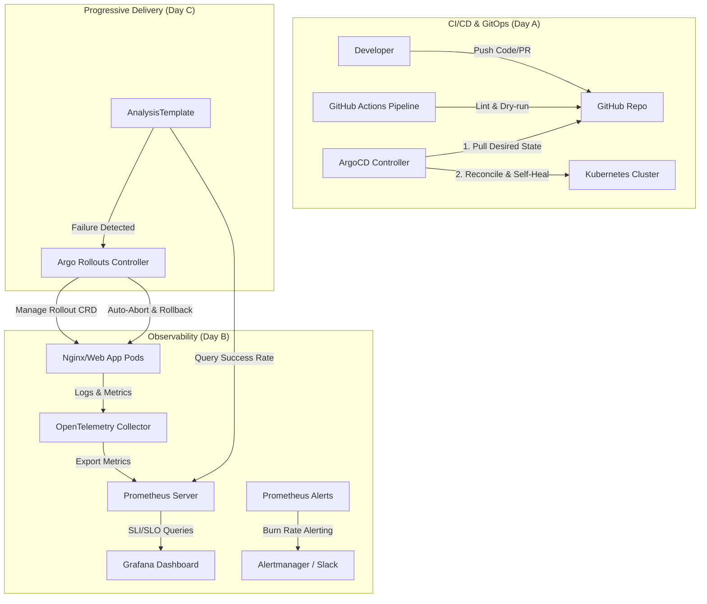

# Hướng Dẫn Tự Học & Ôn Tập Tuần 9: Deliver Smartly

Tuần học này tập trung vào triết lý **Deliver Smartly (Bàn giao thông minh)** trong DevOps và Cloud Engineering. Mục tiêu cốt lõi là chuyển đổi phương thức triển khai phần mềm từ thủ công, thiếu giám sát và nhiều rủi ro sang mô hình tự động hóa hoàn toàn bằng GitOps, đo lường độ tin cậy dịch vụ qua Observability (SLI/SLO) và quản trị rủi ro phát hành qua Progressive Delivery (Canary Deploy + Auto-rollback).

---

## 🗺️ Bản Đồ Kiến Thức Tổng Quan (Architecture Mindmap)



---

## 1. Day A: GitOps & CI/CD (Triển Khai Dựa Trên Khai Báo)

### 🛠️ Tech Stack:
*   **GitOps Agent:** ArgoCD
*   **CI Engine:** GitHub Actions (kube-linter, dry-run validation)
*   **Infrastructure/App Manifests:** K8s YAML (Namespaces, ConfigMaps, Deployments, Services)

### ❌ Vấn Đề Thực Tế (Problem Statement)
Trong mô hình triển khai truyền thống (Push Model):
1.  **Rủi ro bảo mật:** Các công cụ CI (như Jenkins, GitLab CI) cần giữ quyền truy cập tối cao (`kubeconfig`) để đẩy cấu hình xuống Cluster. Nếu máy chủ CI bị tấn công, toàn bộ Cluster sẽ bị kiểm soát.
2.  **Configuration Drift (Lệch cấu hình):** Thành viên trong đội ngũ có thể dùng lệnh `kubectl edit` hoặc `kubectl apply` để sửa đổi trực tiếp trên Cluster. Khi đó, mã nguồn lưu trên Git và trạng thái chạy thực tế của hệ thống không còn đồng bộ với nhau.
3.  **Khó khôi phục trạng thái:** Nếu Cluster bị hỏng, việc tái thiết lập lại toàn bộ ứng dụng từ đầu mất nhiều thời gian vì không có nguồn dữ liệu chuẩn duy nhất (Single Source of Truth).

### ✅ Cách Giải Quyết & Luồng Hoạt Động (Solution & Workflow)
GitOps giải quyết vấn đề này bằng cơ chế **Pull Model**:
*   **Single Source of Truth:** Trạng thái mong muốn (Desired State) của toàn bộ hệ thống được khai báo 100% trong Git.
*   **ArgoCD hoạt động bên trong Cluster:** ArgoCD liên tục kiểm tra Git và so sánh trạng thái khai báo với trạng thái thực tế của Cluster.
*   **Auto-Sync & Self-Healing:** Nếu có sự sai lệch (như ai đó xóa Pod hoặc sửa Service thủ công), ArgoCD sẽ tự động áp dụng lại cấu hình từ Git để đưa hệ thống về trạng thái chuẩn, ngăn chặn hoàn toàn hiện tượng lệch cấu hình.
*   **GitHub Actions CI:** Đóng vai trò là chốt chặn kiểm duyệt chất lượng file manifest. Trước khi Pull Request được duyệt để merge vào nhánh `main`, pipeline sẽ tự động chạy **kube-linter** để kiểm tra bảo mật/best practices và chạy lệnh `kubectl apply --dry-run=client` để xác thực định dạng YAML.

---

## 2. Day B: Observability & SLO/SLI (Quan Sát Hệ Thống Bằng Ngân Sách Lỗi)

### 🛠️ Tech Stack:
*   **Telemetry Agent:** OpenTelemetry Collector
*   **Metrics Database:** Prometheus
*   **Visualization:** Grafana
*   **SLO Framework:** Multi-window Multi-burn-rate Alerting

### ❌ Vấn Đề Thực Tế (Problem Statement)
1.  **Thiếu góc nhìn từ người dùng:** Việc giám sát các chỉ số cơ bản của hạ tầng (như CPU > 80% hoặc RAM > 90%) không cho biết dịch vụ thực tế có hoạt động tốt đối với khách hàng hay không. Một Pod có CPU cao vẫn có thể phản hồi nhanh, ngược lại một Pod có CPU thấp có thể đang trả về lỗi 500 cho khách hàng.
2.  **Tràn ngập cảnh báo ảo (Alert Fatigue):** Kỹ sư nhận hàng trăm thông báo mỗi ngày từ các cảnh báo ngưỡng tĩnh đơn giản, dẫn đến việc bỏ qua các cảnh báo thực sự quan trọng.
3.  **Thiếu cơ sở ra quyết định:** Không có thước đo định lượng để quyết định khi nào cần ưu tiên sửa lỗi (Stability) hơn là phát triển tính năng mới (Velocity).

### ✅ Cách Giải Quyết & Luồng Hoạt Động (Solution & Workflow)
Sử dụng phương pháp luận **SLI/SLO** và khái niệm **Error Budget**:

#### A. Thuật ngữ cốt lõi:
*   **SLI (Service Level Indicator):** Chỉ số đo lường hiệu năng dịch vụ thực tế.
    $$\text{SLI (Availability)} = \frac{\text{Số request thành công (Status code 2xx, 3xx, 404...)}}{\text{Tổng số request nhận được}} \times 100\%$$
*   **SLO (Service Level Objective):** Mục tiêu độ tin cậy mong muốn của dịch vụ trong một khoảng thời gian (ví dụ: 30 ngày).
    *   *Ví dụ:* SLO Availability = 99.0% trong 30 ngày.
*   **Error Budget (Ngân sách lỗi):** Lượng sai số tối đa được cho phép để hệ thống gặp lỗi mà không vi phạm SLO.
    $$\text{Error Budget} = 100\% - \text{SLO} = 100\% - 99\% = 1\%$$
    *   Nếu dịch vụ nhận 1.000.000 request trong 30 ngày, ngân sách lỗi cho phép tối đa 10.000 request thất bại.

#### B. Burn Rate Alerting (Cảnh báo tốc độ tiêu thụ ngân sách lỗi):
Thay vì đợi đến khi hết sạch 100% ngân sách lỗi mới cảnh báo, chúng ta đo lường **tốc độ tiêu thụ** ngân sách lỗi (Burn Rate):
*   **Burn Rate = 1:** Ngân sách lỗi sẽ hết vừa vặn trong đúng chu kỳ SLO (ví dụ: 30 ngày).
*   **Burn Rate = 14.4 (Fast Burn):** Ngân sách lỗi sẽ cạn sạch trong vòng 50 giờ. Điều này phản ánh sự cố nghiêm trọng (như sập database), cần cảnh báo ngay lập tức qua PagerDuty/Slack để cứu hệ thống.
*   **Burn Rate = 6 (Slow Burn):** Ngân sách lỗi sẽ hết trong 120 giờ. Đây là lỗi rò rỉ âm thầm (như một API lỗi nhẹ), cần tạo ticket cảnh báo để xử lý trong ngày.
*   **Multi-window Multi-burn-rate Alerting:** Cảnh báo chỉ kích hoạt khi cả hai cửa sổ thời gian (ví dụ: cửa sổ dài 1 giờ và cửa sổ ngắn 5 phút đối với Fast Burn) đều phát hiện tốc độ tiêu thụ vượt ngưỡng. Kỹ thuật này giúp loại bỏ hoàn toàn các cảnh báo giả do lỗi mạng nhất thời gây ra.

#### C. Kiến trúc OpenTelemetry (OTel):
*   Ứng dụng xuất data dạng chuẩn OTLP.
*   **OTel Collector** thu thập các luồng dữ liệu thô này, thực hiện xử lý gom cụm (batching), lọc bớt dữ liệu thừa (filtering), và đẩy về Prometheus để lưu trữ.

---

## 3. Day C: Progressive Delivery (Phát Hành Từng Phần & Tự Động Hủy Bỏ)

### 🛠️ Tech Stack:
*   **Deployment Controller:** Argo Rollouts (thay thế K8s Deployment mặc định)
*   **Traffic Shifting Strategy:** Canary
*   **Automated Verification:** AnalysisTemplate (sử dụng PromQL query)

### ❌ Vấn Đề Thực Tế (Problem Statement)
Khi cập nhật phiên bản mới của ứng dụng:
1.  **Rủi ro cao ("Tất cả hoặc không có gì"):** Chiến lược mặc định của Kubernetes (Rolling Update) thay thế dần các Pod cũ bằng Pod mới. Nếu phiên bản mới có lỗi nghiêm trọng tiềm ẩn (chỉ xuất hiện dưới tải cao hoặc trong luồng logic đặc biệt), toàn bộ người dùng sẽ phải chịu lỗi trước khi đội ngũ vận hành phát hiện và kích hoạt rollback thủ công.
2.  **Phản ứng chậm:** Thời gian phát hiện lỗi, phân tích nguyên nhân và chạy lệnh rollback thủ công có thể mất từ vài chục phút đến vài giờ, gây ảnh hưởng trực tiếp đến uy tín doanh nghiệp.

### ✅ Cách Giải Quyết & Luồng Hoạt Động (Solution & Workflow)
Sử dụng **Argo Rollouts** phối hợp với **Prometheus** để thực thi tự động hóa hoàn toàn quy trình phát hành:

1.  **Phân luồng lưu lượng (Canary steps):**
    *   Argo Rollouts định nghĩa lộ trình tăng dần lượng tải tiếp cận phiên bản mới (ví dụ: chuyển 20% traffic sang bản mới và tạm dừng 30 giây để kiểm định; nếu ổn định thì nâng lên 50% traffic trong 30 giây; cuối cùng mới đưa lên 100%).
2.  **Đánh giá tự động (Continuous Analysis):**
    *   Trong suốt quá trình dịch chuyển traffic, một `AnalysisTemplate` liên tục chạy ngầm các câu lệnh PromQL truy vấn Prometheus để đo đạc tỷ lệ request thành công (Success Rate) hoặc tốc độ tiêu thụ ngân sách lỗi (Burn Rate) của riêng các Pod phiên bản mới.
3.  **Tự động thu hồi (Auto-Abort & Rollback):**
    *   If tỷ lệ thành công của phiên bản mới thấp hơn ngưỡng an toàn (ví dụ: < 95%) hoặc sinh ra lỗi, Argo Rollouts lập tức đánh dấu đợt rollout thất bại (Status: Failed), ngay lập tức chuyển hướng 100% traffic trở lại các Pod phiên bản cũ an toàn và tự động tắt các Pod lỗi. Quy trình này diễn ra hoàn toàn tự động chỉ trong vài giây mà không cần con người can thiệp.

---

## 🚀 Hướng Dẫn Từng Bước Thực Hành Lại Lab

Thư mục [w9/lab/](file:///e:/x-brain/W8/NguyenDinhThi-aws-accelerator-p2/cloud/w9/lab/) chứa toàn bộ mã nguồn tích hợp giúp bạn triển khai mô hình này trên môi trường local (Minikube).

### Bước 1: Khởi động môi trường hạ tầng
Chạy script cài đặt tự động để cấu hình ArgoCD, Argo Rollouts, Prometheus, Grafana và cài đặt ứng dụng mẫu thông qua GitOps:
```bash
# Di chuyển đến thư mục lab
cd e:/x-brain/W8/NguyenDinhThi-aws-accelerator-p2/cloud/w9/lab

# Phân quyền thực thi và khởi chạy script setup
chmod +x setup-all.sh
./setup-all.sh
```
*Script sẽ tự động tạo các namespace, cài đặt Helm chart cho Prometheus/Grafana, thiết lập cấu hình OTel Collector, và tạo các tài nguyên ArgoCD Application.*

### Bước 2: Quan sát ứng dụng và các công cụ
Sau khi script hoàn thành, ghi lại các địa chỉ IP và Port được hiển thị trên terminal để:
1.  Truy cập giao diện **ArgoCD** để xem mô hình đồ thị đồng bộ ứng dụng.
2.  Mở dashboard **Grafana** để theo dõi biểu đồ SLO Availability và mức độ tiêu hao Error Budget theo thời gian thực.

### Bước 3: Chạy giả lập tải (Load Test)
Sử dụng công cụ **k6** để gửi traffic liên tục vào ứng dụng mẫu. File cấu hình k6 (`k6-load-test.js`) đã được thiết lập để cố ý gửi khoảng 15% request lỗi (truy cập vào đường dẫn không tồn tại `/invalid-page-to-trigger-rollback`) nhằm giả lập một phiên bản lỗi.
```bash
# Đọc IP Minikube và chạy k6 gửi traffic giả lập tải lỗi
# Thay <IP_MINIKUBE> bằng địa chỉ IP Minikube của bạn (ví dụ: 192.168.49.2)
TARGET_URL=http://<IP_MINIKUBE>:30080 k6 run k6-load-test.js
```

### Bước 4: Xem quá trình tự động Abort/Rollback
Trong lúc k6 đang chạy, mở một terminal mới và gõ lệnh sau để theo dõi trạng thái Rollout:
```bash
kubectl argo rollouts get rollout simple-app -n app --watch
```
**Kịch bản xảy ra:**
1.  Argo Rollouts bắt đầu cập nhật ứng dụng mới và định tuyến 20% traffic của k6 vào phiên bản này.
2.  k6 gửi các request lỗi dẫn đến tỷ lệ thành công của ứng dụng tụt giảm.
3.  `AnalysisTemplate` truy vấn Prometheus và phát hiện `success-rate < 95%`.
4.  Argo Rollouts lập tức hủy bỏ tiến trình (Abort), gỡ bỏ 20% traffic khỏi phiên bản mới, đưa hệ thống về trạng thái ban đầu và đánh dấu trạng thái rollout là `Degraded` / `Aborted`.
5.  Xem Dashboard Grafana để quan sát biểu đồ Error Budget sụt giảm và hồi phục trở lại sau khi tự động rollback thành công.

---

## 💡 Bài Học Rút Ra & Thực Hành Tốt Nhất

1.  **State the constraint first, then debate:** Trước khi bắt đầu xây dựng giải pháp công nghệ kỹ thuật phức tạp, hãy làm rõ các ràng buộc của dự án (thời gian, con người, tài chính). Lựa chọn giải pháp đơn giản nhất (như Monolith) đáp ứng được ràng buộc thay vì sa đà vào các kiến trúc quá tầm (như Microservices).
2.  **RACI Framework:** Luôn phân định rõ vai trò khi làm việc nhóm để giải quyết tranh chấp ý kiến:
    *   **Accountable (A):** Người chịu trách nhiệm phê duyệt và kết quả cuối cùng (chỉ có 1 người).
    *   **Responsible (R):** Người trực tiếp thực hiện công việc.
    *   **Consulted (C):** Người được tham khảo ý kiến.
    *   **Informed (I):** Người cần được thông báo kết quả.
3.  **No ticket, no work:** Mọi quyết định kỹ thuật phải được ghi nhận thành tài liệu lưu trữ (ADR) và phân rã thành các Jira ticket cụ thể để theo dõi tiến độ chính xác.
