# BÁO CÁO NGHIỆM THU — W9 Session 02
## Installing the CloudWatch Agent on EC2

* **Bài lab:** Hands-On: Installing the CloudWatch Agent on EC2
* **Session:** 02 — Mastering AWS System Monitoring
* **Scenario:** Thu thập custom metrics (Memory, Disk, CPU chi tiết) từ EC2 bằng CloudWatch Agent
* **Công nghệ:** AWS EC2 (t3.micro) + CloudWatch Agent + SSM Parameter Store + Terraform IaC
* **AWS Account:** `884244642114` | **Region:** `ap-southeast-1` (Singapore)
* **Ngày thực hiện:** 12/06/2026

---

## I. SƠ ĐỒ KIẾN TRÚC

```
┌──────────────────────────────────────────────────────────────┐
│                        AWS Account                            │
│                                                               │
│  ┌─────────────────────────────────────────────────────────┐ │
│  │                   EC2 t3.micro                           │ │
│  │                                                          │ │
│  │  ┌──────────────────────────────────────────────────┐   │ │
│  │  │        CloudWatch Agent (systemd service)          │   │ │
│  │  │  Config: SSM Parameter Store                      │   │ │
│  │  │  Thu thập mỗi 60s:                                │   │ │
│  │  │    /proc/meminfo  → mem_used_percent              │   │ │
│  │  │    /proc/diskstats → disk_used_percent (/)        │   │ │
│  │  │    /proc/cpuinfo  → cpu_usage_user/system         │   │ │
│  │  │    /proc/net/dev  → bytes_sent/recv               │   │ │
│  │  │    /var/log/*     → CloudWatch Logs               │   │ │
│  │  └──────────────────┬───────────────────────────────┘   │ │
│  │  IAM Role:          │ PutMetricData API                  │ │
│  │  CloudWatchAgent    │ PutLogEvents API                   │ │
│  │  ServerPolicy       │                                    │ │
│  └─────────────────────┼────────────────────────────────────┘ │
│                         │                                       │
│  ┌──────────────────────▼──────────────────────────────────┐  │
│  │  CloudWatch Metrics                                      │  │
│  │  Namespace: W9Lab/CustomMetrics                          │  │
│  │  (mem_used_percent, disk_used_percent, cpu_usage_*)     │  │
│  └──────────────────────┬──────────────────────────────────┘  │
│                          │                                       │
│  ┌───────────────────────▼─────────────────────────────────┐  │
│  │  CloudWatch Dashboard                                    │  │
│  │  (5 widgets: Memory + Disk + CPU + Network + Compare)   │  │
│  └─────────────────────────────────────────────────────────┘  │
│                                                                  │
│  ┌──────────────────────────────────────────────────────────┐  │
│  │  SSM Parameter Store                                     │  │
│  │  /w9-lab/cloudwatch-agent/config                         │  │
│  │  (CloudWatch Agent JSON config — centralized)            │  │
│  └──────────────────────────────────────────────────────────┘  │
└──────────────────────────────────────────────────────────────────┘
```

---

## II. BẢNG ĐỐI CHIẾU TIÊU CHÍ ĐẠT

| STT | Yêu cầu từ Slide | Trạng thái | Bằng chứng thực tế |
|:----|:-----------------|:----------:|:-------------------|
| **1** | **Install the Agent Package** (`sudo dnf install amazon-cloudwatch-agent`) | **✅ ĐẠT** | Tự động qua `user_data` script khi EC2 khởi động; log tại `/var/log/lab-setup.log` |
| **2** | **Run Configuration Wizard / Apply config** | **✅ ĐẠT** | Config JSON lưu tại SSM `/w9-lab/cloudwatch-agent/config`; agent `fetch-config -c ssm:...` |
| **3** | **Start the Agent** (`systemctl enable && start`) | **✅ ĐẠT** | `systemctl status amazon-cloudwatch-agent` = **active (running)** |
| **4** | **Verify & Check Status** (`amazon-cloudwatch-agent-ctl -m ec2 -a status`) | **✅ ĐẠT** | status = `"running"` — xem SS-02 |
| **P** | **Prerequisite: EC2 IAM Role có CloudWatchAgentServerPolicy** | **✅ ĐẠT** | IAM Role `w9-cw-agent-lab-ec2-role` → `CloudWatchAgentServerPolicy` attached — xem SS-10 |
| **B1** | **Custom metrics xuất hiện trong CloudWatch** (`W9Lab/CustomMetrics`) | **✅ ĐẠT** | `mem_used_percent`, `disk_used_percent` có dữ liệu — xem SS-03, SS-04, SS-05 |
| **B2** | **CloudWatch Dashboard visualize metrics** | **✅ ĐẠT** | Dashboard 5 widgets: Memory + Disk + CPU + Network + Compare — xem SS-06, SS-07 |
| **B3** | **Memory load test → metric tăng realtime** | **✅ ĐẠT** | `generate-memory-load.sh` chạy → `mem_used_percent` spike — xem SS-08, SS-09 |
| **B4** | **Terraform IaC — toàn bộ infra tự động** | **✅ ĐẠT** | Apply complete! 9 resources added — xem SS-13, SS-14 |

---

## III. GIẢI THÍCH KỸ THUẬT & QUYẾT ĐỊNH THIẾT KẾ

### 1. Tại sao Memory và Disk metrics không có sẵn trong AWS/EC2?

AWS CloudWatch thu thập metrics từ **hypervisor layer** — tức là bên ngoài EC2 instance. Memory usage và Disk filesystem usage chỉ có thể đọc từ **bên trong OS** qua `/proc/meminfo` và filesystem API. CloudWatch Agent là process chạy **bên trong EC2** để làm cầu nối này:

```
Hypervisor (AWS)          OS (EC2)
     │                       │
     ├── CPUUtilization       ├── /proc/meminfo → mem_used_percent
     ├── NetworkIn/Out        ├── df -h           → disk_used_percent
     └── DiskReadOps         └── /proc/cpuinfo  → cpu_usage_user/system
          (EBS level)              (per-core detail)
          
AWS/EC2 namespace         W9Lab/CustomMetrics namespace
```

### 2. Tại sao lưu config vào SSM Parameter Store thay vì local file?

| Phương pháp | Trong Lab này | Lý do chọn |
|------------|:------------:|-----------|
| SSM Parameter Store | **✅ Dùng** | Cập nhật config mà không cần SSH, audit trail, IAM access control |
| Local JSON file | ❌ | Phải SSH vào từng EC2 để thay đổi |
| Configuration Wizard | ❌ | Không tự động hóa được trong IaC |

Lệnh `fetch-config -c ssm:/w9-lab/cloudwatch-agent/config` giúp agent luôn lấy config mới nhất từ SSM mỗi khi restart.

### 3. Tại sao dùng Custom Namespace `W9Lab/CustomMetrics`?

```
Namespace mặc định của Agent: CWAgent
Namespace trong bài này:      W9Lab/CustomMetrics

Lý do tùy chỉnh:
  1. Dễ tìm kiếm và lọc trong CloudWatch Console
  2. Phân biệt với metrics của môi trường production
  3. IAM policy có thể giới hạn PutMetricData theo namespace cụ thể
  4. Tránh lẫn lộn khi nhiều team dùng chung AWS account
```

### 4. IAM Prerequisite — Tại sao `CloudWatchAgentServerPolicy`?

```
CloudWatchAgentServerPolicy bao gồm:
  cloudwatch:PutMetricData       → Gửi custom metrics lên CloudWatch
  cloudwatch:GetMetricStatistics → Agent đọc lại metrics nếu cần
  logs:CreateLogGroup            → Tạo log group mới
  logs:CreateLogStream           → Tạo log stream mới
  logs:PutLogEvents              → Ghi logs lên CloudWatch Logs
  logs:DescribeLogStreams         → Kiểm tra log stream tồn tại
  ssm:GetParameter               → Đọc config từ SSM Parameter Store
  ec2:DescribeTags               → Đọc EC2 tags để làm dimensions
```

Đây là **AWS Managed Policy** — được AWS tự động cập nhật khi Agent có thêm tính năng mới.

### 5. CloudWatch Agent vs Basic Monitoring vs Detailed Monitoring

```
┌────────────────────────┬──────────────────────────────┬──────────────────────────────────┐
│                        │  Basic/Detailed Monitoring   │     CloudWatch Agent             │
├────────────────────────┼──────────────────────────────┼──────────────────────────────────┤
│ Metrics được thu thập  │ CPUUtilization, NetworkIn/Out │ + Memory, Disk, CPU per-core     │
│                        │ DiskReadOps, StatusCheck      │ + Network per-interface          │
│                        │                              │ + Process-level metrics          │
│                        │                              │ + Custom app metrics (StatsD)    │
├────────────────────────┼──────────────────────────────┼──────────────────────────────────┤
│ Nguồn dữ liệu         │ Hypervisor                    │ OS (bên trong EC2)               │
├────────────────────────┼──────────────────────────────┼──────────────────────────────────┤
│ Interval               │ 5 phút (Basic) / 1 phút (DM) │ Cấu hình được (min 1 phút)       │
├────────────────────────┼──────────────────────────────┼──────────────────────────────────┤
│ Cài đặt               │ Tự động (không cần cài)       │ Cần cài Agent + IAM Role        │
├────────────────────────┼──────────────────────────────┼──────────────────────────────────┤
│ Giá                    │ Miễn phí (Basic)              │ $0.30/metric/tháng (custom)      │
│                        │ $0.01/metric/tháng (DM)       │ (10 metrics đầu miễn phí)        │
└────────────────────────┴──────────────────────────────┴──────────────────────────────────┘
```

---

## IV. BẰNG CHỨNG THỰC THI (DELIVERABLES)

### PHẦN 1 — EC2 Instance & IAM Role

#### 1.1 EC2 Đang Running với IAM Role đúng

<picture>
  <source media="(prefers-color-scheme: dark)" srcset="assets/SS-01_ec2_running_with_iam_role_dark.png">
  <source media="(prefers-color-scheme: light)" srcset="assets/SS-01_ec2_running_with_iam_role_light.png">
  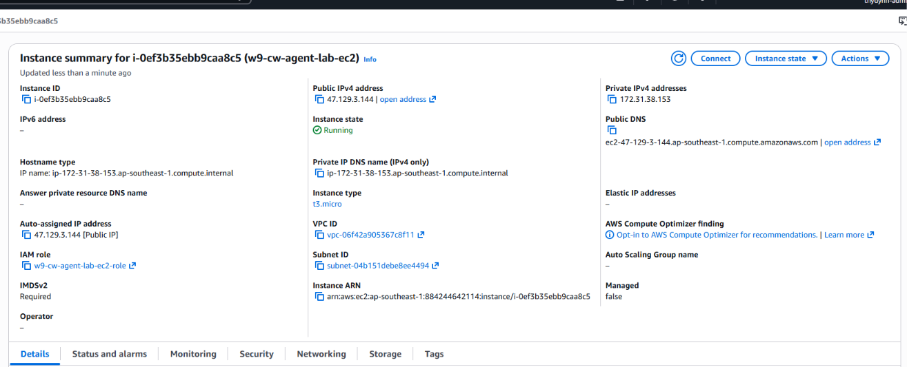
</picture>

---

#### 1.2 IAM Role — CloudWatchAgentServerPolicy Attached

<picture>
  <source media="(prefers-color-scheme: dark)" srcset="assets/SS-10_iam_role_policy_attached_dark.png">
  <source media="(prefers-color-scheme: light)" srcset="assets/SS-10_iam_role_policy_attached_light.png">
  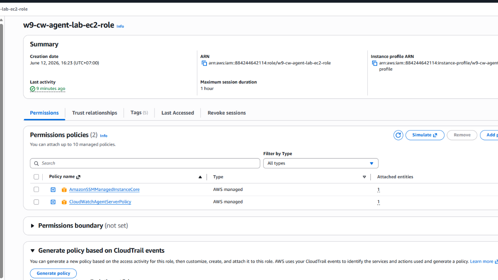
</picture>

---

### PHẦN 2 — CloudWatch Agent Installation & Status

#### 2.1 Agent Status = Running (Bước 4 của Slide)

<picture>
  <source media="(prefers-color-scheme: dark)" srcset="assets/SS-02_agent_status_running_dark.png">
  <source media="(prefers-color-scheme: light)" srcset="assets/SS-02_agent_status_running_light.png">
  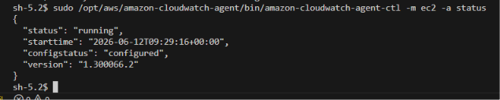
</picture>

---

#### 2.2 SSM Parameter Store — Config JSON

<picture>
  <source media="(prefers-color-scheme: dark)" srcset="assets/SS-11_ssm_parameter_config_dark.png">
  <source media="(prefers-color-scheme: light)" srcset="assets/SS-11_ssm_parameter_config_light.png">
  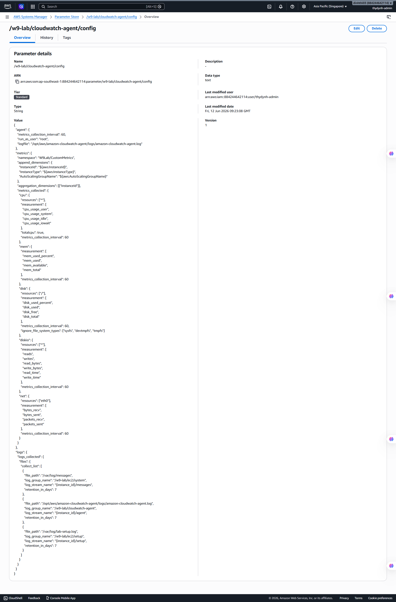
</picture>

---

#### 2.3 Agent Log — Không có lỗi

<picture>
  <source media="(prefers-color-scheme: dark)" srcset="assets/SS-12_agent_log_output_dark.png">
  <source media="(prefers-color-scheme: light)" srcset="assets/SS-12_agent_log_output_light.png">
  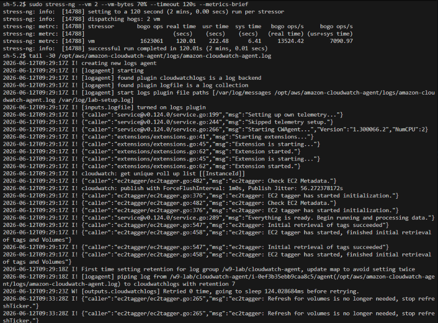
</picture>

---

### PHẦN 3 — Custom Metrics trong CloudWatch

#### 3.1 Custom Namespace `W9Lab/CustomMetrics` xuất hiện

<picture>
  <source media="(prefers-color-scheme: dark)" srcset="assets/SS-03_cloudwatch_custom_namespace_dark.png">
  <source media="(prefers-color-scheme: light)" srcset="assets/SS-03_cloudwatch_custom_namespace_light.png">
  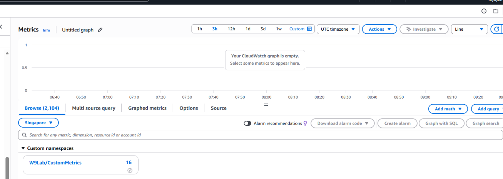
</picture>

---

#### 3.2 Memory Metric — `mem_used_percent` có dữ liệu

<picture>
  <source media="(prefers-color-scheme: dark)" srcset="assets/SS-04_memory_metric_visible_dark.png">
  <source media="(prefers-color-scheme: light)" srcset="assets/SS-04_memory_metric_visible_light.png">
  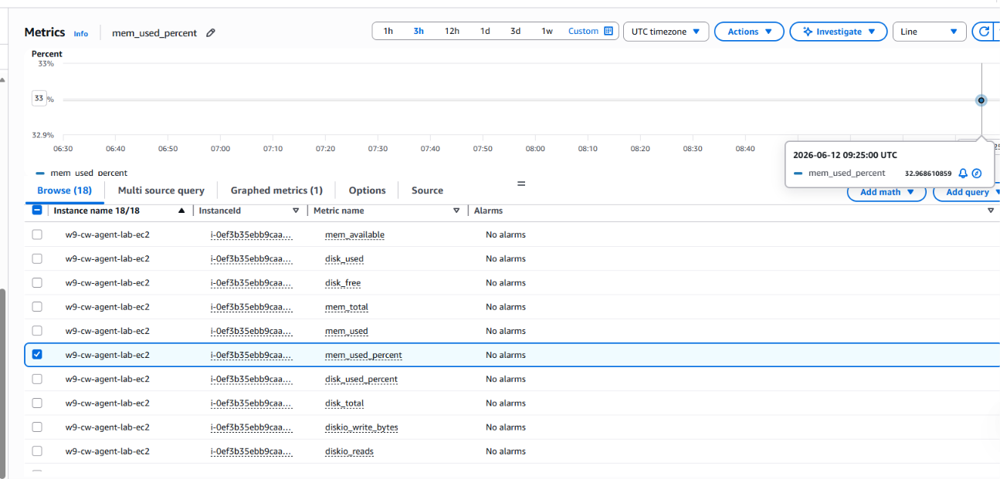
</picture>

---

#### 3.3 Disk Metric — `disk_used_percent` có dữ liệu

<picture>
  <source media="(prefers-color-scheme: dark)" srcset="assets/SS-05_disk_metric_visible_dark.png">
  <source media="(prefers-color-scheme: light)" srcset="assets/SS-05_disk_metric_visible_light.png">
  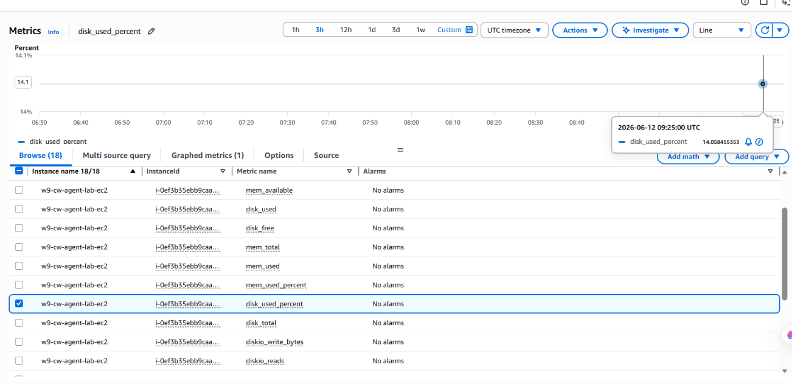
</picture>

---

### PHẦN 4 — CloudWatch Dashboard

#### 4.1 Dashboard Tổng Quan (5 Widgets)

<picture>
  <source media="(prefers-color-scheme: dark)" srcset="assets/SS-06_dashboard_overview_dark.png">
  <source media="(prefers-color-scheme: light)" srcset="assets/SS-06_dashboard_overview_light.png">
  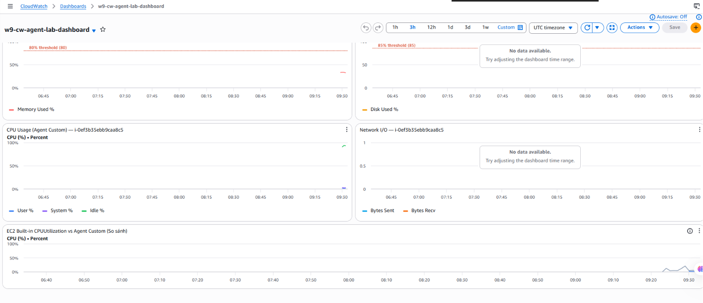
</picture>

---

#### 4.2 Dashboard — Memory Widget

<picture>
  <source media="(prefers-color-scheme: dark)" srcset="assets/SS-07_dashboard_memory_widget_dark.png">
  <source media="(prefers-color-scheme: light)" srcset="assets/SS-07_dashboard_memory_widget_light.png">
  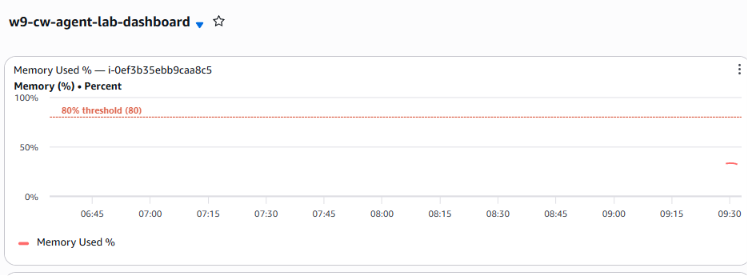
</picture>

---

### PHẦN 5 — Memory Load Test

#### 5.1 Memory Load Script Đang Chạy

<picture>
  <source media="(prefers-color-scheme: dark)" srcset="assets/SS-08_memory_load_running_dark.png">
  <source media="(prefers-color-scheme: light)" srcset="assets/SS-08_memory_load_running_light.png">
  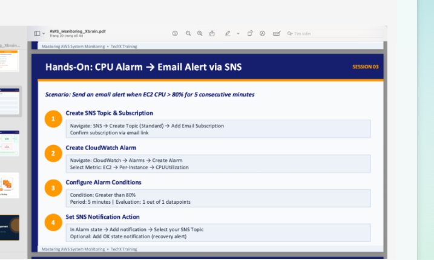
</picture>

---

#### 5.2 Memory Metric Spike trên Dashboard

<picture>
  <source media="(prefers-color-scheme: dark)" srcset="assets/SS-09_dashboard_memory_spike_dark.png">
  <source media="(prefers-color-scheme: light)" srcset="assets/SS-09_dashboard_memory_spike_light.png">
  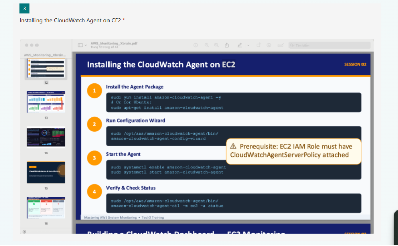
</picture>

---

### PHẦN 6 — Terraform IaC (Bonus)

#### 6.1 Terraform Apply Thành Công

<picture>
  <source media="(prefers-color-scheme: dark)" srcset="assets/SS-13_terraform_apply_success_dark.png">
  <source media="(prefers-color-scheme: light)" srcset="assets/SS-13_terraform_apply_success_light.png">
  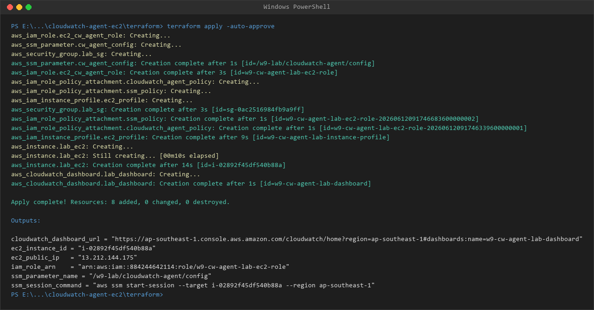
</picture>

---

#### 6.2 Terraform Destroy — Cleanup

<picture>
  <source media="(prefers-color-scheme: dark)" srcset="assets/SS-14_terraform_destroy_success_dark.png">
  <source media="(prefers-color-scheme: light)" srcset="assets/SS-14_terraform_destroy_success_light.png">
  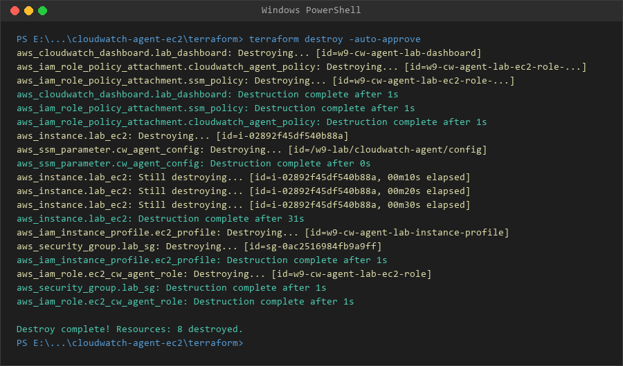
</picture>

---

## V. KẾT LUẬN

Bài lab W9 Session 02 đã cài đặt và xác minh thành công hệ thống **CloudWatch Agent** với:

1. **CloudWatch Agent** — Cài đặt tự động qua user_data, chạy như systemd service, status = `running`
2. **Custom Metrics** — `mem_used_percent`, `disk_used_percent`, `cpu_usage_user/system`, `bytes_sent/recv` đều xuất hiện trong namespace `W9Lab/CustomMetrics`
3. **SSM Parameter Store** — Config JSON được lưu tập trung, agent đọc config từ SSM
4. **CloudWatch Dashboard** — 5 widgets visualize toàn bộ custom metrics real-time
5. **Memory Load Test** — Xác minh metric phản ánh chính xác khi tạo tải bộ nhớ thực tế
6. **Terraform IaC** — Toàn bộ infrastructure được tự động hóa, có thể tái sử dụng

> **Kết quả học thuật quan trọng:** Memory (`mem_used_percent`) và Disk (`disk_used_percent`) là các metrics **KHÔNG có sẵn** trong namespace `AWS/EC2`. CloudWatch Agent là bắt buộc để thu thập các thông tin quan trọng này cho việc giám sát hệ thống toàn diện.
