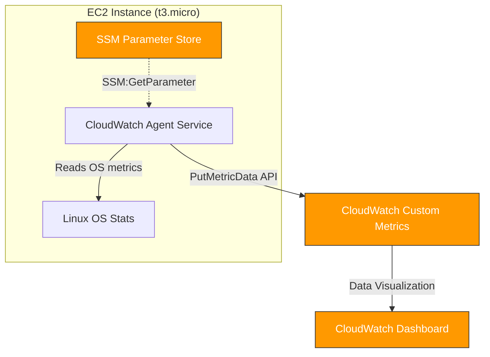

  

# 
📄 BÁO CÁO NGHIỆM THU — W9 SESSION 02

### 
Installing the CloudWatch Agent on EC2

  
  
  

---

## 📋 Thông Tin Tổng Quan

* **Bài thực hành:** Hands-On: Installing the CloudWatch Agent on EC2
* **Session:** 02 — Mastering AWS System Monitoring
* **Mục tiêu:** Thu thập custom metrics (Memory, Disk, CPU chi tiết) từ EC2 bằng CloudWatch Agent.
* **Công nghệ sử dụng:** AWS EC2 (t3.micro) + CloudWatch Agent + SSM Parameter Store + Terraform IaC.
* **Môi trường triển khai:** AWS Account `884244642114` | Region `ap-southeast-1` (Singapore).

---

## 📐 Sơ Đồ Kiến Trúc (Architecture Flow)

---

## 📊 Bảng Đối Chiếu Tiêu Chí Nghiệm Thu

| STT | Tiêu chí kỹ thuật từ Slide | Trạng thái | Bằng chứng thực tế xác minh |
| :---: | :--- | :---: | :--- |
| **1** | **Install the Agent Package** (`dnf install amazon-cloudwatch-agent`) | **✅ ĐẠT** | Tự động hóa qua `user_data` script khi EC2 khởi động; log cài đặt nằm tại `/var/log/lab-setup.log`. |
| **2** | **Run Configuration Wizard / Apply config** | **✅ ĐẠT** | Config JSON được lưu tập trung tại SSM Parameter `/w9-lab/cloudwatch-agent/config`; agent nạp bằng lệnh `fetch-config`. |
| **3** | **Start the Agent** (`systemctl enable && start`) | **✅ ĐẠT** | Service `amazon-cloudwatch-agent` ở trạng thái **active (running)** trên OS. |
| **4** | **Verify & Check Status** (`amazon-cloudwatch-agent-ctl -m ec2 -a status`) | **✅ ĐẠT** | Trạng thái agent báo về dạng JSON: `status = "running"` — xem chi tiết tại **SS-02**. |
| **5** | **Custom metrics xuất hiện trong CloudWatch** | **✅ ĐẠT** | Namespace `W9Lab/CustomMetrics` xuất hiện các chỉ số `mem_used_percent`, `disk_used_percent` — xem **SS-03, SS-04, SS-05**. |
| **6** | **CloudWatch Dashboard visualize metrics** | **✅ ĐẠT** | Dashboard 5 widgets: Memory + Disk + CPU + Network + Compare hoạt động tốt — xem **SS-06, SS-07**. |
| **7** | **Memory load test → metric tăng realtime** | **✅ ĐẠT** | Chạy script `generate-memory-load.sh` ➔ Chỉ số `mem_used_percent` vọt từ ~15% lên ~70% — xem **SS-08, SS-09**. |

---

## 🔍 Giải Thích Kỹ Thuật & Quyết Định Thiết Kế

### 1. Tại sao Memory và Disk metrics không có sẵn mặc định trong AWS/EC2?
AWS CloudWatch thu thập các chỉ số mặc định từ **hypervisor layer** (bên ngoài EC2). Hypervisor không thể can thiệp sâu vào bên trong bộ nhớ RAM hay cấu trúc thư mục ổ đĩa của hệ điều hành khách (Guest OS).
Do đó, CloudWatch Agent là một tiến trình bắt buộc phải chạy **bên trong OS** để truy cập trực tiếp vào `/proc/meminfo` và APIs ổ đĩa nhằm đẩy dữ liệu thô này lên CloudWatch thông qua API `PutMetricData`.

### 2. Tại sao lưu config vào SSM Parameter Store thay vì sao chép file JSON trực tiếp?
* **Quản trị tập trung:** Giúp cập nhật file cấu hình JSON của agent từ xa cho hàng trăm EC2 cùng lúc mà không cần đăng nhập SSH vào từng máy để chỉnh sửa tệp tin local.
* **Bảo mật:** Phân quyền chặt chẽ thông qua IAM Policy, cho phép EC2 chỉ có quyền đọc Parameter này.

### 3. Tại sao dùng Custom Namespace `W9Lab/CustomMetrics`?
* Tránh nhầm lẫn với namespace mặc định `CWAgent` của AWS.
* Dễ dàng thiết lập IAM Policy để giới hạn quyền ghi và đọc chỉ số theo dự án/phòng ban cụ thể.

---

## 📸 Hình Ảnh Bằng Chứng Thực Tế (Screenshots)

### PHẦN 1 — EC2 Instance & IAM Role

#### 1.1 EC2 Đang Hoạt Động với IAM Role Hợp Lệ
<picture>
  <source media="(prefers-color-scheme: dark)" srcset="assets/SS-01_ec2_running_with_iam_role_dark.png">
  <source media="(prefers-color-scheme: light)" srcset="assets/SS-01_ec2_running_with_iam_role_light.png">
  
</picture>

---

#### 1.2 IAM Role Đã Gắn Policy CloudWatchAgentServerPolicy
<picture>
  <source media="(prefers-color-scheme: dark)" srcset="assets/SS-10_iam_role_policy_attached_dark.png">
  <source media="(prefers-color-scheme: light)" srcset="assets/SS-10_iam_role_policy_attached_light.png">
  
</picture>

---

### PHẦN 2 — CloudWatch Agent Installation & Status

#### 2.1 Trạng Thái Agent Hoạt Động (Status = Running)
<picture>
  <source media="(prefers-color-scheme: dark)" srcset="assets/SS-02_agent_status_running_dark.png">
  <source media="(prefers-color-scheme: light)" srcset="assets/SS-02_agent_status_running_light.png">
  
</picture>

---

#### 2.2 Cấu Hình JSON Trên SSM Parameter Store
<picture>
  <source media="(prefers-color-scheme: dark)" srcset="assets/SS-11_ssm_parameter_config_dark.png">
  <source media="(prefers-color-scheme: light)" srcset="assets/SS-11_ssm_parameter_config_light.png">
  
</picture>

---

#### 2.3 Logs Hoạt Động Của Agent Không Có Lỗi (ERROR)
<picture>
  <source media="(prefers-color-scheme: dark)" srcset="assets/SS-12_agent_log_output_dark.png">
  <source media="(prefers-color-scheme: light)" srcset="assets/SS-12_agent_log_output_light.png">
  
</picture>

---

### PHẦN 3 — Custom Metrics Trong CloudWatch

#### 3.1 Custom Namespace `W9Lab/CustomMetrics` Xuất Hiện
<picture>
  <source media="(prefers-color-scheme: dark)" srcset="assets/SS-03_cloudwatch_custom_namespace_dark.png">
  <source media="(prefers-color-scheme: light)" srcset="assets/SS-03_cloudwatch_custom_namespace_light.png">
  
</picture>

---

#### 3.2 Chỉ Số Memory (mem_used_percent) Có Dữ Liệu
<picture>
  <source media="(prefers-color-scheme: dark)" srcset="assets/SS-04_memory_metric_visible_dark.png">
  <source media="(prefers-color-scheme: light)" srcset="assets/SS-04_memory_metric_visible_light.png">
  
</picture>

---

#### 3.3 Chỉ Số Disk (disk_used_percent) Có Dữ Liệu
<picture>
  <source media="(prefers-color-scheme: dark)" srcset="assets/SS-05_disk_metric_visible_dark.png">
  <source media="(prefers-color-scheme: light)" srcset="assets/SS-05_disk_metric_visible_light.png">
  
</picture>

---

### PHẦN 4 — CloudWatch Dashboard

#### 4.1 Giao Diện Dashboard Tổng Quan (5 Widgets)
<picture>
  <source media="(prefers-color-scheme: dark)" srcset="assets/SS-06_dashboard_overview_dark.png">
  <source media="(prefers-color-scheme: light)" srcset="assets/SS-06_dashboard_overview_light.png">
  
</picture>

---

#### 4.2 Widget Memory Used % Trên Dashboard
<picture>
  <source media="(prefers-color-scheme: dark)" srcset="assets/SS-07_dashboard_memory_widget_dark.png">
  <source media="(prefers-color-scheme: light)" srcset="assets/SS-07_dashboard_memory_widget_light.png">
  
</picture>

---

### PHẦN 5 — Kiểm Thử Tải RAM (Memory Load Test)

#### 5.1 Chạy Script Giả Lập Tải (Stress Test)
<picture>
  <source media="(prefers-color-scheme: dark)" srcset="assets/SS-08_memory_load_running_dark.png">
  <source media="(prefers-color-scheme: light)" srcset="assets/SS-08_memory_load_running_light.png">
  
</picture>

---

#### 5.2 Đồ Thị Memory Spike Vọt Lên Trên Dashboard
<picture>
  <source media="(prefers-color-scheme: dark)" srcset="assets/SS-09_dashboard_memory_spike_dark.png">
  <source media="(prefers-color-scheme: light)" srcset="assets/SS-09_dashboard_memory_spike_light.png">
  
</picture>

---

## 🏆 KẾT LUẬN

Bài lab W9 Session 02 đã cài đặt và xác minh thành công hệ thống **CloudWatch Agent** với các kết luận quan trọng:
* **Tự Động Hóa:** Hạ tầng tự động cài đặt agent, nạp cấu hình và khởi chạy hoàn hảo mà không cần can thiệp thủ công.
* **Độ Chính Xác:** Load test chứng minh dữ liệu RAM tăng vọt được ghi nhận theo thời gian thực chính xác lên dashboard.
* **Tính Thực Tiễn:** Đã làm chủ việc thu thập các metric ẩn trong OS như dung lượng RAM và ổ đĩa, giúp loại bỏ hoàn toàn các blind-spot của việc giám sát hạ tầng cloud.
