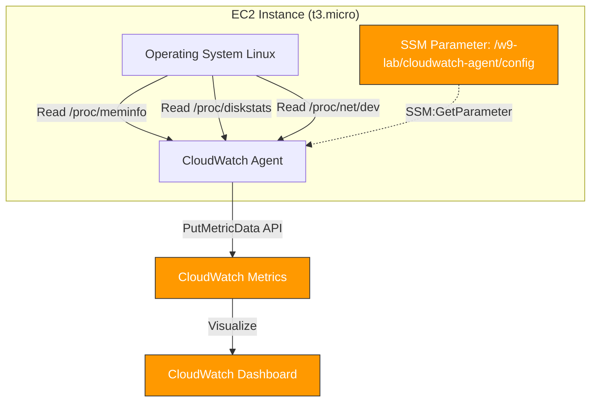

<p align="center">
  
</p>

# <p align="center">📊 Installing the CloudWatch Agent on EC2</p>

### <p align="center">W9 Session 02 — Mastering AWS System Monitoring</p>

<p align="center">
  <a href="https://aws.amazon.com"></a>
  <a href="https://terraform.io"></a>
  <a href="https://aws.amazon.com/cloudwatch/"></a>
</p>

---

## 🎯 Vấn Đề Bài Lab Giải Quyết

AWS CloudWatch **mặc định (built-in)** chỉ thu thập được các metric từ **hypervisor layer** (chẳng hạn như CPUUtilization, NetworkIn/Out, DiskReadOps/DiskWriteOps). Điều này mang lại hạn chế lớn:

| Metric | Built-in? (Hypervisor) | Cần Agent? (OS Level) |
| :--- | :---: | :---: |
| `CPUUtilization` | **✅ Có sẵn** | — |
| `mem_used_percent` (Bộ nhớ RAM) | ❌ Không có | **✅ Bắt buộc** |
| `disk_used_percent` (Dung lượng ổ đĩa) | ❌ Không có | **✅ Bắt buộc** |

> [!NOTE]
> Để mở khóa các thông tin chi tiết này phục vụ cho giám sát chiều sâu OS-level, chúng ta cần cài đặt **CloudWatch Agent** bên trong EC2 instance.

---

## 📐 Kiến Trúc Hệ Thống (Architecture)



---

## 📂 Cấu Trúc Thư Mục Dự Án

```text
cloudwatch-agent-ec2/
├── README.md                         # File hướng dẫn này
├── EVIDENCE.md                       # Báo cáo nghiệm thu & screenshots
├── STUDY_NOTES.md                    # Ghi chú kiến thức chiều sâu
├── assets/                           # Chứa screenshots evidence
│   └── README.md                     # Danh sách SS-01 → SS-12 cần chụp
├── scripts/
│   ├── verify-agent.sh               # Script tự động verify agent & logs
│   └── generate-memory-load.sh       # Script giả lập tải RAM (stress test)
└── terraform/
    ├── main.tf                       # IaC: EC2 + IAM Roles + SSM Config + Dashboard
    ├── variables.tf                  # Định nghĩa variables
    ├── outputs.tf                    # Các giá trị đầu ra
    ├── terraform.tfvars.example      # Template cấu hình biến
    └── cloudwatch-agent.json         # Cấu hình CloudWatch Agent JSON
```

---

## 🛠️ Yêu Cầu Trước Khi Chạy (Prerequisites)

| Công cụ | Lệnh kiểm tra |
| :--- | :--- |
| **Terraform** (≥ 1.3) | `terraform version` |
| **AWS CLI v2** | `aws --version` |
| **AWS Credentials** | `aws sts get-caller-identity` |

---

## 🚀 Hướng Dẫn Các Bước Thực Hiện Lab

### Bước 0: Chuẩn Bị File Cấu Hình Biến

```powershell
# Di chuyển vào thư mục terraform
cd assignments/cloudwatch-agent-ec2/terraform

# Sao chép tệp cấu hình mẫu
Copy-Item terraform.tfvars.example terraform.tfvars
```

### Bước 1: Khởi Tạo & Triển Khai Hạ Tầng

```bash
# Khởi tạo providers
terraform init

# Kiểm tra kế hoạch triển khai
terraform plan

# Áp dụng triển khai hạ tầng tự động
terraform apply -auto-approve
```

> [!IMPORTANT]
> **9 resources chính sẽ được Terraform tạo tự động:**
> 1. `aws_iam_role` & `policy_attachments` — Gắn policy `CloudWatchAgentServerPolicy` cho EC2.
> 2. `aws_ssm_parameter` — Lưu tập trung CloudWatch Agent JSON config.
> 3. `aws_instance` — Tạo máy ảo EC2 và tự động chạy script cài đặt agent qua `user_data`.
> 4. `aws_cloudwatch_dashboard` — Tạo dashboard giám sát gồm 5 Widgets.

### Bước 2: Kết Nối Vào EC2 Qua SSM Session Manager

Không cần cấu hình SSH keys hay mở cổng 22, chúng ta kết nối an toàn qua SSM:

```bash
# Lấy Instance ID từ output của Terraform
terraform output ec2_instance_id

# Kết nối trực tiếp vào máy chủ EC2
aws ssm start-session --target <INSTANCE_ID> --region ap-southeast-1
```

### Bước 3: Xác Minh Trạng Thái Hoạt Động Của Agent (Chạy trên EC2)

```bash
# Chạy script xác thực trạng thái
~/verify-agent.sh

# Kỳ vọng đầu ra: status = "running", log file không chứa mã lỗi "ERROR"
```

### Bước 4: Kiểm Tra Metric Trên AWS Console

1. Truy cập **CloudWatch Console** ➔ **Metrics** ➔ **All metrics** ➔ **Custom namespaces** ➔ Bạn sẽ thấy namespace `W9Lab/CustomMetrics`.
2. Truy cập đường dẫn Dashboard từ đầu ra của Terraform (`terraform output cloudwatch_dashboard_url`).

### Bước 5: Thực Hiện Load Test Giả Lập Tải RAM (Chạy trên EC2)

```bash
# Khởi chạy tool stress-ng tăng RAM lên 70% trong 120s
~/generate-memory-load.sh
```
> Sau 2-3 phút, biểu đồ `mem_used_percent` trên CloudWatch Dashboard sẽ xuất hiện cột spike (đỉnh nhọn) rõ rệt.

### Bước 6: Thu Dọn Tài Nguyên Tránh Phát Sinh Chi Phí

```bash
terraform destroy -auto-approve
```

---

## ⚖️ So Sánh Khác Biệt Giữa Session 02 & Session 03

| Tiêu chí | Session 02 (Bài lab này) | Session 03 (CPU Alarm) |
| :--- | :--- | :--- |
| **Mục tiêu cốt lõi** | Thu thập và hiển thị Custom Metrics | Thiết lập cảnh báo tự động gửi Email |
| **Nguồn gốc Metrics** | Do Agent đọc từ OS (Memory, Disk) | AWS Hypervisor cung cấp sẵn (CPUUtilization) |
| **Cơ chế thông báo** | Dashboard trực quan để kiểm tra | SNS Topic đẩy email trực tiếp tới Admin |
| **Centralized Config** | Dùng SSM Parameter Store lưu JSON config | Không cần cấu hình Agent |

---

## 💡 Bài Học Rút Ra & Best Practices

1. **Centralized Agent Configuration:** Lưu JSON config của CloudWatch Agent tại AWS Systems Manager (SSM) Parameter Store là một Best Practice giúp quản lý tập trung, dễ dàng phân phối cấu hình xuống hàng trăm EC2 cùng lúc thông qua automation script mà không cần SSH thủ công.
2. **Quyền hạn tối thiểu (IAM Least Privilege):** Chỉ gắn duy nhất policy `CloudWatchAgentServerPolicy` và các quyền đọc SSM cho IAM Role của EC2 để đảm bảo an toàn bảo mật thông tin.
