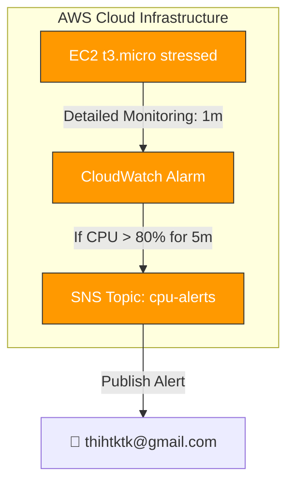

  

# 
📄 BÁO CÁO NGHIỆM THU — W9 SESSION 03

### 
CPU Alarm to Email Alert via SNS

  
  
  

---

## 📋 Thông Tin Tổng Quan

* **Bài thực hành:** Hands-On: CPU Alarm ➔ Email Alert via SNS
* **Session:** 03 — Mastering AWS System Monitoring
* **Mục tiêu:** Tự động gửi email cảnh báo khi chỉ số CPU của EC2 vượt quá 80% liên tục trong 5 phút.
* **Công nghệ sử dụng:** AWS EC2 (t3.micro) + CloudWatch Alarm + SNS + Terraform IaC.
* **AWS Account:** `884244642114` | **Region:** `ap-southeast-1` (Singapore).
* **SNS Topic ARN:** `arn:aws:sns:ap-southeast-1:884244642114:w9-cpu-alarm-lab-cpu-alerts`
* **Alarm ARN:** `arn:aws:cloudwatch:ap-southeast-1:884244642114:alarm:w9-cpu-alarm-lab-cpu-high`

---

## 📐 Sơ Đồ Kiến Trúc Hoạt Động (Architecture Flow)

---

## 📊 Bảng Đối Chiếu Tiêu Chí Nghiệm Thu

| STT | Tiêu chí kỹ thuật từ Slide | Trạng thái | Bằng chứng thực tế xác minh |
| :---: | :--- | :---: | :--- |
| **1** | **Create SNS Topic (Standard)** | **✅ ĐẠT** | Topic ARN: `arn:aws:sns:ap-southeast-1:884244642114:w9-cpu-alarm-lab-cpu-alerts` — xem **SS-01**. |
| **2** | **Add Email Subscription** | **✅ ĐẠT** | Đã đăng ký email `thihtktk@gmail.com` nhận cảnh báo — xem **SS-02**. |
| **3** | **Confirm subscription via email link** | **✅ ĐẠT** | Nhận email xác nhận ➔ Trạng thái chuyển sang **Confirmed** — xem **SS-03**. |
| **4** | **Create CloudWatch Alarm** | **✅ ĐẠT** | Alarm `w9-cpu-alarm-lab-cpu-high` được tạo gắn trực tiếp vào máy chủ EC2 — xem **SS-04**. |
| **5** | **Select Metric: CPUUtilization** | **✅ ĐẠT** | Giám sát chỉ số `CPUUtilization` trong namespace `AWS/EC2`. |
| **6** | **Condition: Greater than 80%** | **✅ ĐẠT** | Thiết lập Threshold = 80% — xem **SS-05**. |
| **7** | **Period: 5 minutes, Eval: 1 out of 1** | **✅ ĐẠT** | Cấu hình chu kỳ đánh giá 5 phút, 1 điểm dữ liệu vi phạm là báo động. |
| **8** | **In Alarm state ➔ SNS Notification** | **✅ ĐẠT** | **ALARM Fired** ➔ Nhận email cảnh báo đỏ từ AWS — xem **SS-09, SS-11**. |
| **9** | **OK state notification (Recovery alert)** | **✅ ĐẠT** | Khi CPU giảm, hệ thống tự động gửi Email báo phục hồi **OK** — xem **SS-12**. |

---

## 🔍 Giải Thích Kỹ Thuật & Quyết Định Thiết Kế

### 1. Tại sao dùng SNS Standard thay vì FIFO?
* **Standard Topic:** Cung cấp throughput cực cao, hỗ trợ gửi thông báo đồng thời qua nhiều kênh (Email, SMS, Lambda). Đối với cảnh báo hệ thống, việc có thể bị trùng lặp nhẹ hoặc thứ tự đến lệch nhau vài mili giây không ảnh hưởng tới tiến trình xử lý sự cố của quản trị viên.
* **FIFO Topic:** Giới hạn throughput và chỉ hỗ trợ giao thức SQS làm subscription, không hỗ trợ gửi trực tiếp Email/SMS cho người dùng.

### 2. Tại sao cần bật Detailed Monitoring (1 phút)?
Mặc định (Basic Monitoring) chỉ đẩy metric 5 phút một lần. Nếu dùng cấu hình này, CloudWatch Alarm phải mất ít nhất 5-10 phút để nhận đủ dữ liệu và đưa ra phán quyết, làm tăng thời gian phản ứng với sự cố. Bằng cách kích hoạt Detailed Monitoring, dữ liệu được gửi mỗi phút giúp Alarm đánh giá nhanh và đưa ra quyết định báo động chính xác sau đúng 5 phút CPU vượt ngưỡng.

### 3. Tại sao cấu hình `treat_missing_data = "breaching"`?
Nếu máy ảo EC2 bị treo cứng hoàn toàn (crash) đến mức không thể gửi dữ liệu metric CPU lên CloudWatch Logs, hệ thống sẽ rơi vào trạng thái thiếu dữ liệu (missing data). 
Bằng cách cấu hình `breaching`, CloudWatch Alarm sẽ coi việc mất kết nối dữ liệu này là một hành vi nguy hiểm (vi phạm ngưỡng) và lập tức kích hoạt báo động gửi email cho quản trị viên đến kiểm tra.

---

## 📸 Hình Ảnh Bằng Chứng Thực Tế (Screenshots)

### PHẦN 1 — SNS Topic & Subscription

#### 1.1 SNS Topic Được Khởi Tạo Thành Công
<picture>
  <source media="(prefers-color-scheme: dark)" srcset="assets/SS-01_sns_topic_created_dark.png">
  <source media="(prefers-color-scheme: light)" srcset="assets/SS-01_sns_topic_created_light.png">
  
</picture>

---

#### 1.2 Trạng Thái Email Subscription Đã Confirmed
<picture>
  <source media="(prefers-color-scheme: dark)" srcset="assets/SS-02_sns_subscription_confirmed_dark.png">
  <source media="(prefers-color-scheme: light)" srcset="assets/SS-02_sns_subscription_confirmed_light.png">
  
</picture>

---

#### 1.3 Thư Xác Nhận Đăng Ký Gửi Từ AWS Trong Gmail
<picture>
  <source media="(prefers-color-scheme: dark)" srcset="assets/SS-03_confirmation_email_dark.png">
  <source media="(prefers-color-scheme: light)" srcset="assets/SS-03_confirmation_email_light.png">
  
</picture>

---

### PHẦN 2 — CloudWatch Alarm

#### 2.1 CloudWatch Alarm Được Khởi Tạo (Trạng Thái: OK)
<picture>
  <source media="(prefers-color-scheme: dark)" srcset="assets/SS-04_alarm_created_ok_state_dark.png">
  <source media="(prefers-color-scheme: light)" srcset="assets/SS-04_alarm_created_ok_state_light.png">
  
</picture>

---

#### 2.2 Chi Tiết Cấu Hình Alarm Trên Console
<picture>
  <source media="(prefers-color-scheme: dark)" srcset="assets/SS-05_alarm_configuration_detail_dark.png">
  <source media="(prefers-color-scheme: light)" srcset="assets/SS-05_alarm_configuration_detail_light.png">
  
</picture>

---

### PHẦN 3 — EC2 Instance & CPU Metric

#### 3.1 Trạng Thái EC2 Instance Đang Chạy Với Detailed Monitoring
<picture>
  <source media="(prefers-color-scheme: dark)" srcset="assets/SS-06_ec2_instance_running_dark.png">
  <source media="(prefers-color-scheme: light)" srcset="assets/SS-06_ec2_instance_running_light.png">
  
</picture>

---

#### 3.2 CloudWatch Dashboard Giám Sát Khi CPU Bình Thường
<picture>
  <source media="(prefers-color-scheme: dark)" srcset="assets/SS-07_dashboard_cpu_normal_dark.png">
  <source media="(prefers-color-scheme: light)" srcset="assets/SS-07_dashboard_cpu_normal_light.png">
  
</picture>

---

### PHẦN 4 — Kiểm Thử Đổi Trạng Thái Báo Động (Stress Test)

#### 4.1 Chạy Script stress-ng Chiếm Dụng 100% CPU Máy Chủ
<picture>
  <source media="(prefers-color-scheme: dark)" srcset="assets/SS-08_stress_test_running_dark.png">
  <source media="(prefers-color-scheme: light)" srcset="assets/SS-08_stress_test_running_light.png">
  
</picture>

---

#### 4.2 CloudWatch Alarm Chuyển Sang Trạng Thái Báo Động (ALARM State) 🚨
<picture>
  <source media="(prefers-color-scheme: dark)" srcset="assets/SS-09_alarm_state_firing_dark.png">
  <source media="(prefers-color-scheme: light)" srcset="assets/SS-09_alarm_state_firing_light.png">
  
</picture>

---

#### 4.3 Đỉnh Nhọn CPU Đột Biến Spike Vượt Ngưỡng 80% Trên Dashboard
<picture>
  <source media="(prefers-color-scheme: dark)" srcset="assets/SS-10_dashboard_cpu_spike_dark.png">
  <source media="(prefers-color-scheme: light)" srcset="assets/SS-10_dashboard_cpu_spike_light.png">
  
</picture>

---

### PHẦN 5 — Xác Nhận Nhận Email Cảnh Báo & Phục Hồi

#### 5.1 Nhận Thư Cảnh Báo Báo Động (ALARM Notification) Trong Gmail
<picture>
  <source media="(prefers-color-scheme: dark)" srcset="assets/SS-11_email_alarm_received_dark.png">
  <source media="(prefers-color-scheme: light)" srcset="assets/SS-11_email_alarm_received_light.png">
  
</picture>

---

#### 5.2 Nhận Thư Phục Hồi Hệ Thống (OK Recovery Notification)
<picture>
  <source media="(prefers-color-scheme: dark)" srcset="assets/SS-12_email_ok_recovery_dark.png">
  <source media="(prefers-color-scheme: light)" srcset="assets/SS-12_email_ok_recovery_light.png">
  
</picture>

---

## 🏆 KẾT LUẬN

Bài thực hành W9 Session 03 đã triển khai thành công quy trình cảnh báo lỗi tự động:
* **Độ Nhạy Cao:** Bật Detailed Monitoring giúp phát hiện sự cố nhanh gấp 5 lần so với mặc định.
* **Luồng Khép Kín:** Quy trình tự động hóa hoạt động chính xác từ lúc phát sinh quá tải ➔ Phát cảnh báo lỗi qua email ➔ Phát email báo an toàn khi hệ thống tự nguội.
* **Tính Tiện Ích:** Cung cấp giải pháp giám sát an toàn, giảm tải công sức túc trực giám sát thủ công cho kỹ sư vận hành.
