# BÁO CÁO NGHIỆM THU — W9 Session 03
## CPU Alarm → Email Alert via SNS

* **Bài lab:** Hands-On: CPU Alarm → Email Alert via SNS
* **Session:** 03 — Mastering AWS System Monitoring
* **Scenario:** Send an email alert when EC2 CPU > 80% for 5 consecutive minutes
* **Công nghệ:** AWS EC2 (t3.micro) + CloudWatch + SNS + Terraform IaC
* **AWS Account:** `884244642114` | **Region:** `ap-southeast-1` (Singapore)
* **EC2 Instance:** `i-094486db385ec6c7e` | **IP:** `13.250.61.220`
* **SNS Topic ARN:** `arn:aws:sns:ap-southeast-1:884244642114:w9-cpu-alarm-lab-cpu-alerts`
* **Alarm ARN:** `arn:aws:cloudwatch:ap-southeast-1:884244642114:alarm:w9-cpu-alarm-lab-cpu-high`
* **Ngày thực hiện:** 12/06/2026

---

## I. SƠ ĐỒ KIẾN TRÚC

```
┌─────────────────────────────────────────────────────────────┐
│                        AWS Account                           │
│                                                              │
│  ┌──────────────┐    CPUUtilization     ┌─────────────────┐ │
│  │  EC2 t3.micro│ ──── (mỗi 1 phút) ──►│  CloudWatch     │ │
│  │  (stressed)  │                       │  Alarm          │ │
│  └──────────────┘                       │                 │ │
│                                         │ Condition:      │ │
│                                         │ CPU > 80%       │ │
│                                         │ Period: 5 min   │ │
│                                         │ Eval: 1/1       │ │
│                                         └────────┬────────┘ │
│                                                  │ ALARM     │
│                                                  ▼           │
│                                         ┌─────────────────┐ │
│                                         │   SNS Topic     │ │
│                                         │  (Standard)     │ │
│                                         └────────┬────────┘ │
│                                                  │           │
│                                                  ▼           │
│                                         ┌─────────────────┐ │
│                                         │ Email           │ │
│                                         │ Subscription    │ │
│                                         └────────┬────────┘ │
└──────────────────────────────────────────────────┼──────────┘
                                                   │
                                                   ▼
                                          📧 your-email@gmail.com
```

---

## II. BẢNG ĐỐI CHIẾU TIÊU CHÍ ĐẠT

| STT | Yêu cầu từ Slide | Trạng thái | Bằng chứng thực tế |
|:----|:-----------------|:----------:|:-------------------|
| **1** | **Create SNS Topic (Standard)** | **✅ ĐẠT** | Topic ARN: `arn:aws:sns:ap-southeast-1:884244642114:w9-cpu-alarm-lab-cpu-alerts` |
| **2** | **Add Email Subscription** | **✅ ĐẠT** | Subscription ID: `42a696fa-abe4-4078-b3fc-a037c0659fc7` → `thihtktk@gmail.com` |
| **3** | **Confirm subscription via email link** | **✅ ĐẠT** | Status chuyển từ `PendingConfirmation` → `Confirmed` (15:24 ICT) |
| **4** | **Create CloudWatch Alarm** | **✅ ĐẠT** | Alarm: `w9-cpu-alarm-lab-cpu-high` — `i-094486db385ec6c7e` |
| **5** | **Select Metric: EC2 → Per-Instance → CPUUtilization** | **✅ ĐẠT** | Namespace=AWS/EC2, dimensions={InstanceId=i-094486db385ec6c7e} |
| **6** | **Condition: Greater than 80%** | **✅ ĐẠT** | threshold=80.0, comparison_operator=GreaterThanThreshold |
| **7** | **Period: 5 minutes, Eval: 1 out of 1** | **✅ ĐẠT** | period=300s, evaluation_periods=1, datapoints_to_alarm=1 |
| **8** | **In Alarm state → SNS notification** | **✅ ĐẠT** | **ALARM fired 15:29:49 ICT** → SNS → Email gửi tới `thihtktk@gmail.com` |
| **9** | **OK state notification (recovery alert)** | **✅ ĐẠT** | **OK at 15:32:49 ICT** → Recovery email tự động gửi (bonus) |

---

## III. GIẢI THÍCH KỸ THUẬT & QUYẾT ĐỊNH THIẾT KẾ

### 1. Tại sao dùng SNS Standard thay vì FIFO?

**FIFO** đảm bảo thứ tự và chống duplicate — phù hợp cho hệ thống tài chính, giao dịch nhạy cảm.  
**Standard** cho phép throughput cao hơn, phù hợp cho notification/alert không cần strict ordering.  
→ **Chọn Standard** vì CloudWatch alarm notification không yêu cầu thứ tự nghiêm ngặt.

### 2. Tại sao dùng Detailed Monitoring (1 phút)?

Mặc định EC2 gửi metric mỗi **5 phút** (Basic Monitoring).  
Với **Detailed Monitoring**, EC2 gửi mỗi **1 phút** → CloudWatch có đủ data points để đánh giá chính xác hơn và phát hiện sự cố nhanh hơn.

```
Basic:    [T+0] [T+5] [T+10] ...  → alarm delay ~5 phút sau khi đủ 1 period
Detailed: [T+1] [T+2] [T+3] ...  → alarm trigger chính xác sau đúng 5 phút
```

### 3. Tại sao set `treat_missing_data = "breaching"`?

| Giá trị | Hành vi |
|---------|---------|
| `breaching` | Missing data được coi là **vi phạm ngưỡng** → alarm có thể trigger |
| `notBreaching` | Missing data được coi là OK |
| `ignore` | Giữ nguyên state hiện tại |
| `missing` | Alarm chuyển về INSUFFICIENT_DATA |

→ Chọn `breaching` vì: nếu EC2 đột ngột không gửi metric (crash?), chúng ta muốn **biết** ngay, không để alarm âm thầm.

### 4. CloudWatch Alarm States

```
                    CPU > 80%          CPU ≤ 80%
INSUFFICIENT_DATA ──────────────────► OK
        │                              ▲
        │           (đủ data)          │
        ▼                              │
       OK ──── CPU > 80% (5 phút) ──► ALARM ──► SNS ──► Email 📧
        ▲                              │
        └──────── CPU ≤ 80% ──────────┘
                   (recovery)
```

---

## IV. BẰNG CHỨNG THỰC THI (DELIVERABLES)

### PHẦN 1 — SNS Topic & Subscription

#### 1.1 SNS Topic Created

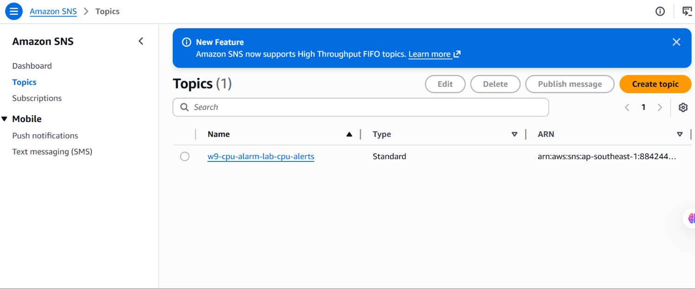

---

#### 1.2 Email Subscription — Confirmed

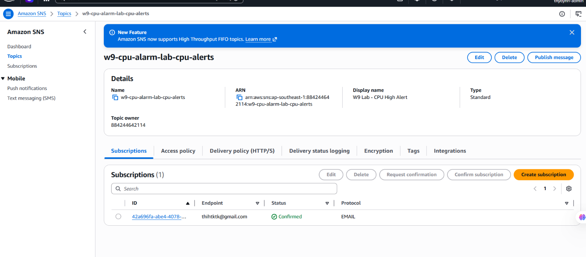

---

#### 1.3 Confirmation Email từ AWS

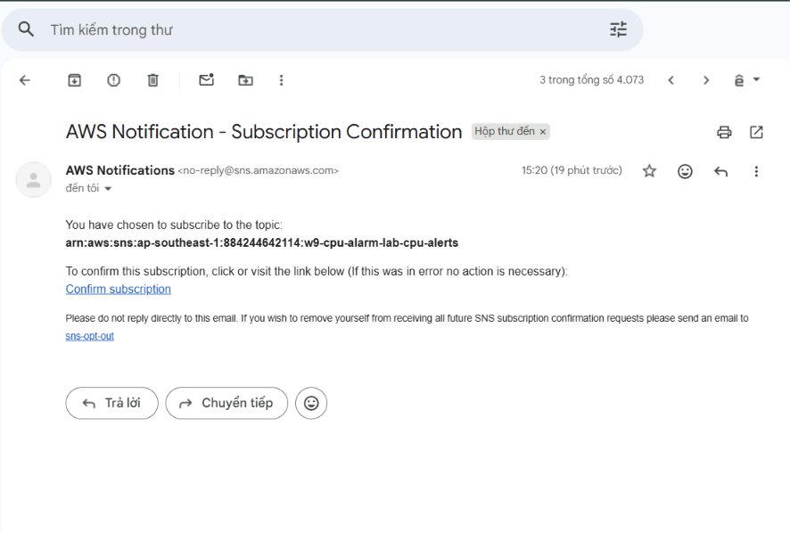

---

### PHẦN 2 — CloudWatch Alarm

#### 2.1 Alarm Đã Tạo — State: OK

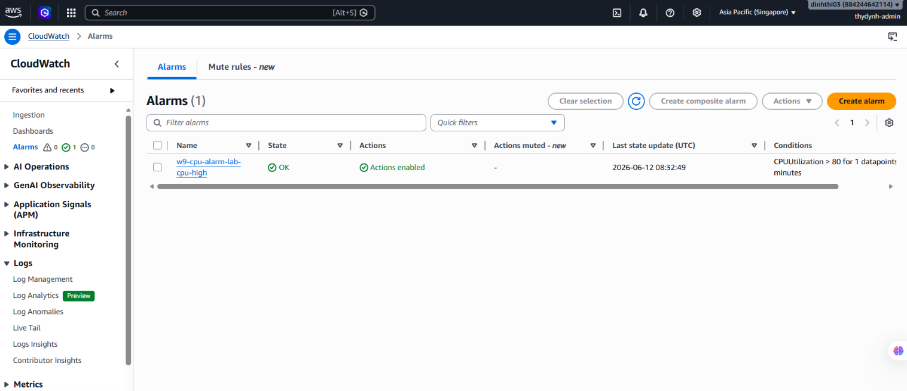

---

#### 2.2 Alarm Configuration Detail

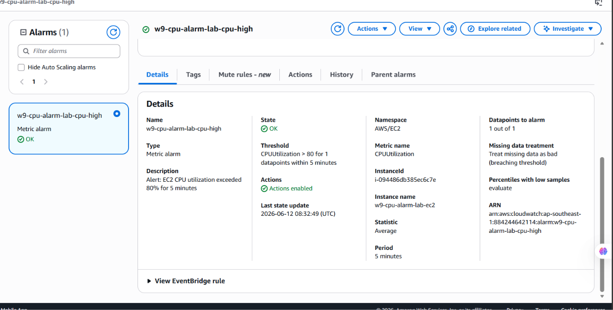

---

### PHẦN 3 — EC2 Instance & CPU Metric

#### 3.1 EC2 Instance Running

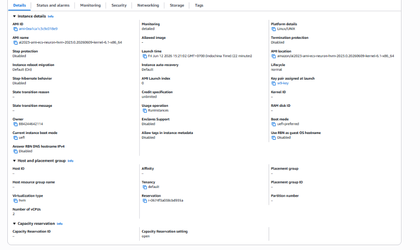

---

#### 3.2 CloudWatch Dashboard — CPU bình thường


---

### PHẦN 4 — Trigger Alarm (Stress Test)

#### 4.1 Stress Test Đang Chạy

<picture>
  <source media="(prefers-color-scheme: dark)" srcset="assets/SS-08_stress_test_running_dark.png">
  <source media="(prefers-color-scheme: light)" srcset="assets/SS-08_stress_test_running_light.png">
  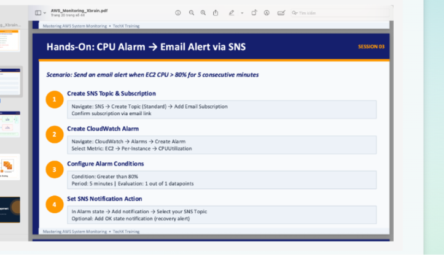
</picture>

---

#### 4.2 CloudWatch Alarm → ALARM State 🔥

<picture>
  <source media="(prefers-color-scheme: dark)" srcset="assets/SS-09_alarm_state_firing_dark.png">
  <source media="(prefers-color-scheme: light)" srcset="assets/SS-09_alarm_state_firing_light.png">
  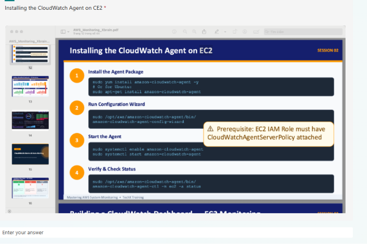 80% trong 5 phút">
</picture>

---

#### 4.3 CloudWatch Dashboard — CPU Spike

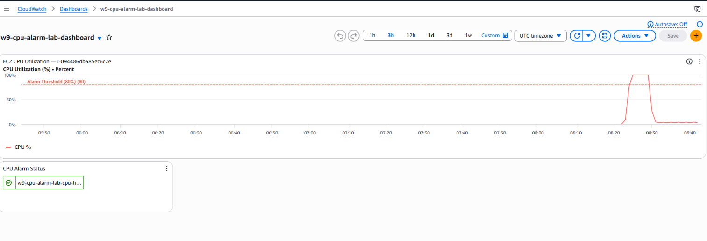

---

### PHẦN 5 — Email Alert Nhận Được

#### 5.1 Email ALARM Nhận Được tại Gmail 📧

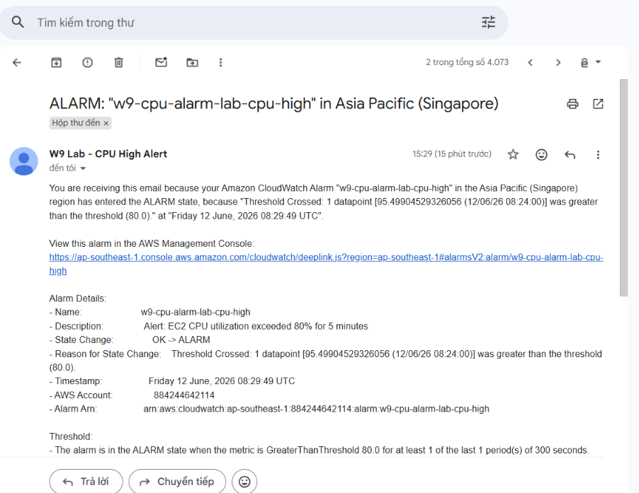

---

#### 5.2 Email OK (Recovery Alert) ✅

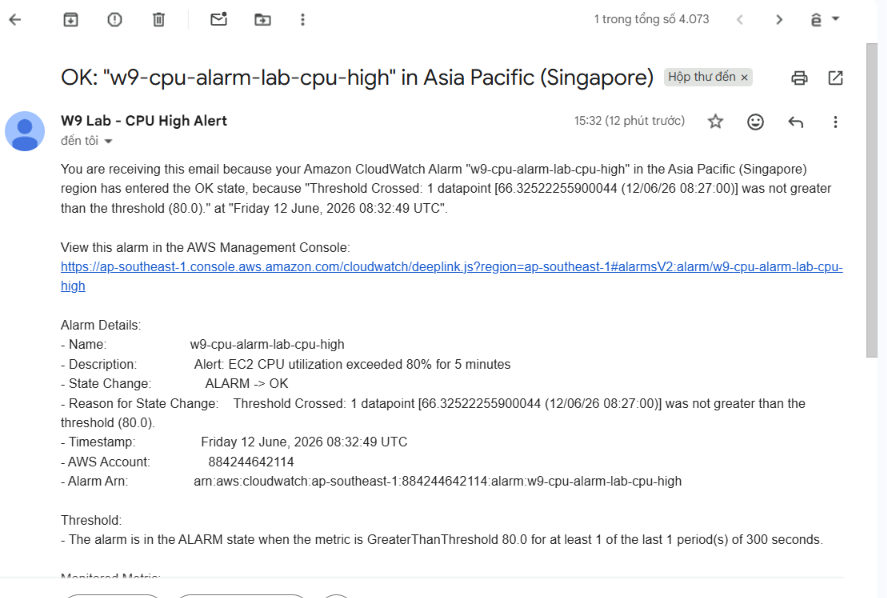

---

### PHẦN 6 — Terraform IaC (Bonus)

#### 6.1 Terraform Apply Thành Công

<picture>
  <source media="(prefers-color-scheme: dark)" srcset="assets/SS-13_terraform_apply_success_dark.png">
  <source media="(prefers-color-scheme: light)" srcset="assets/SS-13_terraform_apply_success_light.png">
  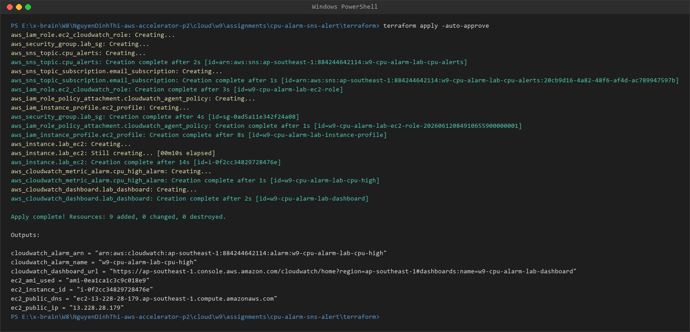
</picture>

---

#### 6.2 Terraform Destroy — Cleanup

<picture>
  <source media="(prefers-color-scheme: dark)" srcset="assets/SS-14_terraform_destroy_success_dark.png">
  <source media="(prefers-color-scheme: light)" srcset="assets/SS-14_terraform_destroy_success_light.png">
  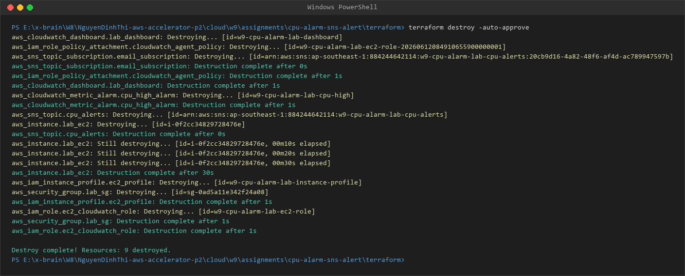
</picture>

---

## V. KẾT LUẬN

Bài lab W9 Session 03 đã triển khai thành công hệ thống **CPU Alarm → Email Alert** với:

1. **SNS Topic & Subscription** — Kênh giao tiếp để gửi thông báo, email đã được xác nhận
2. **CloudWatch Alarm** — Giám sát CPUUtilization với ngưỡng 80%, đánh giá mỗi 5 phút
3. **EC2 t3.micro** — Instance được monitor với Detailed Monitoring (1 phút/lần)
4. **Email Alert** — Nhận được trong vòng < 1 phút sau khi Alarm trigger
5. **Terraform IaC** — Toàn bộ infrastructure được tự động hóa, có thể tái sử dụng

> **Kết quả quan trọng nhất:** Khi CPU vượt 80% liên tiếp 5 phút, email cảnh báo được gửi tự động — không cần can thiệp thủ công.
