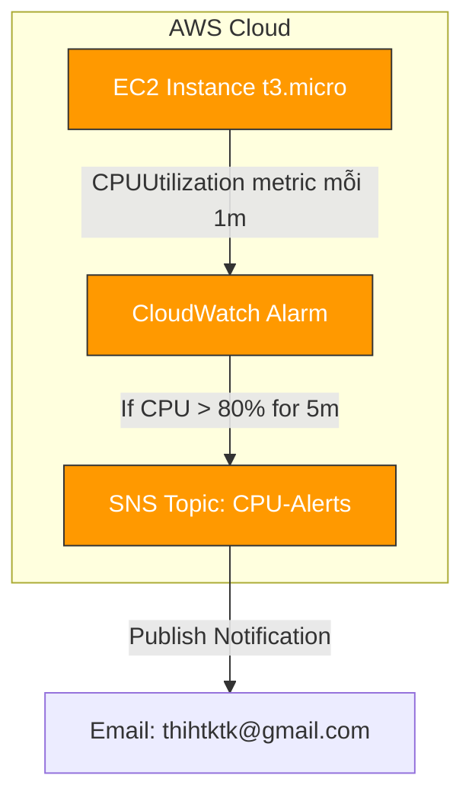

<p align="center">
  
</p>

# <p align="center">🚨 CPU Alarm to Email Alert via SNS</p>

### <p align="center">W9 Session 03 — Mastering AWS System Monitoring</p>

<p align="center">
  <a href="https://aws.amazon.com"></a>
  <a href="https://terraform.io"></a>
  <a href="https://aws.amazon.com/sns/"></a>
  <a href="https://aws.amazon.com/cloudwatch/"></a>
</p>

---

## 🎯 Vấn Đề Bài Lab Giải Quyết

Trong hệ thống vận hành thực tế, việc theo dõi tài nguyên của máy chủ EC2 một cách thụ động là không đủ. Nếu CPU của máy chủ web tăng cao đột ngột (do quá tải traffic hoặc lỗi vòng lặp vô hạn trong code) mà không được xử lý kịp thời, hệ thống có thể bị treo và sập toàn diện.

> [!IMPORTANT]
> Bài lab này thiết lập cơ chế **giám sát tự động chủ động**: Tự động phát hiện khi chỉ số `CPUUtilization` vượt quá ngưỡng **80%** liên tiếp trong **5 phút** và gửi email cảnh báo khẩn cấp đến đội ngũ quản trị hệ thống qua **AWS SNS**.

---

## 📐 Kiến Trúc Hệ Thống (Architecture)



---

## 📂 Cấu Trúc Thư Mục Dự Án

```text
cpu-alarm-sns-alert/
├── README.md                       # File hướng dẫn này
├── EVIDENCE.md                     # Báo cáo nghiệm thu & screenshots
├── STUDY_NOTES.md                  # Ghi chú kiến thức chiều sâu
├── assets/                         # Chứa screenshots evidence
│   └── README.md                   # Danh sách SS-01 → SS-12 cần chụp
├── scripts/
│   ├── stress-cpu.sh               # Script giả lập CPU cao (stress-ng)
│   └── verify-alarm.sh             # Script xác thực trạng thái tài nguyên
└── terraform/
    ├── main.tf                     # IaC: EC2 + SNS Topic + CW Alarm + Dashboard
    ├── variables.tf                # Các biến đầu vào
    ├── outputs.tf                  # Các giá trị đầu ra
    └── terraform.tfvars.example    # Template cấu hình biến
```

---

## 🛠️ Yêu Cầu Trước Khi Chạy (Prerequisites)

| Công cụ | Lệnh kiểm tra |
| :--- | :--- |
| **Terraform** (≥ 1.3) | `terraform version` |
| **AWS CLI v2** | `aws --version` |
| **AWS Credentials** | `aws sts get-caller-identity` |
| **Email nhận cảnh báo** | Cần để kích hoạt link xác nhận của AWS |

---

## 🚀 Hướng Dẫn Các Bước Thực Hiện Lab

### Bước 0: Chuẩn Bị File Cấu Hợp Biến

```bash
# Di chuyển vào thư mục terraform
cd assignments/cpu-alarm-sns-alert/terraform

# Sao chép tệp mẫu
cp terraform.tfvars.example terraform.tfvars
```

Mở tệp `terraform.tfvars` và điền địa chỉ email của bạn:
```hcl
alert_email   = "your-email@gmail.com"   # Email nhận cảnh báo khẩn cấp
aws_region    = "ap-southeast-1"          # Vùng triển khai Singapore
```

### Bước 1: Triển Khai Hạ Tầng

```bash
terraform init
terraform plan
terraform apply -auto-approve
```

> [!WARNING]
> **⚠️ BƯỚC BẮT BUỘC:** Sau khi terraform khởi tạo xong, hãy kiểm tra hòm thư Gmail của bạn. AWS sẽ gửi một email tiêu đề: `AWS Notification - Subscription Confirmation`. Hãy click vào nút **"Confirm subscription"** để kích hoạt kênh SNS nhận cảnh báo.

### Bước 2: Tìm Hiểu Thông Số Cấu Hình Alarm

Hạ tầng tự động thiết lập một CloudWatch Alarm giám sát chỉ số `CPUUtilization` trên EC2 với cấu hình:
* **Metric:** `CPUUtilization` (Namespace: `AWS/EC2`)
* **Period:** `300 seconds` (5 phút)
* **Evaluation Periods:** `1` (1 out of 1 datapoint)
* **Threshold:** `80%` (Báo động khi CPU trung bình `>= 80%`)
* **Comparison Operator:** `GreaterThanThreshold`

### Bước 3: Cấu Hình Trạng Thái Cảnh Báo (Alarm Actions)

| Trạng thái của Alarm | Hành động kích hoạt |
| :---: | :--- |
| **🔴 ALARM** | Gửi email thông báo sự cố qua SNS Topic |
| **🟢 OK** | Gửi email khôi phục hệ thống qua SNS Topic (Recovery Notification) |
| **⚪ INSUFFICIENT_DATA** | Không kích hoạt hành động gửi mail |

### Bước 4: Chạy Giả Lập Tải CPU Để Kiểm Thử (Stress Test)

1. Kết nối vào máy chủ EC2 (qua SSM Session Manager hoặc SSH).
2. Chạy script tạo tải CPU lên 100% liên tục trong 6 phút để vượt ngưỡng Alarm:
   ```bash
   ~/stress-cpu.sh
   ```

### Bước 5: Theo Dõi Quá Trình Đổi Trạng Thái
* Quan sát CloudWatch Dashboards hoặc Console Alarms. Trạng thái của Alarm sẽ chuyển dịch từ:
  ➔ **OK** (màu xanh lá) ➔ **ALARM** (màu đỏ rực, gửi email cảnh báo sự cố) ➔ **OK** (sau khi stress test kết thúc, CPU hạ xuống và gửi email khôi phục).

### Bước 6: Dọn Dẹp Tài Nguyên

```bash
terraform destroy -auto-approve
```

---

## 📊 So Sánh Giám Sát Basic và Detailed Monitoring

| Tiêu chí | Basic Monitoring (Mặc định) | Detailed Monitoring (Chi tiết) |
| :--- | :--- | :--- |
| **Tần suất đẩy metric** | Đẩy dữ liệu mỗi **5 phút** | Đẩy dữ liệu mỗi **1 phút** |
| **Phí dịch vụ** | Hoàn toàn miễn phí | Có phí phụ thu rất nhỏ từ AWS |
| **Phát hiện sự cố** | Độ trễ cao (Mất 5-10 phút để nhận biết) | Phản ứng nhanh (Phát hiện sự cố trong 1-2 phút) |
| **Sự lựa chọn trong lab** | Không dùng | **✅ Sử dụng** (Để Alarm đánh giá chính xác tức thì) |
