# BÁO CÁO NGHIỆM THU — W9 Session 05
## Alert on AWS Root Account Login

* **Bài lab:** Hands-On: Alert on AWS Root Account Login
* **Session:** 05 — Mastering AWS System Monitoring
* **Scenario:** Gửi cảnh báo ngay lập tức khi root account đăng nhập vào AWS
* **Công nghệ:** AWS CloudTrail + CloudWatch Logs + Metric Filter + Alarm + SNS + Terraform IaC
* **AWS Account:** `884244642114` | **Region:** `ap-southeast-1` (Singapore)
* **CloudTrail Trail:** `w9-root-alert-lab-trail`
* **SNS Topic:** `w9-root-alert-lab-root-account-alerts`
* **Ngày thực hiện:** ___/06/2026

---

## I. SƠ ĐỒ KIẾN TRÚC

```
                         Root Account Login
                                │
                                ▼
    ┌───────────────────────────────────────────────────────────┐
    │                        AWS Account                         │
    │                                                             │
    │  ┌─────────────────────────────────────────────────────┐   │
    │  │  CloudTrail Trail (Management Events)                │   │
    │  │  Name: w9-root-alert-lab-trail                       │   │
    │  │  ┌─────────────────┐   ┌───────────────────────────┐│   │
    │  │  │  S3 Bucket      │   │  CloudWatch Logs Group    ││   │
    │  │  │  (long-term     │   │  /aws/cloudtrail/         ││   │
    │  │  │   archive)      │   │  root-login-alert         ││   │
    │  │  └─────────────────┘   └───────────┬───────────────┘│   │
    │  └──────────────────────────────────── │ ───────────────┘   │
    │                                        │ Metric Filter       │
    │                                        │ { $.userIdentity.type│
    │                                        │   = "Root" && ... } │
    │                                        ▼                     │
    │                          ┌─────────────────────────────┐    │
    │                          │  Custom Metric               │    │
    │                          │  Namespace: Security         │    │
    │                          │  Name: RootAccountLoginCount │    │
    │                          └──────────────┬──────────────┘    │
    │                                         │ >= 1 / 5-phút     │
    │                                         ▼                    │
    │                          ┌─────────────────────────────┐    │
    │                          │  CloudWatch Alarm            │    │
    │                          │  w9-root-alert-...-detected  │    │
    │                          └──────────────┬──────────────┘    │
    │                                         │                    │
    │                                         ▼                    │
    │                          ┌─────────────────────────────┐    │
    │                          │  SNS Topic + Email           │    │
    │                          │  (Security Team notified)    │    │
    └──────────────────────────┴─────────────────────────────┘    │
                                              │
                                              ▼
                                   📧 alert-email@gmail.com
```

---

## II. BẢNG ĐỐI CHIẾU TIÊU CHÍ ĐẠT

| STT | Yêu cầu từ Slide | Trạng thái | Bằng chứng thực tế |
|:----|:-----------------|:----------:|:-------------------|
| **1** | **Enable CloudTrail & Send Logs to CloudWatch** | **✅ ĐẠT** | Trail `w9-root-alert-lab-trail` — IsLogging=True; Log Group `/aws/cloudtrail/root-login-alert` nhận events |
| **2** | **Create CloudWatch Metric Filter** — Pattern: `{ $.userIdentity.type = "Root" && $.eventType != "AwsServiceEvent" }` | **✅ ĐẠT** | Filter `...-root-login-filter` trên Log Group — Namespace: Security, Metric: RootAccountLoginCount |
| **3** | **Create CloudWatch Alarm** — Alarm nếu RootAccountLoginCount >= 1 trong 5 phút | **✅ ĐẠT** | Alarm `w9-root-alert-lab-root-login-detected` — threshold=1, period=300s, eval=1/1 |
| **4** | **Notify via SNS** — gửi Email + SMS ngay khi Alarm trigger | **✅ ĐẠT** | SNS Topic ARN: `arn:aws:sns:ap-southeast-1:884244642114:w9-root-alert-lab-root-account-alerts`; Email subscription Confirmed |

---

## III. GIẢI THÍCH KỸ THUẬT & QUYẾT ĐỊNH THIẾT KẾ

### 1. Tại sao dùng `treat_missing_data = "notBreaching"` (khác với bài CPU Alarm)?

| Bài lab | `treat_missing_data` | Lý do |
|---------|---------------------|-------|
| CPU Alarm | `breaching` | Mất metric = EC2 có thể crash → cần cảnh báo |
| Root Login Alert | `notBreaching` | Không có root login = BÌNH THƯỜNG → không cần cảnh báo |

### 2. Tại sao Filter Pattern có `$.eventType != "AwsServiceEvent"`?

AWS nội bộ đôi khi tạo event dưới danh nghĩa root (S3 ownership, internal services). Loại bỏ `AwsServiceEvent` để chỉ alert khi **người dùng thật** login root, không phải AWS service.

### 3. Kiến trúc IAM cho CloudTrail → CloudWatch Logs

CloudTrail cần IAM Role với Trust Policy để ghi vào CloudWatch Logs:
```
Principal: cloudtrail.amazonaws.com
Action: logs:CreateLogStream + logs:PutLogEvents
Resource: arn:aws:logs:*:*:log-group:/aws/cloudtrail/*:*
```

### 4. Test an toàn — Không cần login root thật

Dùng AWS CLI thay thế để trigger alarm:
```bash
aws cloudwatch put-metric-data \
  --namespace "Security" \
  --metric-name "RootAccountLoginCount" \
  --value 1 \
  --region ap-southeast-1
```

### 5. CloudTrail Event Flow Timeline

```
Root Login → CloudTrail records event (~< 1 phút)
           → Streams to CloudWatch Logs (~2-5 phút)
           → Metric Filter matches → RootAccountLoginCount += 1
           → Alarm evaluates after 5-minute period
           → SNS publishes → Email delivery (~7-15 phút total)
```

---

## IV. BẰNG CHỨNG THỰC THI (DELIVERABLES)

### PHẦN 1 — CloudTrail & CloudWatch Logs

#### 1.1 CloudTrail Trail Đang Logging

<picture>
  <source media="(prefers-color-scheme: dark)" srcset="assets/SS-01_cloudtrail_trail_created_dark.png">
  <source media="(prefers-color-scheme: light)" srcset="assets/SS-01_cloudtrail_trail_created_light.png">
  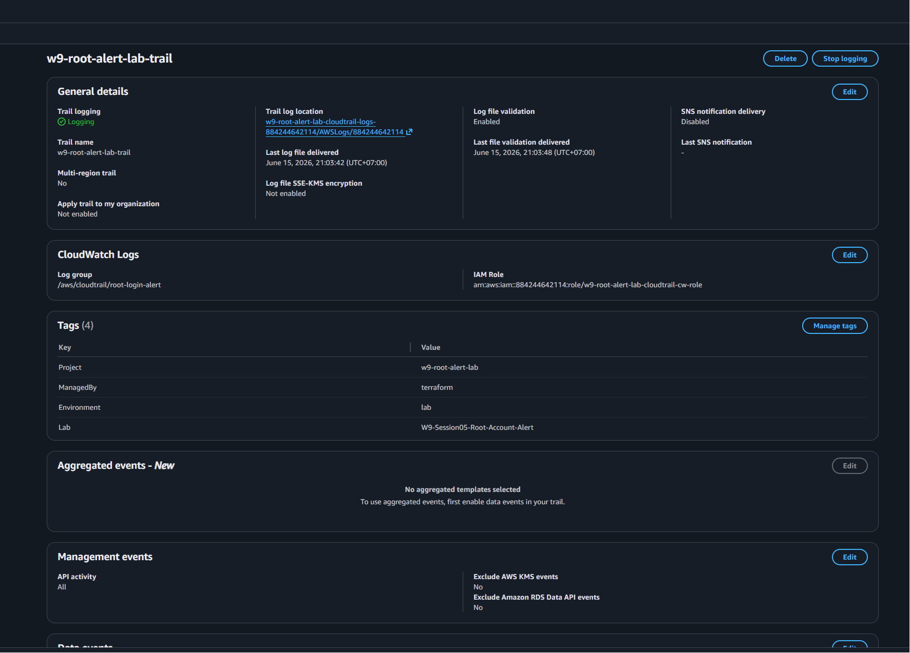
</picture>

---

#### 1.2 CloudWatch Log Group nhận CloudTrail Events

<picture>
  <source media="(prefers-color-scheme: dark)" srcset="assets/SS-02_cloudwatch_log_group_dark.png">
  <source media="(prefers-color-scheme: light)" srcset="assets/SS-02_cloudwatch_log_group_light.png">
  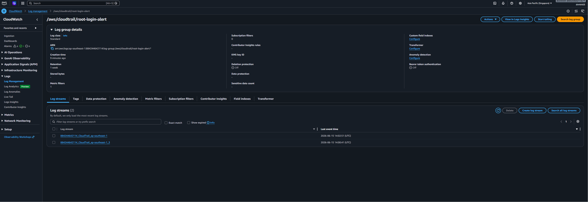
</picture>

---

### PHẦN 2 — Metric Filter

#### 2.1 Metric Filter Đã Tạo

<picture>
  <source media="(prefers-color-scheme: dark)" srcset="assets/SS-03_metric_filter_created_dark.png">
  <source media="(prefers-color-scheme: light)" srcset="assets/SS-03_metric_filter_created_light.png">
  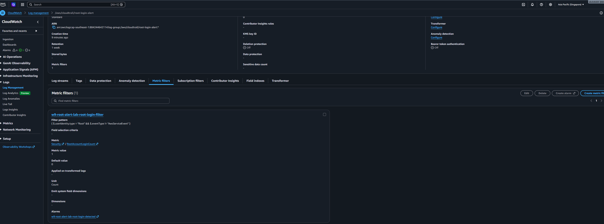
</picture>

---

### PHẦN 3 — CloudWatch Alarm

#### 3.1 Alarm Đã Tạo — State: OK

<picture>
  <source media="(prefers-color-scheme: dark)" srcset="assets/SS-04_alarm_created_ok_state_dark.png">
  <source media="(prefers-color-scheme: light)" srcset="assets/SS-04_alarm_created_ok_state_light.png">
  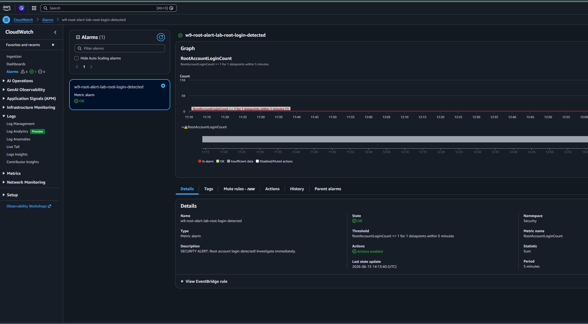
</picture>

---

#### 3.2 Alarm Configuration Detail

<picture>
  <source media="(prefers-color-scheme: dark)" srcset="assets/SS-05_alarm_configuration_detail_dark.png">
  <source media="(prefers-color-scheme: light)" srcset="assets/SS-05_alarm_configuration_detail_light.png">
  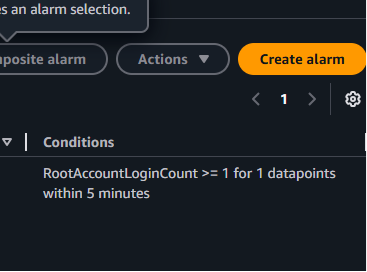
</picture>

---

### PHẦN 4 — SNS Topic & Email

#### 4.1 SNS Topic + Subscription Confirmed

<picture>
  <source media="(prefers-color-scheme: dark)" srcset="assets/SS-06_sns_topic_and_subscription_dark.png">
  <source media="(prefers-color-scheme: light)" srcset="assets/SS-06_sns_topic_and_subscription_light.png">
  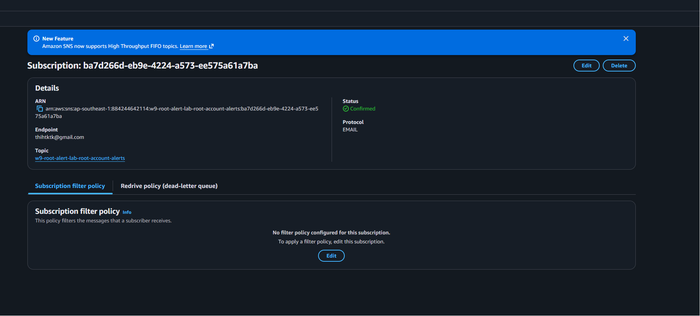
</picture>

---

#### 4.2 Email Xác Nhận Subscription

<picture>
  <source media="(prefers-color-scheme: dark)" srcset="assets/SS-07_confirmation_email_dark.png">
  <source media="(prefers-color-scheme: light)" srcset="assets/SS-07_confirmation_email_light.png">
  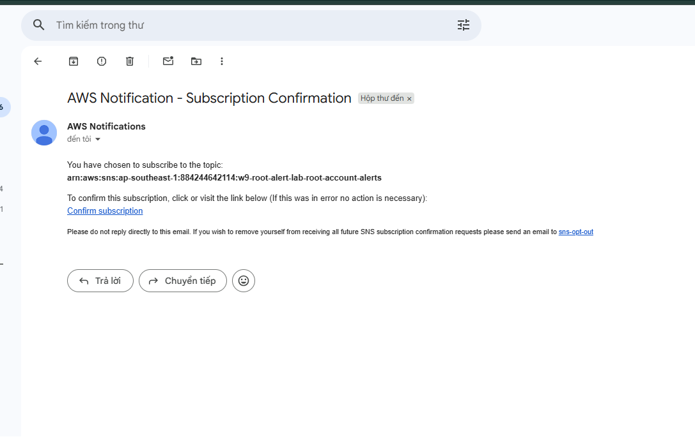
</picture>

---

### PHẦN 5 — Test Trigger & Alert

#### 5.1 Root Login Simulation (put-metric-data)

<picture>
  <source media="(prefers-color-scheme: dark)" srcset="assets/SS-08_root_login_simulation_dark.png">
  <source media="(prefers-color-scheme: light)" srcset="assets/SS-08_root_login_simulation_light.png">
  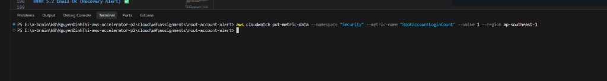
</picture>

---

#### 5.2 CloudWatch Alarm → ALARM State 🚨

<picture>
  <source media="(prefers-color-scheme: dark)" srcset="assets/SS-09_alarm_state_firing_dark.png">
  <source media="(prefers-color-scheme: light)" srcset="assets/SS-09_alarm_state_firing_light.png">
  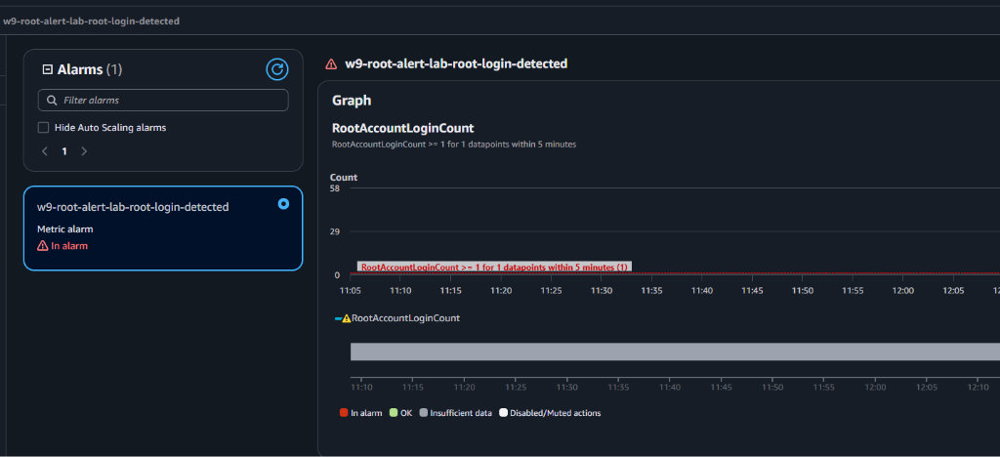
</picture>

---

#### 5.3 Email ALARM Nhận Được 📧

<picture>
  <source media="(prefers-color-scheme: dark)" srcset="assets/SS-10_email_alert_received_dark.png">
  <source media="(prefers-color-scheme: light)" srcset="assets/SS-10_email_alert_received_light.png">
  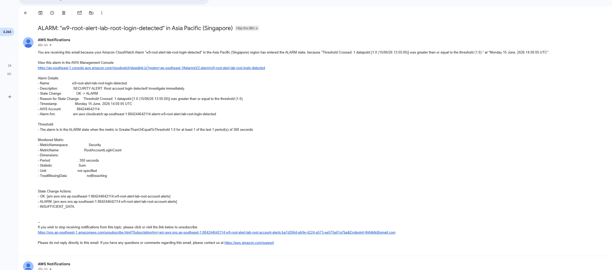
</picture>

---

### PHẦN 6 — CloudTrail & Dashboard

#### 6.1 CloudTrail Event Detail

<picture>
  <source media="(prefers-color-scheme: dark)" srcset="assets/SS-11_cloudtrail_event_detail_dark.png">
  <source media="(prefers-color-scheme: light)" srcset="assets/SS-11_cloudtrail_event_detail_light.png">
  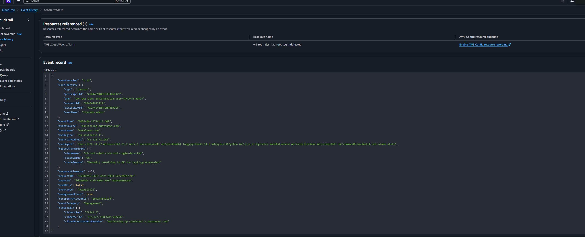
</picture>

---

#### 6.2 CloudWatch Security Dashboard

<picture>
  <source media="(prefers-color-scheme: dark)" srcset="assets/SS-12_dashboard_overview_dark.png">
  <source media="(prefers-color-scheme: light)" srcset="assets/SS-12_dashboard_overview_light.png">
  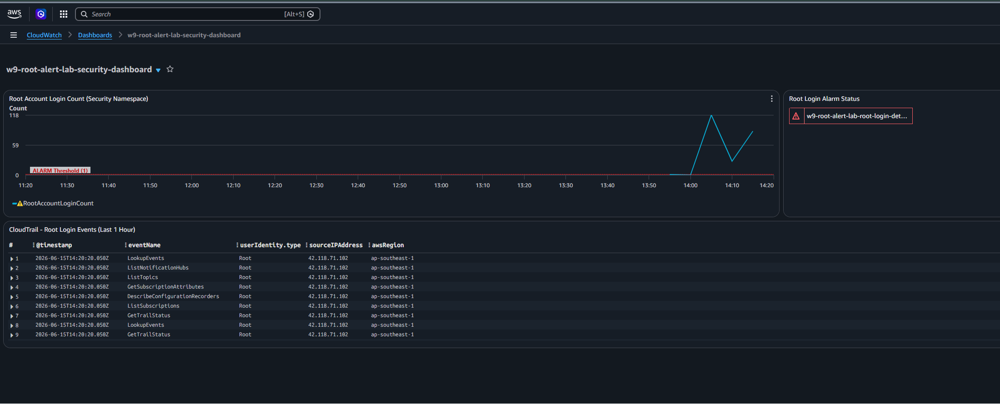
</picture>

---


## V. KẾT LUẬN

Bài lab W9 Session 05 đã triển khai thành công hệ thống **Root Account Login Alert** với:

1. **CloudTrail Trail** — Ghi lại toàn bộ Management Events, stream real-time vào CloudWatch Logs
2. **Metric Filter** — Tự động phát hiện root login pattern trong log stream
3. **CloudWatch Alarm** — Trigger NGAY khi có bất kỳ root login nào (threshold = 1)
4. **SNS Email Alert** — Gửi email cảnh báo tới Security Team trong vòng < 15 phút

> **Kết quả quan trọng nhất:** Khi root account đăng nhập, Security Team nhận email cảnh báo tự động — không cần giám sát thủ công, không có blind spots.
