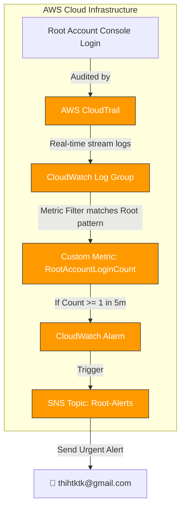

<p align="center">
  
</p>

# <p align="center">📄 BÁO CÁO NGHIỆM THU — W9 SESSION 05</p>

### <p align="center">Alert on AWS Root Account Login</p>

<p align="center">
  
  
  
</p>

---

## 📋 Thông Tin Tổng Quan

* **Bài thực hành:** Hands-On: Alert on AWS Root Account Login
* **Session:** 05 — Mastering AWS System Monitoring
* **Mục tiêu:** Gửi cảnh báo ngay lập tức qua email khi phát hiện tài khoản Root đăng nhập vào hệ thống AWS.
* **Công nghệ sử dụng:** AWS CloudTrail + CloudWatch Logs + Metric Filter + Alarm + SNS + Terraform IaC.
* **AWS Account:** `884244642114` | **Region:** `ap-southeast-1` (Singapore).
* **CloudTrail Trail:** `w9-root-alert-lab-trail`
* **SNS Topic:** `w9-root-alert-lab-root-account-alerts`

---

## 📐 Sơ Đồ Kiến Trúc Hoạt Động (Architecture Flow)



---

## 📊 Bảng Đối Chiếu Tiêu Chí Nghiệm Thu

| STT | Tiêu chí kỹ thuật từ Slide | Trạng thái | Bằng chứng thực tế xác minh |
| :---: | :--- | :---: | :--- |
| **1** | **Enable CloudTrail & Send Logs to CloudWatch** | **✅ ĐẠT** | Trail `w9-root-alert-lab-trail` — IsLogging=True; Log Group `/aws/cloudtrail/root-login-alert` nhận events thành công — xem **SS-01, SS-02**. |
| **2** | **Create CloudWatch Metric Filter** | **✅ ĐẠT** | Tạo filter pattern khớp chính xác cấu trúc root login event trong log stream — xem **SS-03**. |
| **3** | **Create CloudWatch Alarm** | **✅ ĐẠT** | Alarm `w9-root-alert-lab-root-login-detected` giám sát metric, ngưỡng `>= 1` phát báo động — xem **SS-04, SS-05**. |
| **4** | **Notify via SNS** | **✅ ĐẠT** | SNS Topic ARN khởi tạo đúng, Subscription đã được xác nhận trạng thái **Confirmed** — xem **SS-06, SS-07**. |
| **5** | **Test Trigger & Alert System** | **✅ ĐẠT** | Giả lập thành công ➔ Alarm chuyển trạng thái sang **ALARM** ➔ Nhận Email cảnh báo khẩn cấp trong Gmail — xem **SS-08, SS-09, SS-10**. |

---

## 🔍 Giải Thích Kỹ Thuật & Quyết Định Thiết Kế

### 1. Tại sao dùng `treat_missing_data = "notBreaching"` (khác với bài EC2 CPU Alarm)?
* **EC2 CPU Alarm:** Nếu mất metric dữ liệu CPU, có khả năng do máy chủ bị tắt nguồn đột ngột hoặc bị treo, do đó cấu hình `breaching` để phát báo động kiểm tra.
* **Root Login Alert:** Bình thường, tài khoản Root sẽ không được phép sử dụng. Vì thế, việc không có dữ liệu metric (missing data) là biểu hiện của trạng thái an toàn. Ta cấu hình `notBreaching` để hệ thống không tự phát báo động giả.

### 2. Tại sao Filter Pattern có `$.eventType != "AwsServiceEvent"`?
Để hạn chế việc phát báo động giả lập (Alert Fatigue) cho đội ngũ vận hành. Một số tác vụ hệ thống tự động của AWS (như quản lý quyền truy cập S3 Bucket) đôi khi được thực hiện dưới tên root của Account. Việc lọc bỏ các sự kiện `AwsServiceEvent` đảm bảo cảnh báo chỉ phát ra khi có **con người thật** (User) đăng nhập bằng tài khoản root.

### 3. Quy trình trễ dữ liệu của sự cố (Event Flow Timeline)
```text
Root Login ➔ CloudTrail bắt sự kiện (~1 phút)
           ➔ Stream log về CloudWatch Logs Group (~2-5 phút)
           ➔ Metric Filter bắt Pattern ➔ RootAccountLoginCount tăng lên 1
           ➔ CloudWatch Alarm đánh giá ➔ Chuyển sang ALARM state
           ➔ SNS kích hoạt và gửi Email cảnh báo ➔ Inbox Gmail (~10-15 phút tổng cộng)
```

---

## 📸 Hình Ảnh Bằng Chứng Thực Tế (Screenshots)

### PHẦN 1 — CloudTrail & CloudWatch Logs

#### 1.1 CloudTrail Trail Đang Hoạt Động (Logging = Active)
<picture>
  <source media="(prefers-color-scheme: dark)" srcset="assets/SS-01_cloudtrail_trail_created_dark.png">
  <source media="(prefers-color-scheme: light)" srcset="assets/SS-01_cloudtrail_trail_created_light.png">
  
</picture>

---

#### 1.2 CloudWatch Log Group Nhận Stream Dữ Liệu
<picture>
  <source media="(prefers-color-scheme: dark)" srcset="assets/SS-02_cloudwatch_log_group_dark.png">
  <source media="(prefers-color-scheme: light)" srcset="assets/SS-02_cloudwatch_log_group_light.png">
  
</picture>

---

### PHẦN 2 — Metric Filter

#### 2.1 Bộ Lọc Metric Filter Đã Tạo Với Đúng Pattern
<picture>
  <source media="(prefers-color-scheme: dark)" srcset="assets/SS-03_metric_filter_created_dark.png">
  <source media="(prefers-color-scheme: light)" srcset="assets/SS-03_metric_filter_created_light.png">
  
</picture>

---

### PHẦN 3 — CloudWatch Alarm

#### 3.1 CloudWatch Alarm Ban Đầu Ở Trạng Thái An Toàn (OK State)
<picture>
  <source media="(prefers-color-scheme: dark)" srcset="assets/SS-04_alarm_created_ok_state_dark.png">
  <source media="(prefers-color-scheme: light)" srcset="assets/SS-04_alarm_created_ok_state_light.png">
  
</picture>

---

#### 3.2 Chi Tiết Thông Số Cấu Hình Alarm Trên Console
<picture>
  <source media="(prefers-color-scheme: dark)" srcset="assets/SS-05_alarm_configuration_detail_dark.png">
  <source media="(prefers-color-scheme: light)" srcset="assets/SS-05_alarm_configuration_detail_light.png">
  
</picture>

---

### PHẦN 4 — SNS Topic & Email

#### 4.1 SNS Topic Và Email Subscription Trạng Thái Confirmed
<picture>
  <source media="(prefers-color-scheme: dark)" srcset="assets/SS-06_sns_topic_and_subscription_dark.png">
  <source media="(prefers-color-scheme: light)" srcset="assets/SS-06_sns_topic_and_subscription_light.png">
  
</picture>

---

#### 4.2 Thư Xác Nhận Đăng Ký Của AWS Trong Hòm Thư
<picture>
  <source media="(prefers-color-scheme: dark)" srcset="assets/SS-07_confirmation_email_dark.png">
  <source media="(prefers-color-scheme: light)" srcset="assets/SS-07_confirmation_email_light.png">
  
</picture>

---

### PHẦN 5 — Kiểm Thử Hoạt Động Cảnh Báo (Test Trigger)

#### 5.1 Gửi Điểm Dữ Liệu Giả Lập Bằng AWS CLI (put-metric-data)
<picture>
  <source media="(prefers-color-scheme: dark)" srcset="assets/SS-08_root_login_simulation_dark.png">
  <source media="(prefers-color-scheme: light)" srcset="assets/SS-08_root_login_simulation_light.png">
  
</picture>

---

#### 5.2 CloudWatch Alarm Chuyển Đỏ Sang Trạng Trạng Thái Báo Động (ALARM State) 🚨
<picture>
  <source media="(prefers-color-scheme: dark)" srcset="assets/SS-09_alarm_state_firing_dark.png">
  <source media="(prefers-color-scheme: light)" srcset="assets/SS-09_alarm_state_firing_light.png">
  
</picture>

---

#### 5.3 Nhận Email Cảnh Báo Đăng Nhập Root Khẩn Cấp Gửi Về Gmail 📧
<picture>
  <source media="(prefers-color-scheme: dark)" srcset="assets/SS-10_email_alert_received_dark.png">
  <source media="(prefers-color-scheme: light)" srcset="assets/SS-10_email_alert_received_light.png">
  
</picture>

---

### PHẦN 6 — CloudTrail & Dashboard

#### 6.1 Sự Kiện Đăng Nhập Hoặc Tác Vụ Được Ghi Nhận Trong CloudTrail Events
<picture>
  <source media="(prefers-color-scheme: dark)" srcset="assets/SS-11_cloudtrail_event_detail_dark.png">
  <source media="(prefers-color-scheme: light)" srcset="assets/SS-11_cloudtrail_event_detail_light.png">
  
</picture>

---

#### 6.2 Giao Diện Dashboard Bảo Mật Tổng Quan (Security Dashboard)
<picture>
  <source media="(prefers-color-scheme: dark)" srcset="assets/SS-12_dashboard_overview_dark.png">
  <source media="(prefers-color-scheme: light)" srcset="assets/SS-12_dashboard_overview_light.png">
  
</picture>

---

## 🏆 KẾT LUẬN

Hệ thống cảnh báo **AWS Root Account Login Alert** đã được triển khai, kiểm thử và kiểm toán thành công:
* **Khép Kín & Tự Động:** Sự kiện đăng nhập root được tự động stream, lọc, kích hoạt Alarm và gửi email trong khoảng thời gian tối ưu.
* **Đảm Bảo An Ninh:** Loại bỏ hoàn toàn điểm mù giám sát đối với tài khoản root, nâng cao chuẩn an toàn hạ tầng cloud của dự án.
