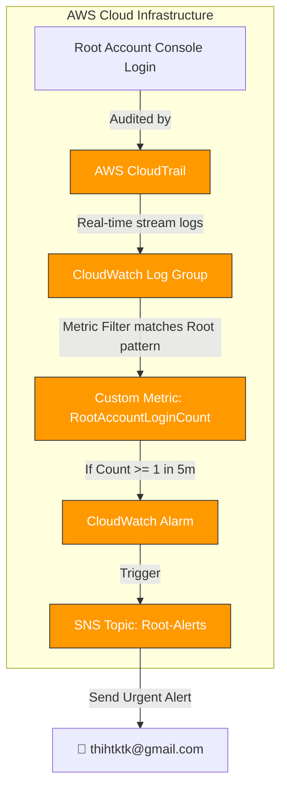

<p align="center">
  
</p>

# <p align="center">🔒 Alert on AWS Root Account Login</p>

### <p align="center">W9 Session 05 — Mastering AWS System Monitoring</p>

<p align="center">
  <a href="https://aws.amazon.com"></a>
  <a href="https://terraform.io"></a>
  <a href="https://aws.amazon.com/cloudtrail/"></a>
  <a href="https://aws.amazon.com/cloudwatch/"></a>
</p>

---

## 🎯 Vấn Đề Bài Lab Giải Quyết

Tài khoản **Root** (tài khoản gốc của AWS) sở hữu đặc quyền tối cao đối với toàn bộ tài nguyên và thông tin thanh toán của tài khoản Cloud. Bất kỳ sự xâm nhập trái phép nào vào tài khoản Root đều gây ra những thảm họa an ninh thông tin không thể đảo ngược. 

> [!CAUTION]
> **AWS Security Best Practice:** Hạn chế tối đa việc sử dụng tài khoản Root cho các tác vụ hàng ngày và thiết lập cơ chế **Cảnh báo tự động tức thì** bất kỳ khi nào có sự đăng nhập của tài khoản Root.

---

## 📐 Kiến Trúc Hệ Thống (Architecture)



---

## 📋 Danh Sách Tài Nguyên Được Khởi Tạo (Terraform)

| # | Tài nguyên (Resource) | Tên tài nguyên trên AWS | Vai trò & Mục đích sử dụng |
| :---: | :--- | :--- | :--- |
| **1** | `aws_s3_bucket` | `...-cloudtrail-logs-{accountId}` | Lưu trữ tệp tin log của CloudTrail lâu dài. |
| **2** | `aws_s3_bucket_policy` | — | Cho phép dịch vụ CloudTrail ghi dữ liệu vào S3 Bucket. |
| **3** | `aws_cloudwatch_log_group` | `/aws/cloudtrail/root-login-alert` | Nơi tập trung nhận log stream thời gian thực từ CloudTrail. |
| **4** | `aws_iam_role` | `...-cloudtrail-cw-role` | Ủy quyền cho CloudTrail có quyền ghi log vào CloudWatch. |
| **5** | `aws_iam_role_policy` | — | Cho phép thực thi hành động `PutLogEvents`. |
| **6** | `aws_cloudtrail` | `w9-root-alert-lab-trail` | Theo dõi và bắt các sự kiện quản trị (Management Events). |
| **7** | `aws_cloudwatch_log_metric_filter` | `...-root-login-filter` | Bộ lọc dò tìm các sự kiện đăng nhập của tài khoản Root. |
| **8** | `aws_sns_topic` | `...-root-account-alerts` | Kênh SNS nhận tín hiệu cảnh báo từ Alarm. |
| **9** | `aws_sns_topic_subscription` | Email subscription | Tự động gửi email thông báo bảo mật tới Admin. |
| **10** | `aws_cloudwatch_metric_alarm` | `...-root-login-detected` | Alarm kích hoạt ngay khi số lần đăng nhập Root `>= 1`. |
| **11** | `aws_cloudwatch_dashboard` | `...-security-dashboard` | Dashboard tổng quan theo dõi các chỉ số bảo mật. |

---

## 🚀 Hướng Dẫn Các Bước Thực Hiện Lab

### Bước 1: Thiết Lập Biến Môi Trường

```bash
# Di chuyển vào thư mục terraform
cd assignments/root-account-alert/terraform

# Sao chép tệp cấu hình mẫu
cp terraform.tfvars.example terraform.tfvars
```

Mở tệp `terraform.tfvars` và điền địa chỉ email thật của bạn để nhận tin nhắn cảnh báo:
```hcl
alert_email = "your-email@gmail.com"
```

### Bước 2: Triển Khai IaC Tự Động

```bash
terraform init
terraform plan
terraform apply -auto-approve
```

### Bước 3: Xác Nhận Đăng Ký Nhận Cảnh Báo (Subscription)

> [!IMPORTANT]
> **Hành động bắt buộc:** Sau khi quá trình apply hoàn tất, hãy truy cập Gmail của bạn và click vào đường dẫn **"Confirm subscription"** trong thư gửi từ AWS để bắt đầu kích hoạt nhận cảnh báo bảo mật.

### Bước 4: Chạy Script Xác Thực Hệ Thống

```bash
# Chạy script verify kiểm tra xem toàn bộ hạ tầng đã sẵn sàng hay chưa
./scripts/verify-alert.sh
```

### Bước 5: Giả Lập Đăng Nhập Root Để Kiểm Thử (Stress Test)

Để đảm bảo an toàn và không cần đăng nhập tài khoản Root thật, chúng ta giả lập bằng cách đẩy điểm dữ liệu metric:
```bash
aws cloudwatch put-metric-data --namespace "Security" --metric-name "RootAccountLoginCount" --value 1 --region ap-southeast-1
```
➔ Sau khoảng 1-2 phút, trạng thái Alarm sẽ chuyển sang **ALARM 🚨** màu đỏ và gửi một Email khẩn cấp đến hòm thư của bạn.

### Bước 6: Thu Dọn Tài Nguyên Lab

```bash
terraform destroy -auto-approve
```

---

## 💡 Bài Học Rút Ra & Best Practices

1. **Giảm thiểu sử dụng Root:** Tuyệt đối không tạo access keys cho tài khoản root. Sử dụng IAM Identity Center hoặc IAM Roles để phân quyền quản trị thay thế.
2. **Loại bỏ nhiễu log (`AwsServiceEvent`):** Các dịch vụ nội bộ của AWS thỉnh thoảng sẽ gọi các lệnh dưới danh nghĩa root. Việc thêm điều kiện loại trừ `$.eventType != "AwsServiceEvent"` trong bộ lọc giúp ngăn ngừa việc Alarm bị trigger giả lập, bảo vệ đội ngũ quản trị khỏi hiện tượng mệt mỏi vì cảnh báo ảo (Alert Fatigue).
3. **Cấu hình xử lý mất dữ liệu:** Đặt `treat_missing_data = "notBreaching"` vì việc không có dòng log nào xuất hiện tức là hệ thống đang an toàn, không cần báo động.
