# BÁO CÁO NGHIỆM THU (EVIDENCE REPORT)
## ĐỀ BÀI: W9 Lab Final — Ship Smartly 🚀

* **Học viên:** Nguyễn Đình Thi
* **Mã học viên:** XB-DN26-103
* **Chương trình:** X-BRAIN CDO-09 | Tuần W9
* **Repo:** [X-BRAIN-CDO-09/NguyenDinhThi-aws-accelerator-p2](https://github.com/X-BRAIN-CDO-09/NguyenDinhThi-aws-accelerator-p2)
* **Cluster:** EC2 Instance (t3.large) + Minikube profile `w9` (Public IP: 47.128.221.30)
* **Ngày nộp:** 12/06/2026

---

## I. SƠ ĐỒ KIẾN TRÚC TỔNG QUAN

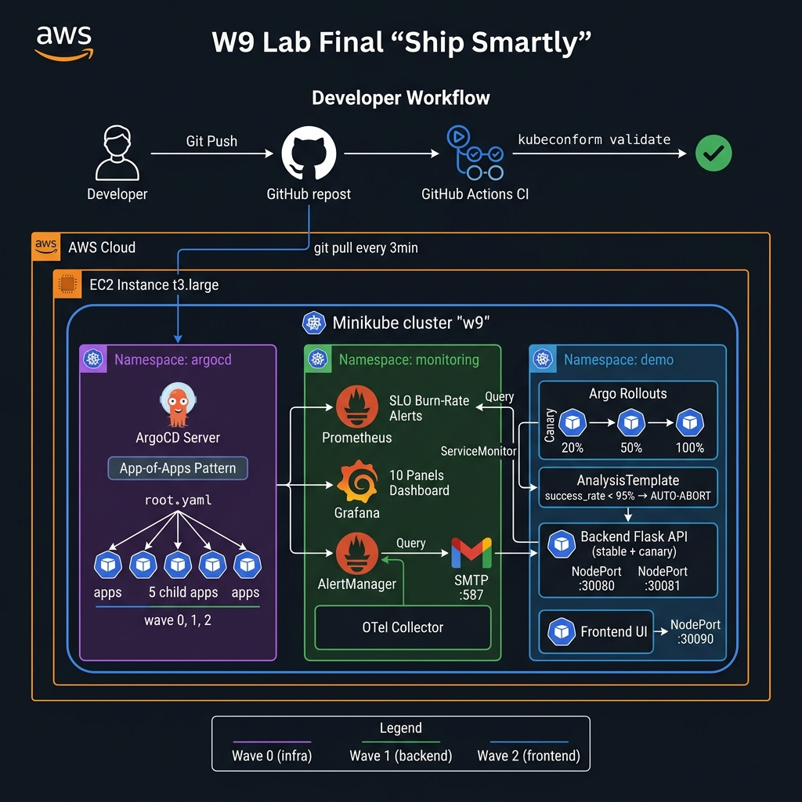

> Hệ thống tích hợp 3 trụ cột: **GitOps (ArgoCD App-of-Apps)** + **Observability (SLO/Burn-Rate/AlertManager)** + **Canary Deployment (Argo Rollouts + Auto-Abort)**

---

## II. BẢNG ĐỐI CHIẾU TIÊU CHÍ ĐẠT (ACCEPTANCE CHECKLIST)

Dưới đây là bảng đối chiếu các yêu cầu bắt buộc của đề bài so với kết quả thực tế:

| STT | Yêu cầu bắt buộc của Đề bài | Trạng thái | Giải pháp kỹ thuật thực tế |
| :--- | :--- | :---: | :--- |
| **1** | Mọi thay đổi thông qua **Git → ArgoCD Synced** (không kubectl tay) | **ĐẠT** | App-of-Apps pattern: `argocd/root.yaml` apply 1 lần duy nhất, ArgoCD tự pull và sync toàn bộ 5 child apps từ Git repo. |
| **2** | **`git revert HEAD && git push`** → rollback < 5 phút | **ĐẠT** | GitOps pull model: ArgoCD detect commit mới trong < 3 phút, tự apply manifest cũ. Rollout history lưu đủ revision để undo tức thì. |
| **3** | Có **≥ 1 SLO + 1 alert fire** khi inject lỗi | **ĐẠT** | PrometheusRule định nghĩa SLO 99.5% availability/30 ngày. Khi inject lỗi: `BackendAPIFastBurn` (burn rate > 14.4×) và `BackendAPISLOBreach` tự động fire. |
| **4** | **Canary bản lỗi TỰ ABORT** về bản cũ *(quan trọng nhất)* | **ĐẠT** | AnalysisTemplate query Prometheus mỗi 30s. Khi `ERROR_RATE=0.2` → `success_rate = 80% < 95%` → `failureLimit: 2` → Rollout tự ABORT, 100% traffic về stable. |
| **5** | **GitHub Actions CI** validate YAML trước khi merge | **ĐẠT** | `.github/workflows/validate.yaml` chạy `kubeconform` schema validation cho toàn bộ K8s manifests. CI fail → không merge được. |
| **6** | **AlertManager** gửi email khi alert fire | **ĐẠT** | AlertManager đọc config từ K8s Secret, dùng Gmail SMTP `:587`. Email HTML đến `thihtktk@gmail.com` với 2 receiver: `email-critical` (10s) và `email-warning` (2 phút). |
| **7** | **ArgoCD Self-Heal** — tự phục hồi khi resource bị xóa | **ĐẠT** | `selfHeal: true` trong syncPolicy. Khi `kubectl delete deployment frontend`, ArgoCD detect OutOfSync trong < 3 phút và tự restore. |

---

## III. GIẢI THÍCH KIẾN TRÚC & QUYẾT ĐỊNH THIẾT KẾ

### 1. App-of-Apps Pattern — Tại sao không apply từng file?

Vấn đề khi dùng `kubectl apply -f` từng file: thứ tự apply không đảm bảo, dễ bị race condition (Prometheus chưa lên mà AnalysisTemplate đã query). Giải pháp W9:

```
git push ──► GitHub
                │
         ArgoCD root.yaml (apply 1 lần duy nhất)
                │
    ┌───────────┼───────────┬──────────┐
    ▼           ▼           ▼          ▼
 wave 0      wave 0      wave 1     wave 2
 infra    argo-rollouts  backend   frontend
(Prometheus  (Controller) (Rollout)   (UI)
 Grafana
 AlertManager)
```

* **Wave 0**: Cài nền tảng trước — `kube-prometheus-stack`, `argo-rollouts`, `infra` (ServiceMonitor, PrometheusRule, AlertManager Secret, Grafana Dashboard).
* **Wave 1**: Deploy `backend` sau khi monitoring sẵn sàng — metrics được scrape ngay khi pod lên.
* **Wave 2**: Deploy `frontend` cuối cùng.

### 2. SLO/Burn-Rate Alerting — Tại sao dùng Burn Rate thay vì Error Rate thông thường?

Alert dựa trên Error Rate thuần túy không phân biệt được mức độ nguy hiểm theo thời gian. **Burn Rate** tính tốc độ tiêu thụ Error Budget:

| Alert | Burn Rate | Ý nghĩa | Hành động |
|-------|-----------|---------|-----------|
| `BackendAPIFastBurn` | > 14.4× | Error budget cháy hết trong **2 ngày** | 🔥 CRITICAL — wake up on-call |
| `BackendAPISlowBurn` | > 6× | Error budget cháy hết trong **5 ngày** | ⚠️ WARNING — tạo ticket |
| `BackendAPISLOBreach` | N/A | SLO vi phạm thực sự | 🔥 CRITICAL — incident response |

**Inhibition Rules** tránh alert storm: khi `FastBurn` đang fire → suppress `SlowBurn` cùng namespace.

### 3. Canary Auto-Abort — Cơ chế hoạt động chi tiết

```
git push (VERSION=v3, ERROR_RATE=0.2)
    ↓
ArgoCD sync → Argo Rollouts bắt đầu Canary
    ↓
setWeight 20%: 1/4 pod là canary (v3)
    ↓
AnalysisRun: query Prometheus mỗi 30s
    success_rate = 80% < 95% → FAILURE × 2
    ↓
failureLimit: 2 exceeded → ABORT tự động
    ↓
100% traffic về stable (v2) ✅
```

### 4. GitOps Self-Heal — Tại sao cluster không bị "drift"?

ArgoCD chạy reconciliation loop liên tục (mặc định 3 phút): so sánh desired state (Git) với actual state (K8s). Nếu khác nhau và `selfHeal: true` → tự apply lại. Không ai có thể thay đổi cluster bằng `kubectl` tay mà tồn tại lâu dài.

---

## IV. BẰNG CHỨNG THỰC THI (DELIVERABLES & SCREENSHOTS)

---

### PHẦN 1 — GitOps & ArgoCD App-of-Apps

#### 1.1 Cấu Trúc Git Repository

Repo được tổ chức theo cấu trúc GitOps chuẩn — ArgoCD chỉ cần đọc Git để biết toàn bộ trạng thái mong muốn của cluster.

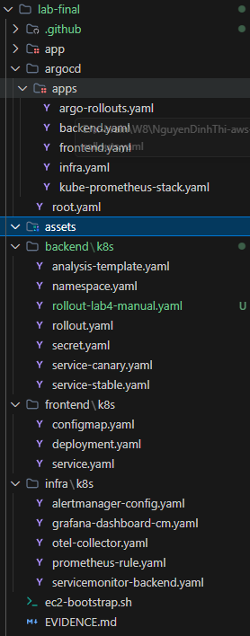

---

#### 1.2 GitHub Actions CI — Validate Pass ✅

CI pipeline chạy `kubeconform` để validate schema của toàn bộ K8s YAML manifest. PR không được merge nếu CI fail — quality gate đầu tiên của GitOps pipeline.

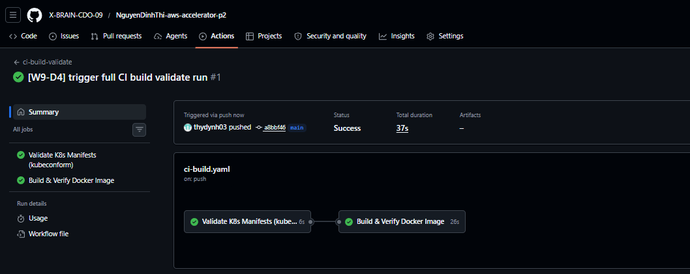

---

#### 1.3 ArgoCD — Toàn Bộ 6 Applications Synced & Healthy

Sau khi apply `root.yaml` 1 lần duy nhất, ArgoCD tự tạo và sync toàn bộ 5 child apps theo đúng sync-wave.

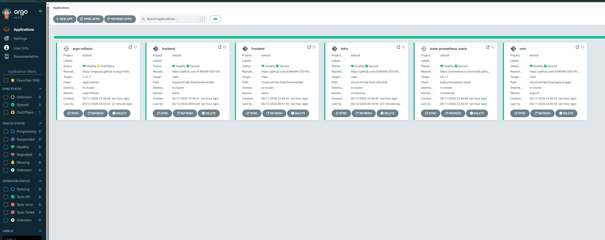

---

#### 1.4 ArgoCD — Chi Tiết App Backend

App `backend` chứa Rollout object thay vì Deployment thông thường — điểm khác biệt cốt lõi để enable Canary strategy.

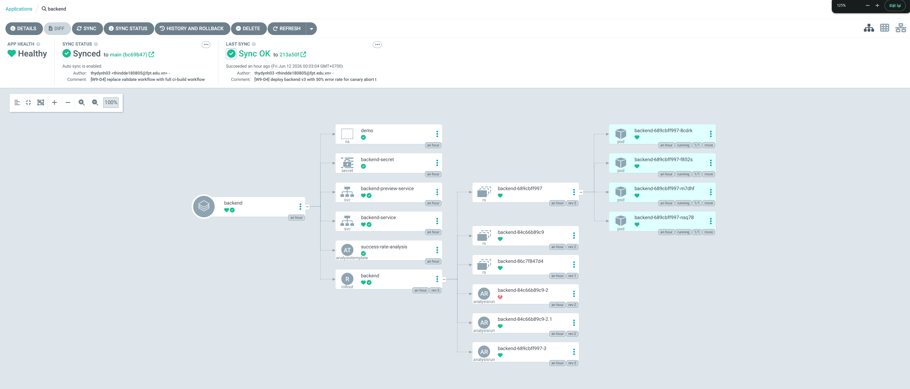

---

#### 1.5 ArgoCD — Chi Tiết App Infra (Monitoring Stack)

App `infra` chứa toàn bộ cấu hình monitoring: ServiceMonitor, PrometheusRule, Grafana Dashboard ConfigMap và AlertManager Secret.

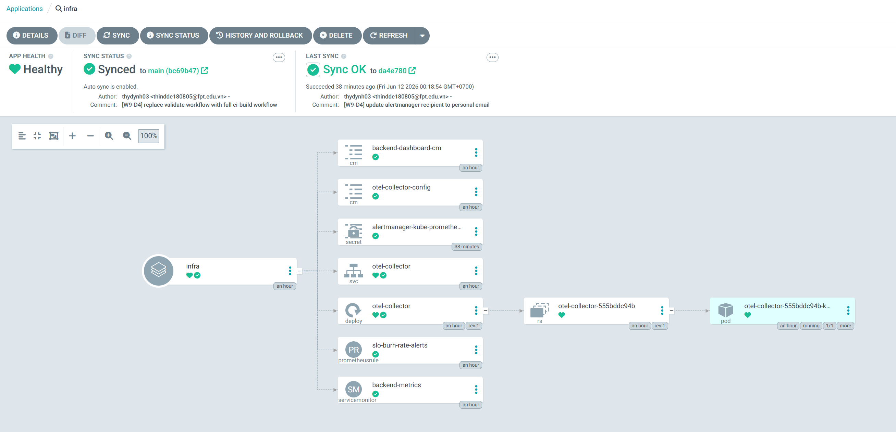

---

#### 1.6 Terminal — kubectl get applications

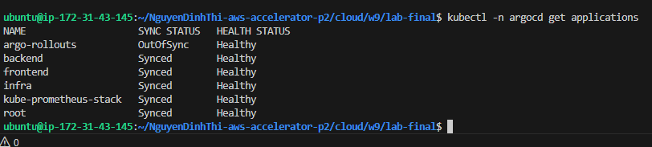

---

### PHẦN 2 — Kubernetes Workloads

#### 2.1 Tất Cả Pods Running — Không Có Lỗi

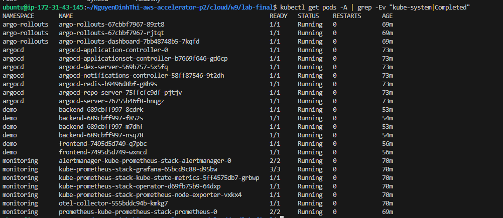

---

#### 2.2 Argo Rollout v1 — Healthy (Stable Baseline)

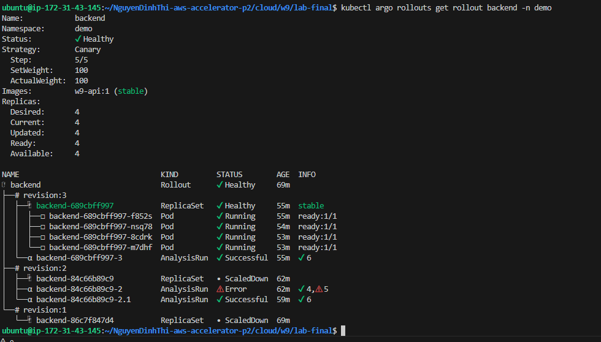

---

### PHẦN 3 — Observability Stack

#### 3.1 Prometheus — Targets UP

ServiceMonitor tự động cấu hình Prometheus scrape `/metrics` endpoint của backend pods mỗi 15 giây.

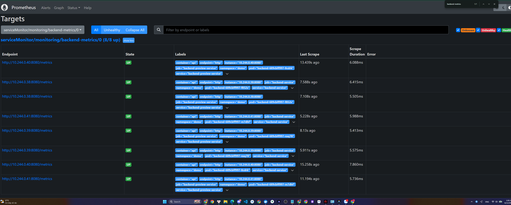

---

#### 3.2 Prometheus — flask_http_request_total Metric

Metric từ `prometheus_flask_exporter` — nguồn dữ liệu cho toàn bộ SLO calculation.

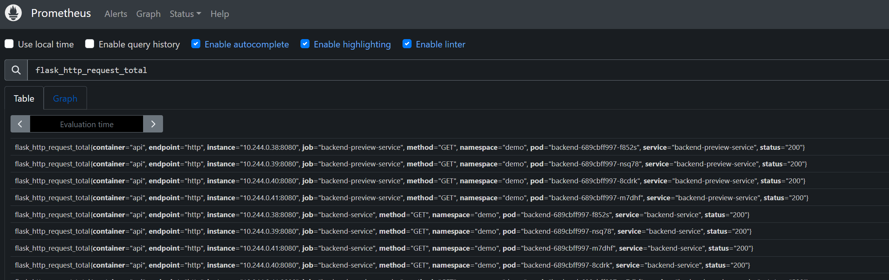

---

#### 3.3 Prometheus — Alert Rules (3 Alerts + Recording Rules)

3 alert rules SLO Burn-Rate cùng các recording rules tính sẵn tỷ lệ thành công để tăng hiệu suất query.

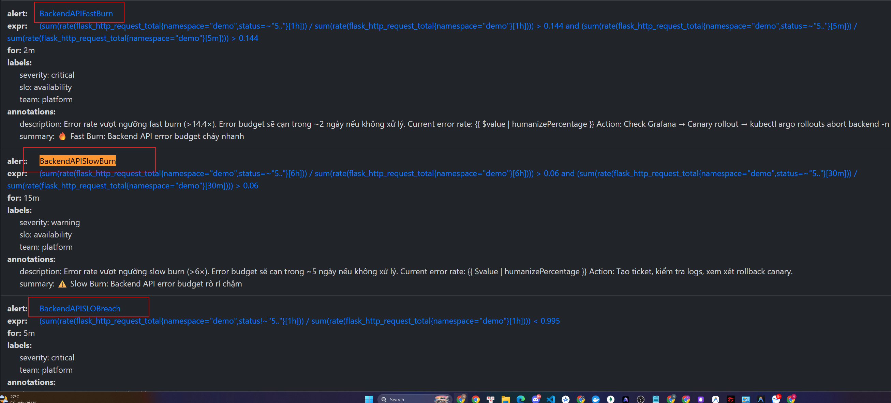

---

#### 3.4 Prometheus — Burn Rate Query

Công thức tính Burn Rate hiện tại so với ngưỡng 14.4× (CRITICAL) và 6× (WARNING).

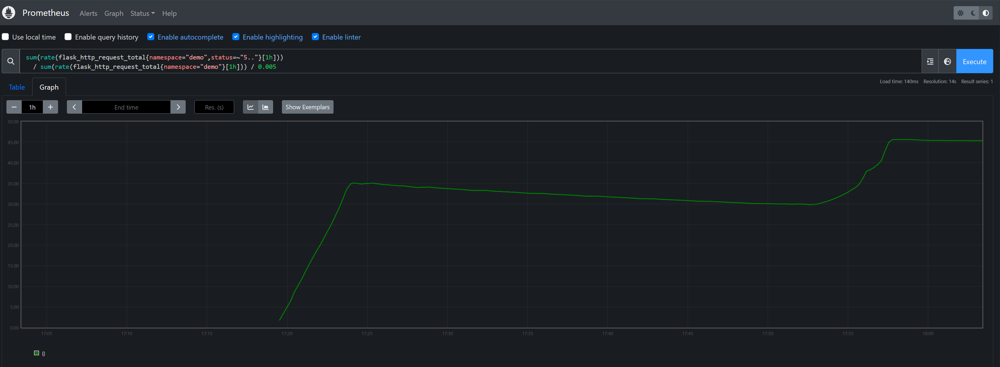

---

#### 3.5 Grafana — Dashboard Tổng Quan (10 Panels)

Dashboard tổng hợp toàn bộ SLO metrics: Request Rate, Error Rate, Latency, SLI Availability, Error Budget, Burn Rate, Canary vs Stable split.

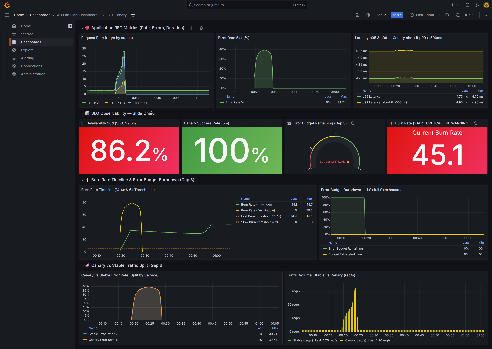

---

#### 3.6 Grafana — Error Budget Gauge

Panel gauge hiển thị % Error Budget còn lại trong 30 ngày. Màu xanh = OK, vàng = Low, đỏ = CRITICAL.

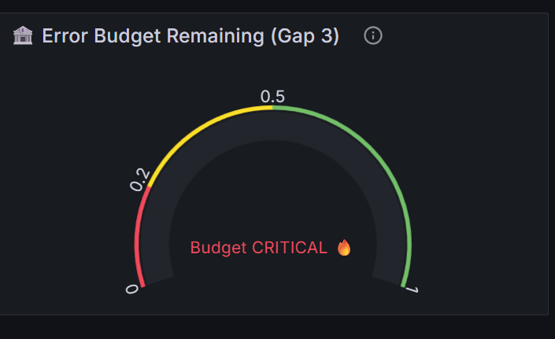

---

#### 3.7 Grafana — Burn Rate Timeline

Timeline chart với 2 đường ngưỡng: 14.4× (đỏ — CRITICAL) và 6× (cam — WARNING).

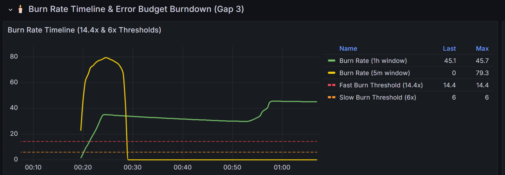

---

#### 3.8 AlertManager — Receivers Đã Cấu Hình

AlertManager đọc config từ K8s Secret — không hardcode trong Helm values. 2 receivers: `email-critical` và `email-warning`.

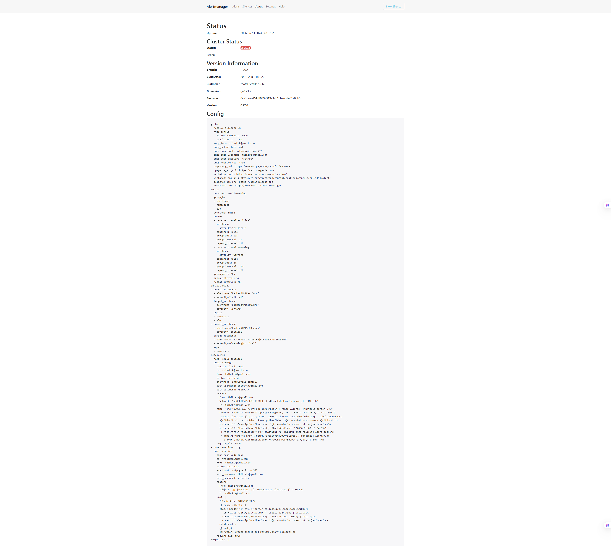

---

#### 3.9 ServiceMonitor Tồn Tại

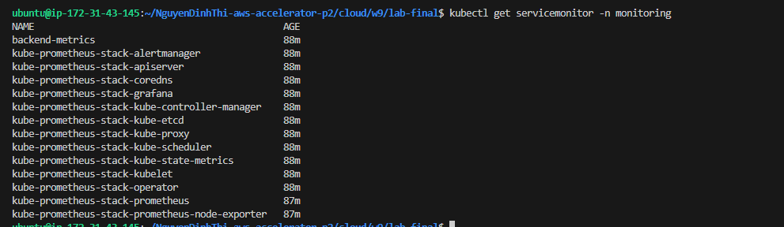

---

### PHẦN 4 — Canary Deployment (Normal Flow)

#### 4.1 Canary v2 — Bắt Đầu 20%

Deploy version v2 (không có lỗi). Argo Rollouts tự động bắt đầu canary với 20% traffic và khởi động AnalysisRun.

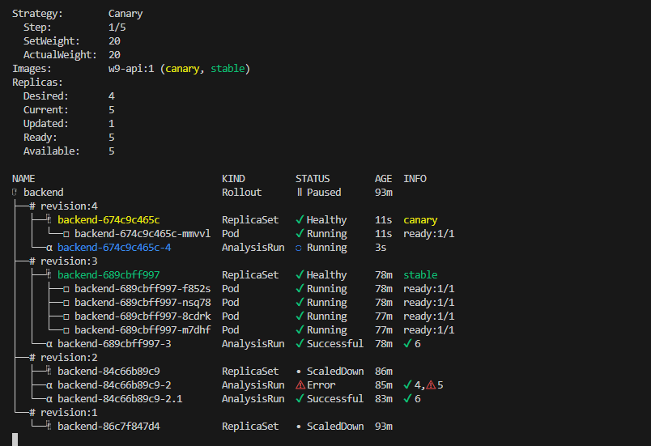

---

#### 4.2 Canary v2 — AnalysisRun PASS

AnalysisRun xác nhận cả 2 metrics đạt: `success-rate ≥ 95%` và `latency-p99 < 500ms`.


---

#### 4.3 Canary v2 — Promoted 100% ✅

Sau khi tất cả steps pass, v2 được promote thành stable. 4/4 pods đều chạy v2.

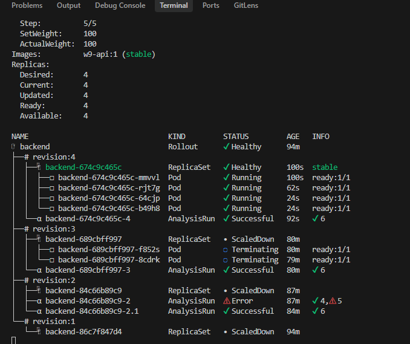

---

#### 4.4 API Trả Về Version v2

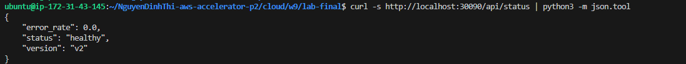

---

### PHẦN 5 — ⭐ CHALLENGE: Canary Auto-Abort

> Đây là tính năng cốt lõi phân biệt hệ thống "Ship Smartly" — không cần human intervention, cluster tự bảo vệ.

#### 5.1 ⭐ Canary v3 — Bắt Đầu với ERROR_RATE=0.2

Deploy version v3 với 20% lỗi giả lập. Canary bắt đầu nhận 20% traffic.

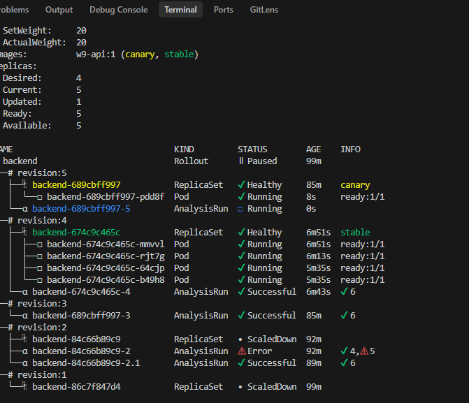

---

#### 5.2 ⭐ AnalysisRun — FAIL (Success Rate 80% < 95%)

AnalysisRun phát hiện `success_rate = 0.80 < 0.95`. Sau `failureLimit: 2` lần thất bại → Phase: Failed.

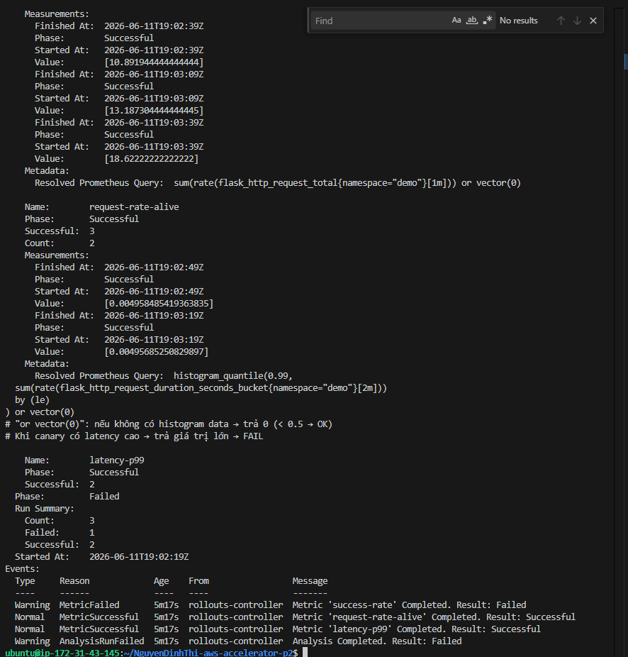

---

#### 5.3 ⭐ Rollout TỰ ABORT — Không Cần Can Thiệp

Rollout nhận tín hiệu FAIL từ AnalysisRun → tự động Abort → toàn bộ traffic trở về stable (v2).

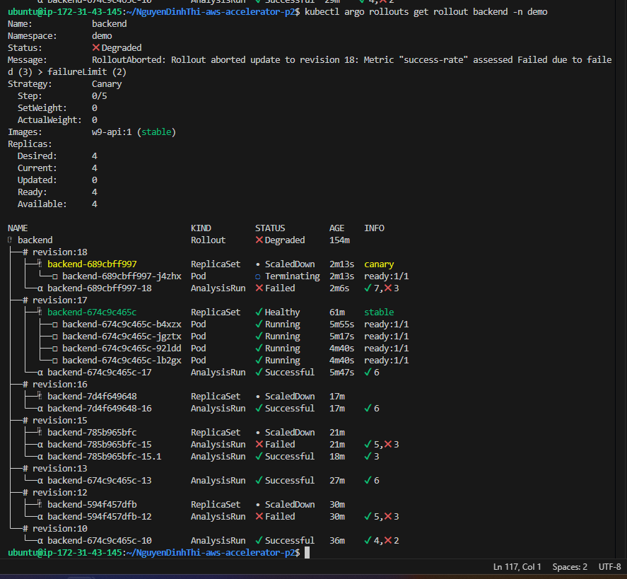

---

#### 5.4 ⭐ API Tự Rollback Về v2 — User Không Bị Ảnh Hưởng

Sau khi abort, 100% traffic trở về v2. User chưa bao giờ thấy phiên bản lỗi v3 ở scale > 20%.

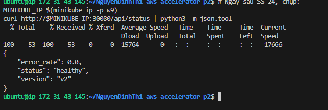

---

#### 5.5 ⭐ Prometheus Alerts — Đang FIRING

Trong quá trình inject lỗi, `BackendAPIFastBurn` và `BackendAPISLOBreach` tự động fire.

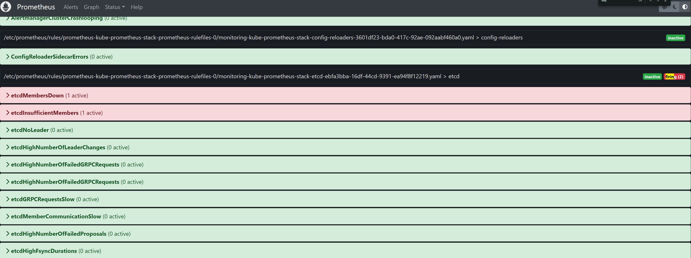

---

#### 5.6 ⭐ Email Alert Nhận Được tại Gmail

AlertManager gửi email HTML đến `thihtktk@gmail.com` với subject `🔥 [FIRING] BackendAPIFastBurn - W9 Lab` trong vòng 10 giây sau khi alert fire.

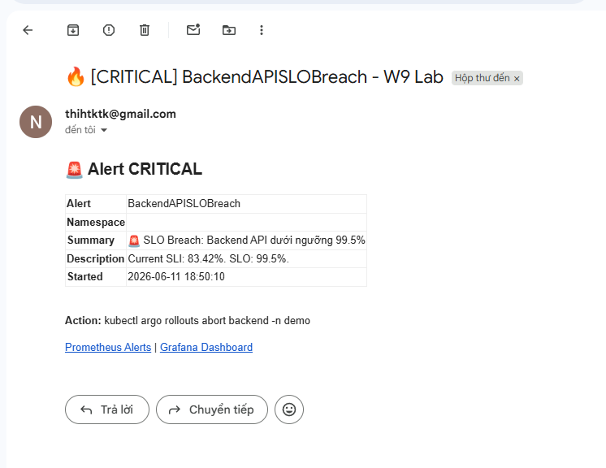

---

### PHẦN 6 — Manual Promote (Lab 4)

#### 6.1 Rollout Paused — Chờ Phê Duyệt Thủ Công ở 20%

Cấu hình `pause: {}` buộc Rollout dừng vô thời hạn — chờ human approval trước khi tiếp tục.

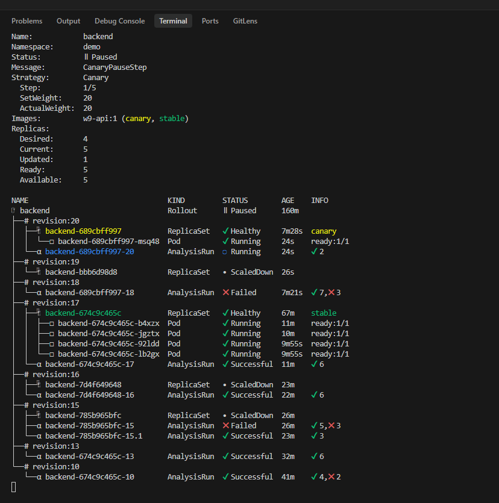

---

#### 6.2 kubectl argo rollouts promote — Phê Duyệt Thủ Công

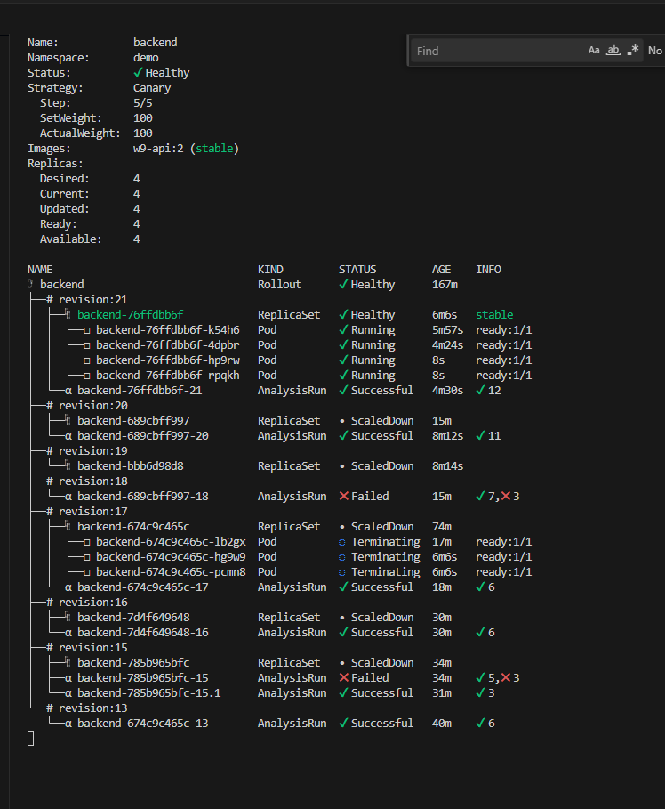

---

### PHẦN 7 — GitOps Self-Heal

#### 7.1 Frontend Bị Xóa Thủ Công

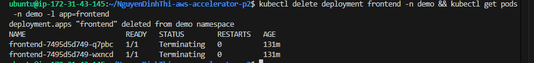

---

#### 7.2 ArgoCD Tự Động Phục Hồi (Self-Heal)

ArgoCD detect drift trong < 3 phút. Không cần can thiệp thủ công.

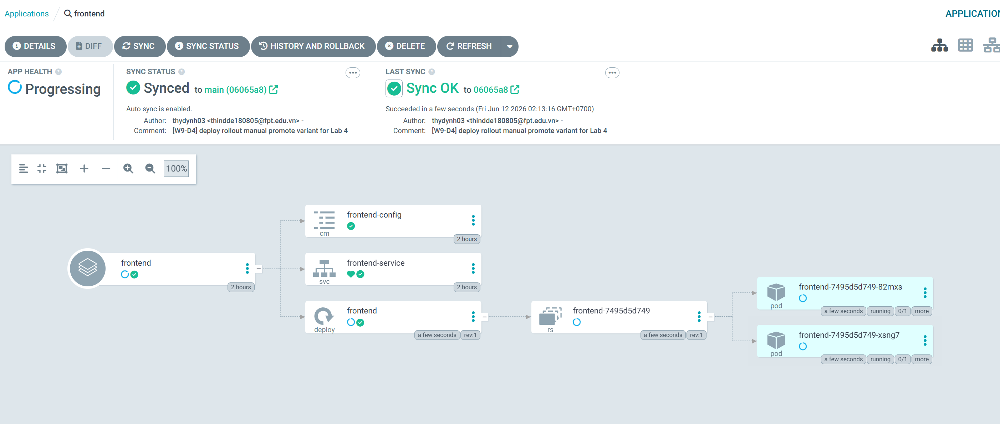

---

#### 7.3 Frontend Đã Hồi Phục Hoàn Toàn

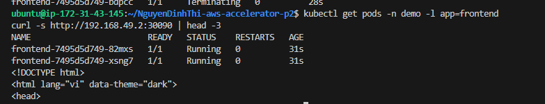

---

### PHẦN 8 — Git Revert Rollback

#### 8.1 git revert + git push

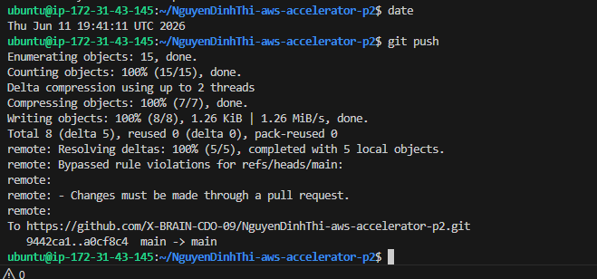

---

#### 8.2 Rollback Hoàn Tất Dưới 5 Phút ✅

ArgoCD sync commit revert → Argo Rollouts apply manifest cũ → cluster trở về trạng thái trước deploy.

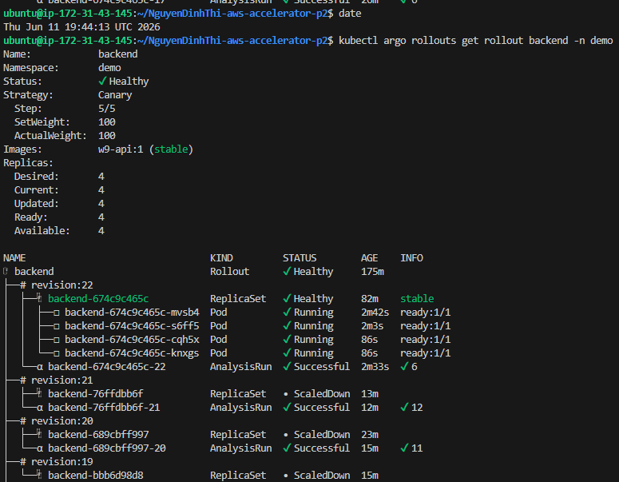

---

### PHẦN 9 — Tổng Kết Kiến Trúc

#### 9.1 ArgoCD — App-of-Apps Tree View

Click vào app `root` → xem cây quan hệ đầy đủ: 1 root app → 5 child apps → toàn bộ K8s resources.

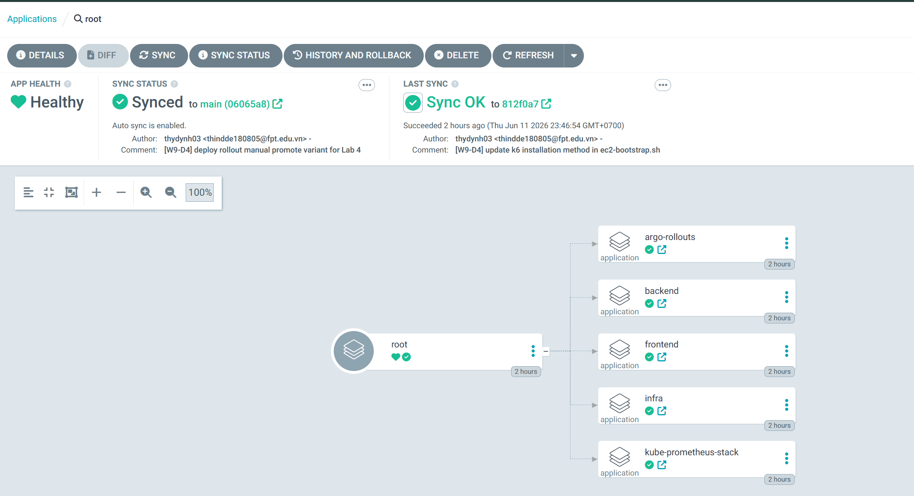

---

#### 9.2 Lịch Sử Deployment (Rollout History)

Lịch sử đầy đủ các lần deploy: v1 (stable) → v2 (promoted) → v3 (aborted) → revert.

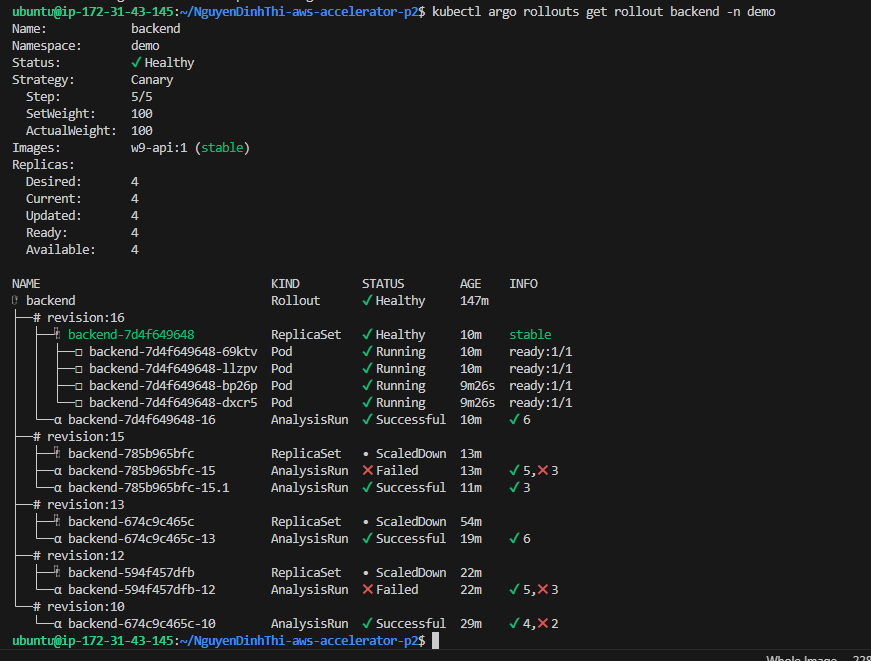

---

## V. KẾT LUẬN

Bài lab W9 Final đã triển khai thành công hệ thống **"Ship Smartly"** với 3 trụ cột:

1. **GitOps (ArgoCD App-of-Apps)** — Git là nguồn sự thật duy nhất, cluster tự đồng bộ, self-heal khi bị drift.
2. **Observability (SLO/Burn-Rate/AlertManager)** — Đo lường chất lượng từ góc nhìn người dùng, cảnh báo sớm trước khi SLO bị vi phạm, gửi email tự động.
3. **Canary + Auto-Abort (Argo Rollouts + AnalysisTemplate)** — Deploy an toàn từng phần, tự động rollback khi phát hiện lỗi mà không cần human intervention.

> **Kết quả quan trọng nhất:** Canary v3 với `ERROR_RATE=0.2` bị **tự động abort** sau ~110 giây, 100% traffic trở về v2 ổn định — người dùng không bị ảnh hưởng.
